# IOT Electronic Engineering Learning Kit for ESP-32

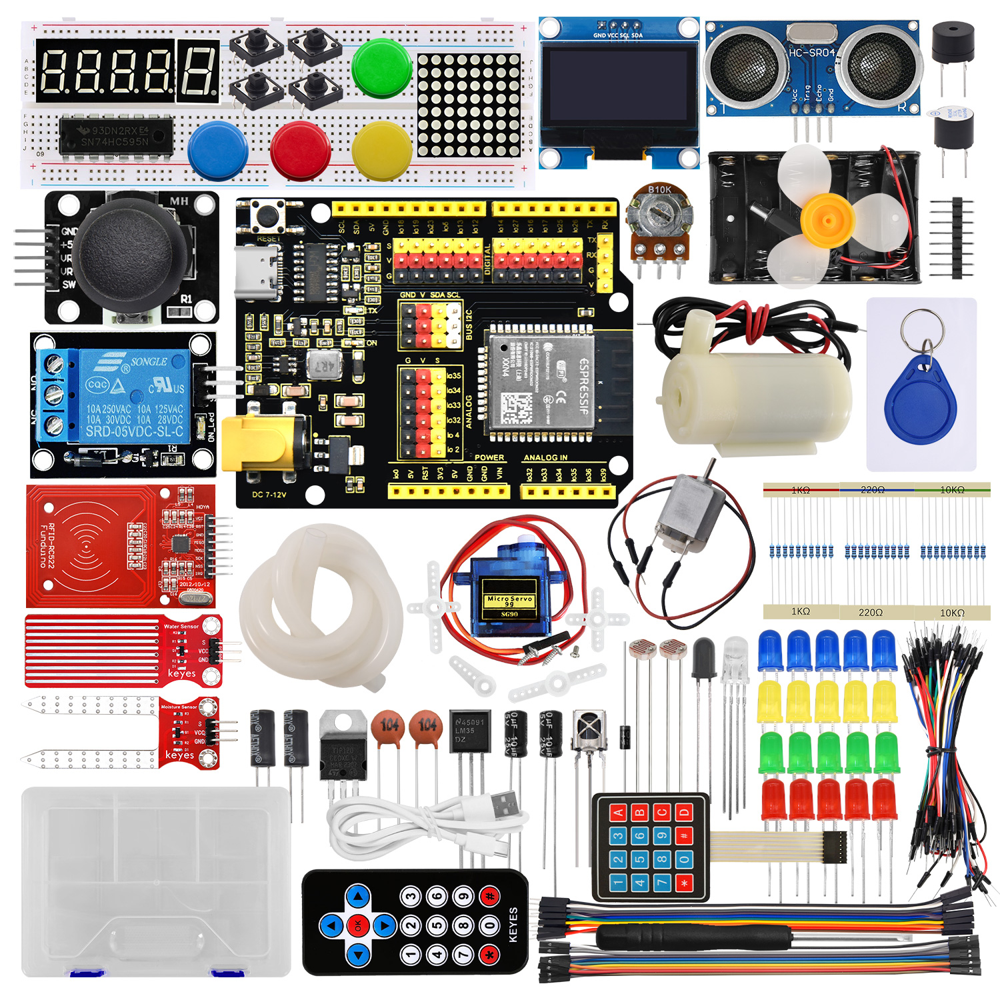

# 1. Brief Introduction

Based on ESP32 development board, this kit is designed for electronics enthusiasts, makers and beginners of the Internet of Things, which includes over twenty kinds of commonly used sensors and modules, such as LED, digital tube, OLED, motor, servo, water pump and photoresistor. Beyond that, it also provides tutorials for basic experiments, comprehensive projects, Internet of Things (IoT) applications. Through step-by-step practice, you will master core skills like circuit design, sensor data acquisition, actuator control and MQTT remote communication, and even independently develop your own IoT systems of remote watering, greenhouse environment monitoring and remote control.

**Features:**

1. **Comprehensive coverage of core Iot technologies**——master ESP32 development from basic electronics to WiFi/MQTT remote communication.
2. **20+ sensors and actuators**——include environment monitoring (temperature, flame, light), human-computer interaction (button, joystick, RFID), executive control (motor, servo, water pump), etc.
3. **Step-by-step learning**——Basics → Comprehension →IoT, suitable for learners of different levels.
4. **Real case of IoT**——Provide practical projects such as remote watering, fish tank and greenhouse monitoring.
5. **Open source code with detailed tutorials**——Complete sample program, circuit diagram and graphic tutorial reduce the learning threshold.

Whether you’re a student, an engineer, or a DIY enthusiast, you can get a quick start on ESP32 development and build your own smart hardware projects with this kit!

# 2. Kit List

When you receive this kit, check it according to the following list to ensure that all parts are intact. If you find any missing parts, please contact our sales staff immediately.

| NO.  |                     PIC                     |                             NAME                             | QTY  |
| :--: | :-----------------------------------------: | :----------------------------------------------------------: | :--: |
|  1   |                |                 Keyestudio development board                 |  1   |
|  2   |                         |                           red LED                            |  5   |
|  3   |                      |                          yellow LED                          |  5   |
|  4   |                       |                          green LED                           |  5   |
|  5   |                    |                           blue LED                           |  5   |
|  6   |                         |                           RGB LED                            |  1   |
|  7   |                        |                        220R resistor                         |  10  |
|  8   |                         |                         1KΩ resistor                         |  10  |
|  9   |                        |                        10KΩ resistor                         |  10  |
|  10  |                      |                   electrolytic capacitance                   |  2   |
|  11  |                    |                      ceramic capacitor                       |  2   |
|  12  |  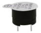  |                        active buzzer                         |  1   |
|  13  |  |                        passive buzzer                        |  1   |
|  14  |                      |                            button                            |  4   |
|  15  |            |                       green button cap                       |  1   |
|  16  |                |                        red button cap                        |  1   |
|  17  |              |                       blue button cap                        |  1   |
|  18  |          |                      yellow button cap                       |  1   |
|  19  |                          |                         IR receiver                          |  1   |
|  20  |                        |                            LM35D                             |  1   |
|  21  |                  |                         flame sensor                         |  1   |
|  22  |        |                         tilt switch                          |  2   |
|  23  |           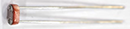            |                        photoresistor                         |  2   |
|  24  |                      |                        potentiometer                         |  1   |
|  25  |                      |                      1-bit digital tube                      |  1   |
|  26  |                  |                      4-bit digital tube                      |  1   |
|  27  |          |                        8x8 dot matrix                        |  1   |
|  28  |                  |                            diode                             |  1   |
|  29  |                |                          transistor                          |  1   |
|  30  |                      |                          74HC595 IC                          |  1   |
|  31  |                       |                       motor with wire                        |  1   |
|  32  |                       |                            servo                             |  1   |
|  33  |                   |                     water pump with wire                     |  1   |
|  34  |                    |                  HC-SR04 ultrasonic sensor                   |  1   |
|  35  |                      |                     PS2 joystick module                      |  1   |
|  36  |                    |                     soil humidity sensor                     |  1   |
|  37  |        |                      water level sensor                      |  1   |
|  38  |                  |                     single-way 5V relay                      |  1   |
|  39  |                |                      4*4 matrix key pad                      |  1   |
|  40  |                      |                         1*8 pin 2.54                         |  1   |
|  41  |                |                1.3-inch SSH1106 OLED display                 |  1   |
|  42  |                        |                         RFID module                          |  1   |
|  43  |              |                            ID key                            |  1   |
|  44  |                |                           IC card                            |  1   |
|  45  |        |                          breadboard                          |  1   |
|  46  |        |                        battery holder                        |  1   |
|  47  |  | remote control<br /><span style="color:red;">Remote control requires [CR2025] (not included)</span> |  1   |
|  48  |                      |                     M-F 20cm DuPont wire                     |  10  |
|  49  |                      |                     F-F 20cm DuPont wire                     |  10  |
|  50  |                    |                          jump wires                          |  1   |
|  51  |                      |                         package box                          |  1   |
|  52  |                      |                          USB cable                           |  1   |
|  53  |            |                             fan                              |  1   |
|  54  |          |                        silicone tube                         | 50CM |
|  55  |      |                         screwdriver                          |  1   |


# 3. ESP32 Main Control Board

## 3.1 Introduction

ESP32 main control board integrates ESP32-WROOM-32 module and is a universal WIFI and Bluetooth development board, whose pins are compatible with Arduino. It boasts a wealth of peripherals, high-speed SDIO/SPI, UART, I2S and I2C, etc., and can be equipped with freeRTOS operating system. Therefore, it is very suitable for Internet of things and smart home solutions.

## 3.2 Parameters

| Voltage                             | 3.3V-5V              |
| :---------------------------------- | :------------------- |
| Current                             | Output 1.2A(maximum) |
| Maximum power                       | Output 10W           |
| Working temperature                 | 0℃~50℃               |
| Dimension                           | 69x54x14.5mm         |
| Weight                              | 25.5g                |
| Environmental protection attributes | ROHS                 |

## 3.3 Pin-out


## 3.4 Pin Functions

| GPIO |   Input   | Output | Functions                                                    |
| :--: | :-------: | :----: | :----------------------------------------------------------- |
|  0   | pulled up |   OK   | Output PWM signal when power on. <span style="color:red;">Must be LOW to enter burn mode.</span> |
|  1   |  TX pin   |   OK   | Power-on debug output.                                       |
|  2   |    OK     |   OK   | Connect to the onboard LED. <span style="color:red;">Must be hang or low to enter burn mode.</span> |
|  3   |    OK     | RX pin | Be high when power on.                                       |
|  4   |    OK     |   OK   |                                                              |
|  5   |    OK     |   OK   | Output PWM signal at start-up and bind pins.                 |
|  6   |     x     |   x    | Connect to integrated SPI flash.                             |
|  7   |     x     |   x    | Connect to integrated SPI flash.                             |
|  8   |     x     |   x    | Connect to integrated SPI flash.                             |
|  9   |     x     |   x    | Connect to integrated SPI flash.                             |
|  10  |     x     |   x    | Connect to integrated SPI flash.                             |
|  11  |     x     |   x    | Connect to integrated SPI flash.                             |
|  12  |    OK     |   OK   | <span style="color:red;">If pulled high, fails to start up, bind pins.</span> |
|  13  |    OK     |   OK   |                                                              |
|  14  |    OK     |   OK   | Power on to output PWM signal                                |
|  15  |    OK     |   OK   | Output PWM signal at start-up and bind pins.                 |
|  16  |    OK     |   OK   |                                                              |
|  17  |    OK     |   OK   |                                                              |
|  18  |    OK     |   OK   |                                                              |
|  19  |    OK     |   OK   |                                                              |
|  21  |    OK     |   OK   |                                                              |
|  22  |    OK     |   OK   |                                                              |
|  23  |    OK     |   OK   |                                                              |
|  25  |    OK     |   OK   |                                                              |
|  26  |    OK     |   OK   |                                                              |
|  27  |    OK     |   OK   |                                                              |
|  32  |    OK     |   OK   |                                                              |
|  33  |    OK     |   OK   |                                                              |
|  34  |    OK     |   x    |                                                              |
|  35  |    OK     |   x    |                                                              |
|  36  |    OK     |   x    |                                                              |
|  39  |    OK     |   x    |                                                              |

## 3.5 Schematic Diagram

Click here to download the schematic PDF if required. [Schematic diagram PDF download](./KS5016_ESP32_development_board_schematic.pdf)


# 4. Arduino IDE

## 4.1About Arduino IDE

Arduino IDE is an integrated development environment dedicated to Arduino which is an open-source electronics platform based on easy-to-read interface and simplified programming process, aimed at students without a background in electronics. 

Its clear interface, syntax highlighting and auto-completion functions make the programming process easy and enjoyable. It also offers a wealth of tutorials, sample codes, and community support to help beginners get started quickly and solve practical  problems.

Importantly, it is published as an open source tool. Therefore,  it not only accelerates users own learning process by utilizing and referring others’ works, it is also available for extension experienced programmers to freely access, modify and distribute codes.

In one word, Arduino IDE is easy-to-use for beginners, yet flexible enough for advanced users to take advantage of as well.

## 4.2 Download Arduino IDE

### **4.2.1 For Windows**

Arduino official:[Software | Arduino](https://www.arduino.cc/en/software/)

Arduino boasts multiple versions such as Widows, mac and Linux(as shown below), please ensure that the one you download is compatible with your computer.


Here,  we will take Windows system as an example to introduce how to download and install it. Two versions are provided for Windows: for installing and for downloading(a zipped file, no need to install).


Click **JUST DOWNLOAD** to download the software. 

### **4.2.2 For MAC**

Its download method is similar to the Windows.


Follow the prompts to install.

### **4.2.3 Steps**

1.Save the .exe file downloaded from the software page to your hard drive and simply run the file .


2.Read the License Agreement and agree it.

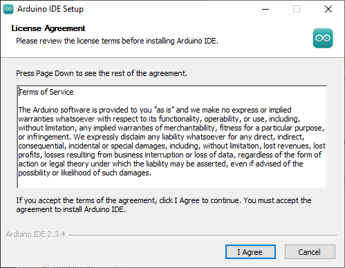

3.Choose the installation options.


4.Choose the install location.

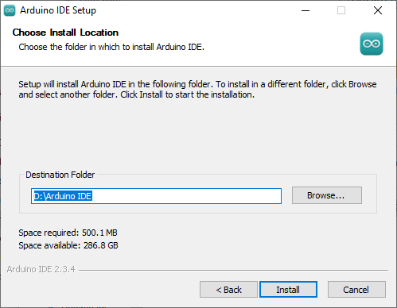

5.Click finish and run Arduino IDE


## 4.3 Install USB Driver

Note that please connect the ESP32 board to your computer via USB cable before installing the USB driver. Or else, the driver may fail to be installed.

### 4.3.1 For Windows

Click to download [Windows CH340 driver](./Windows.zip).

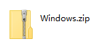

For Windows 10 and later versions, the driver will be automatically installed. 

Connect the control board to computer via USB, click Computer–Attributes–Device Manager. As is shown in the picture, the driver has already exist.


If there is a yellow exclamation mark, you should install it manually.


Tap  to choose “Update drive…” to update the driver.


Click “Browse my computer for drivers”.

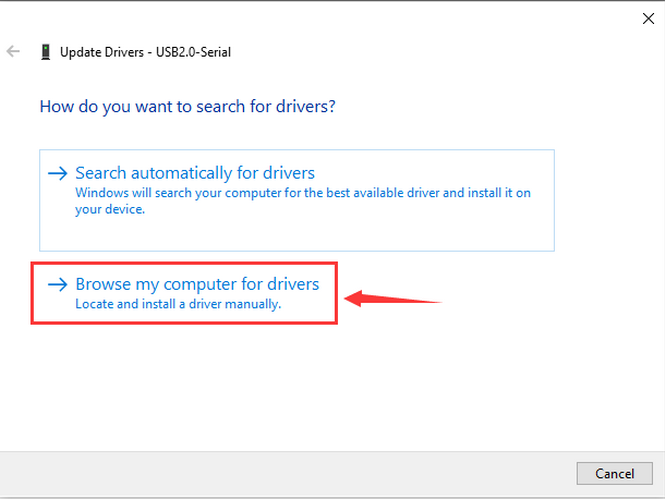

Enter“Browse…” to find the folder `usb_ch341_3.1.2009.06` , and then “Next”.


Close the page after installation, and then the serial port number appears.


Finally, click Computer–Attributes–Device Manager:


### 4.3.2 For MAC

Click to download [MAC CH340 driver](./MAC.zip).


**Step 1:** Download the driver from the Website and extract the file to the local installation directory.


**Step 2:** For details about how to install the driver in pkg format by default, see Step 3. If OS X 11.0 or later does not support Rosetta, refer to Step 4 to install the dmg driver.

Before installation, please forward to “System Preferences”->“Security & Privacy”->“General” page, below the title “Allow apps downloaded from:” choose the choice 2->“Mac App Store and identified developers”, then the driver will work normally.


**Step 3:** To install the driver in pkg format, tap the driver file → Continue→ Install


Then the installation will be successful


To install the pkg format driver on OS X 11.0 and later: Open “LaunchPad”→“CH34xVCPDriver”→Install


When using OS X 10.9 to OS X 10.15, click “Restart” to restart your computer, and perform the following steps after the restart.


**Step 4:** To install the dmg driver, tap the dmg file and drag “CH34xVCPDriver” to enter the application folder in the operating system.


Then open “LaunchPad”→“CH34xVCPDriver”→Install


Then the installation will be successful


When inserting the CH340 control board into the USB port, open System Report -> Hardware ->USB. On the right is USB Device Tree. If the USB device is working properly, you will find a device whose “Vendor ID” is [0x1a86].


Open “Terminal” program under Applications-Utilities folder and type the command “ls /dev/tty*”.


You should see the “tty.wchusbserialx” where “x” is the assigned device number similar to Windows COM port assignment.

## 4.4 Install ESP32 Board

Open Arduino IDE and click “Tools” → “Board”. But we cannot find ESP32, so we need to install it manually.


**Installation Steps of the ESP32:**

Open Arduino IDE.

Click “**File → Preferences**”, add the link `https://espressif.github.io/arduino-esp32/package_esp32_index.json` in Additional boards manager URLs and click **OK**.


Select the icon of board manager to open the the board options.


Search for **ESP32** in the search box and install the latest version. You can check its process in the lower right corner. **During installation, keep the network stable. If the installation fails, repeat the above steps.**

<span style="color:red; font-size:20px;">Note: We adopt ESP32 version 3.1.3 in this tutorial. Please keep it consistent to avoid code incompatibilities.</span>


Installed:


## 4.5 Use Arduino IDE


1. **File** - includes new Sketch, open Sketch, open recently used code, open sample code, close the IDE, save code, preferences, advanced Settings, etc.
2. **Edit** - includes copy, paste, automatic formatting, font size, etc. (shortcut keys are recommended).
3. **Sketch** - includes verify\compile, upload code, import library and so on.
4. **Tools** - The most important two are development board and port.
5. **Help** - Views the IDE version and official reference documents.
6. **Open Serial Plotter** - displays serial data in a method of line graph
7. **Open Serial Monitor** - opens the Serial Monitor tool, as a new tab in the console.
8. **Verify** - compiles your code to your Arduino Board.
9. **Verify / Upload** - compiles and uploads your code to your Arduino Board.
10. **Sketchbook** - here you will find all of your sketches locally stored on your computer. Additionally, you can sync with the Arduino Cloud, and also obtain your sketches from the online environment.
11. **Boards Manager** - install or remove Arduino Boards .
12. **Library Manager** - browse through thousands of Arduino libraries or import local libraries
13. **Debugger** - test and debug programs in real time.
14. **Search** - search for keywords in your code.
15. **Code editing area**
16. **IDE prompt area** (Uploading fails or succeeds) & **Serial monitor display area**

## 4.6 Upload Code on Arduino IDE

Connect the board to your computer via the USB cable.


Connect the the corresponding ESP32 board model in Arduino IDE.


Choose COM port. You may check your port number at Device Manager. If there are many COM ports, unplug the cable of board to see which port disappears. Then that one is the port ready to use. If there is no COM port, please check whether driver is installed.


Herein, our COM port is COM3. Click “Tools” → “Port” → “COM3”.


When the board is connected, both of these places appear its model. Here we provide a sample code that prints “Hello Keyestudio!” once per second in the serial monitor.

Copy and paste the following code to Arduino IDE.

```c
/*
  keyestudio 
  Print “Hello Keyestudio!”
  http://www.keyestudio.com
*/
void setup() {  
    // put your setup code here, to run once:
    Serial.begin(9600);  //Set the serial port baud rate to 9600
}

void loop() {  
    // put your main code here, to run repeatedly:
    Serial.println("Hello Keyestudio!");  //Serial port printing
 	delay(1000);  //Delay of 1 second
}
```


Click  to compile and upload code. Two prompts will appear after upload is successful:


After that, click  to show serial monitor and set baud rate to 9600. You will see “Hello Keyestudio!” on the monitor.


1. **Toggle Auto-scroll** - Sets whether the prints scroll automatically
2. **Toggle Timestamp** - Sets whether to display print time
3. **Clear Output** - Clears printed messages
4. **Serial Input**
5. **Serial Output Format**
6. **Baud Rate** - Sets the baud rate you need
7. **Printing Window**

Now that you’re familiar with the steps of uploading code, please continue to learn how to import libraries to Arduino IDE. They are indispensable, as the IDE will report an error if library files are not added.

## 4.7 Import Library

### 4.7.1 What are Libraries?

A library is a collection of codes, and it facilitates the connection of sensors, displays and modules. 

For instance, the LiquidCrystal_I2C library simplifies the communication with LCD1602 display. Moreover, hundreds of libraries are available on Internet. In the reference, in-built and manually-added libraries are listed.

When you see “No such file or directory”, oops, libraries are missing! For instance, we do not include LiquidCrystal_I2C before uploading related codes:


### 4.7.2 How to Install the Libraries?

We still take LiquidCrystal_I2C as an example.

Click **Skerch>Include Library>Add .Zip Library...**


Select the zipped files you need and click ok to add a library. If success, the message bar will show “**Library installed**”.


**Operation demo:**


For how to install libraries, MAC and WINDOWS are the same.

# 5. Arduino C Basic Codes

## 5.1 Arduino IDE Programming Language

The default option for programming your board to connect to the Arduino is by using the **C++ language**. 

C++ is often viewed as a superset of C, but there are a few of the differences between the two languages. C is procedural while C++ is object-oriented. Early Arduino core library was written in C, yet the latest library contains both C and C++ due to the idea of object orientation. 

Generally, Arduino Languages, which is also known as the Arduino API, is formed by the secondary encapsulation of the microcontroller libraries at lower levels. MCU users must deal with registers. Nonetheless, these API allows beginners to  control Arduino without complex register configuration, which improves development efficiency.

## 5.2 Program Structures

Arduino consists of two main functions:

`void setup(){}` 

When the code starts running, setup () function is called. It initializes variables, sets pin modes, and  imports libraries. It runs only once when Arduino board is powered on or reset.

`void loop(){}` 

It is equivalent to an endless loop while(1){}. Of course, you can customize functions in the above two. Note that the two functions are essential, otherwise an error will be reported.

## 5.3 Common Statements

### 5.3.1 delay(value) ;

delay() is a delay function, which is used where the program needs to wait. 

Syntax: `delay(value)`

**value**: Delay time value (unit: ms); 1S = 1000mS, 1mS = 1000 uS; Generally we use mS

### 5.3.2 digitalWrite(Pin,State);

digitalWrite() is used to control the specified pin to output HIGH or LOW. 

Syntax: `digitalWrite(pin, value)`

- **pin**： the Arduino pin number
- **value**：HIGH or LOW

### 5.3.3 digitalRead(Pin)

digitalRead(Pin) is used to read TTL level of digital pins, high (1), low (0).

Syntax: `digitalRead(Pin);`

**Pin:** The digital pin that needs to be read

### 5.3.4 analogWrite(Pin,Vlaue)

analogWrite() outputs analog value (PWM signal). It can be used to light an LED at different brightness or drive a motor at different speeds. After analogWrite (); is called, this pin will generate a stable rectangular wave with the specified duty cycle until it is called next time on the same pin. So do digitalRead () and digitalWrite ().

Syntax: `analogWrite(pin, value)`

- **pin:** the Arduino pin to write to. Allowed data types:int
- **value:** the duty cycle: between 0 (always off) and 255 (always on). Allowed data types:int

### 5.3.5 analogRead(Pin)

We learned the function of reading digital signals, and the analogRead() reads analog signals. ESP32 analog values range from 0 to 4095.

Syntax: `analogRead(Pin);`

**Pin:** The analog pin that needs to be read

### 5.3.6 pinMode(Pin,mode)

pinMode() is used to set the specified pin to input or output or pull-up

Syntax: `pinMode(pin, mode)`

- **pin**: the Arduino pin number to set the mode of.
- **mode**:INPUT,OUTPUT, orINPUT_PULLUP

### 5.3.7 if(){...}else{}

if() is used to check whether the condition is met. If yes, execute codes in  “{ }”. If not, skip the execution.

**else** is the condition for “not”. If not, execute codes in “else { }”

### 5.3.8 for()

`for` statement is a basic loop structure that repeats a block of code a fixed number of times. It is especially suitable for execution with a known number of cycles. 

Syntax of `for` loop:

```c
for (Initialization; Condition; Iterative command) {  
    // Loop: Codes to be executed repeatedly
}
```

- **Initialization**: Execute before the loop starts, usually to initialize one or more loop control variables.
- **Condition**: Check before each iteration of the loop. If the condition is true (non-zero), the loop is executed; If it is false (zero), the loop exits.
- **Iterative command**: Execute at the end of each loop iteration, usually to update these variables.


①: Set the initial value of the loop; execute only once; then enter ②

②: Determine whether to meet the condition. Herein, `i <= 255`, i is less than or equal to 255 to enter the loop code ③

③: Loop code, put the code that needs to loop here. For instance, if we need to control pwm value from 0 to 255, we set i to pwm and enter ④

④： i++ adds 1 to the value of original i, which also means i = i +1. So does i- -(i = i - 1). After that, run code ⑤

⑤： After i + 1 (or i - 1), determine whether i is less than or equal to 255. If yes, execute code ③. If not, exit the for loop.

### 5.3.9 while(condition){…}

The while loop runs indefinitely until the expression inside the () becomes false. It will never exit unless you change the test variable. This could be in your code, such as an incremental variable, or it could be an external condition, such as a test sensor.

### 5.3.10 Comparison Operators: “>,<,<=,>=,==,!=”

Comparing variables of different data types can produce unpredictable results. Therefore, it is recommended to operate in the same data type (including signed/unsigned types).

(1): `>` compares left and right values or variables. When the left operand is greater than the right, outputs true. Or else, returns false.

​	Syntax:

```c++
x > y; // is true if x is bigger than y and it is false if x is equal or smaller than y
```


(2): `>=` compares left and right values or variables. When the left operand is greater than or equal to the right, outputs true. Or else, returns false.

​	Syntax:

```c++
x >= y; // is true if x is bigger than or equal to y and it is false if x is smaller than y
```


(3): `<` compares left and right values or variables. When the left operand is smaller than the right, outputs true. Or else, returns false.

​	Syntax:

```c++
x < y; // is true if x is smaller than y and it is false if x is equal or bigger than y
```


(4): `<=` compares left and right values or variables. When the left operand is smaller than or equal to the right, outputs true. Or else, returns false.

​	Syntax: 

```c++
x <= y; // is true if x is smaller than or equal to y and it is false if x is greater than y
```


(5): `==` compares left and right values or variables. When the two operands equal to each other, outputs true. Or else, returns false. (Note that there are two equal signs “==”!)

​	Syntax: 

```c++
x == y; // is true if x is equal to y and it is false if x is not equal to y
```


(6): `!=` compares left and right values or variables. When the two operands do not equal to each other, outputs true. Or else, returns false.

​	Syntax: 

```c++
x != y; // is false if x is equal to y and it is true if x is not equal to y
```


### 5.3.11 Arithmetic Operators: “+,-,*,/,%,=”

(1): addition (`+`) is one of the four main arithmetic operations. The operator “+” (plus) sums up the two operands to get a result.

​	Syntax: `sum = operand1 + operand2;`

(2): subtraction (`-`) is one of the four main arithmetic operations. The operator “-” (minus) produces the difference value between the second operand and the first.

​	Syntax: `difference = operand1 - operand2;`

(3): multiplication (`*`) is one of the four main arithmetic operations. The operator “*” (asterisk) multiplies the two operands to get a result.

​	Syntax: `product = operand1 * operand2;`

(4): division method (`/`) is one of the four main arithmetic operations. The operator “/” divides the two operands to get a result.

​	Syntax: `result = numerator / denominator;`

(5): Remainder operation (`%`) calculates the remainder of an integer divided by another. It helps to keep variables within a specific range (such as the size of an array). The operator “%” (percent) is used to perform the remainder operation.

​	Syntax: `remainder = dividend % divisor;`

(6): A single equal sign (`=`) is an assigning operator in C++, which is a different meaning from that of equations in algebra. The operator “=” tells the MCU to assign any value or expression on the right of the equal sign and store it in the variable on the left.

Sample:

```c++
int sensVal;              // declare an integer variable named sensVal
    sensVal = analogRead(0);  // store the (digitized) input voltage at analog pin 0 in SensVal
```


### 5.3.12 Boolean Operators: “||,&&，!”

(1): `||` can be regard as “or”. If either of the two operands is true, the result of the logical OR is true.

​	Sample: 

```c++
if (x > 0 || y > 0) { // if either x or y is greater than zero
      // statements
    }
```

(2): `&&` can be regard as “and”. The result of a logical AND is true only if both operands are true.

​	Sample: 

```c++
if (digitalRead(2) == HIGH && digitalRead(3) == HIGH) { // if BOTH the switches read HIGH
      // statements
    }
```


### 5.3.13 #include

#includeimports the external library(s) in a Sketch, so that programmers can access to considerable standard C libraries (groups of prefabricated functions), as well as exclusive libraries for Arduino.

​	Syntax: `#include <LibraryFile.h>` or `#include "LocalFile.h"`

### 5.3.14 #define

 #define is used to set constant(a quantity that does not vary). 

Syntax: `#define constantName value`

- **constantName:** the name of the macro to define
- **value:** the value to assign to the macro

### 5.3.15 Serial.begin(9600)

Serial.begin(9600); sets serial baud rate. Serial port printing can be performed only after the baud rate is set to the same as that of the serial printing tool. 9600 and 115200 are the most common.

### 5.3.16 Serial.print()

Serial.print(); prints data without wrapping on the serial monitor. Enter characters(need to be placed in double quotes) or variables in parentheses.

### 5.3.17 Serial.println()

Serial.println(); prints data with wrapping on the serial monitor. Enter characters(need to be placed in double quotes) or variables in parentheses.

### 5.3.18 int

`int` declares integer variables. For example, `int i = 0;` declares a variable named i whose value equals to 0.

### 5.3.19 char

`char` declares character variables. For example, `chat ch = ‘A’` declares a character named ch whose content is ‘A’.

To learn more about the Arduino API, check out the [Language Reference | Arduino Documentation](https://docs.arduino.cc/language-reference/#variables)


# 6. Code and Library Download


Download links for the tutorial's library files and code files:

[Click to download](./resource.zip)

# 7. Basic Projects

## 7.1 Light up LED

### 7.1.1 Introduction

Here we guide you step by step to learn how to light up LED, covering basic circuit knowledge (working principle), components (such as resistors and power supplies) and practical operation (circuit design). Whether you are a beginner or an electronics enthusiast, you can easily light up an LED with these practical and easy-to-understand instructions.

### 7.1.2 Component Knowledge

**LED:**

LEDs convert electric energy into light energy. It works based on the photoelectric effect of semiconductors. 

Specifically, the heart of the LED is a semiconductor chip, composed of P- and N-type semiconductors, between which P-N junctions are formed. When current is applied to this chip through the wire, electrons are injected into the P region from the N region, while holes are injected in the opposite direction(P to N), and these few carriers (electrons and holes) are combined near the P-N junction, and energy is released during combination, thus producing light.

LED chips of different materials emit different colors of light. For example, gallium nitride (GaN) semiconductors are often used in blue LEDs. By changing materials and packaging process, LEDs can emit different colors, including cool white, warm white and colorful.

Note: As shown below, the long pin is the positive pole connected to the GPIO pole, while the short one is the negative pole to GND. If they are reversed, the LED will not light up.


**(2) Five-color-ring Resistor**

A resistor(R) limits or regulates the flow of current in the circuit. The left picture is the appearance of the resistor and the right one is its circuit symbol. Its unit of R is ohm(Ω). 1 mΩ= 1000 kΩ, 1 kΩ = 1000Ω.


We can use resistors to protect sensitive components, like LED. The resistance is marked on the body with an electronic color code. Each color represents a number, and you can refer to it in the resistance card.

​	-Color Ring 1 – 1st Digit.
​	-Color Ring 2 – 2nd Digit.
​	-Color Ring 3 – 3rd Digit.
​	-Color Ring 4 – Multiplier.
​	-Color Ring 5 – Tolerance.


In this kit, we provide four five-color-ring resistor. Here we take three of them as examples.

220Ω resistor*10


10KΩ resistor*10


1KΩ resistor*10


In the same voltage, there will be less current but more resistance. The connection between current(I), voltage(V), and resistance(R) can be expressed: I=U/R. In the figure below, for instance, if the voltage is 3V, the current through R1 equals I = U / R = 3 V / 10 KΩ= 0.0003A= 0.3mA.


Don’t connect a low resistance directly to the two poles of the power supply, as this will cause excessive current to damage the electronic components. Resistors are nonpolar.

**(3) Breadboard**

Breadboards are used to build and test circuits quickly before completing any circuit design. There are many holes in the breadboard so that components such as resistors can be inserted into it. 

A typical breadboard is shown below:


The breadboard comes with many metal strips that run underneath the board to connect holes together. They are laid out as shown below. Note that the top and bottom rows of holes are connected horizontally, while the remaining holes are connected vertically.


The first two rows (top) and the last two rows (bottom) are used for power positive(+) and negative(-) respectively. The conductive layout is shown below:


We should know that the up and low holes of groove in the middle are not connected. So we can connect the DIP(Dual in-line Packages) components (say, integrated circuits, microcontrollers, chips, etc.) as shown below:


### 7.1.3 Components

|          |    |  |
| :-----------------------------------: | :-----------------------: | :-----------------------: |
|          ESP32 main board x1          |        red LED x1         |     220Ω resistor x1      |
|  |  |    |
|             breadboard x1             |        jump wires         |       USB cable x1        |

### 7.1.4 Wiring Diagram

**Schematic diagram:**

We adopt digital pin IO26 in this experiment. In the circuit, we connect a 220Ω resistor in serial, which protect the LED from over-current.


**Wiring diagram:**


### 7.1.5 Test Code

The test code is saved in `Code` file named `7_1_LED_Blinking`:


Open `7_1_LED_Blinking.ino` in Arduino IDE.

```c++
/*
 * File name: 7_1_LED_Blinking
 * Function: LED blinks 1s
 * Compiling IDE: ARDUINO 2.3.4
 * Author: https://www.keyestudio.com/
*/
const int Red_LED_Pin = 26; // Define LED pin to IO26.

void setup(){
  pinMode(Red_LED_Pin, OUTPUT); // Set LED pin to output
}

void loop(){
  digitalWrite(Red_LED_Pin, HIGH); // LED on.
  delay(1000); // Delay 1s.
  digitalWrite(Red_LED_Pin, LOW); // LED off.
  delay(1000); // Delay 1s.
}
```


### 7.1.6 Test Result

After wiring up and uploading the code to the board, the red LED repeatedly lights up for 1S and goes off for 1S. If you have a puzzle of how to upload code, please back to Chapter [4.6 Upload Code on Arduino IDE](https://docs.keyestudio.com/projects/KT0303/en/latest/docs/Arduino_Tutorial.html#upload-code-on-arduino-ide).


### 7.1.7 Code Explanation

```c
const int Red_LED_Pin = 26; // Define LED pin to IO26.
```

- `const int` → Declare an **integer** variable with a fixed value (unmodifiable when running)
- `Red_LED_Pin` → variable name, **red LED pin**
- `=` → Assignment operator, which assigns a value on the right to a variable on the left. Official definition: [= (assignment operator) | Arduino Documentation](https://docs.arduino.cc/language-reference/en/structure/arithmetic-operators/assignment/)
- `26` → set LED control pin to **GPIO26**

---------------

```c
void setup(){
    ...
}
```

`void setup(){}` : When the code starts running, the setup () function is called. It initializes variables, pin modes, libraries. It runs only once after each power on or reset of the Arduino board.

Official definition: [setup() | Arduino Documentation](https://docs.arduino.cc/language-reference/en/structure/sketch/setup/)

-------------------------

```c
  pinMode(Red_LED_Pin, OUTPUT); // Set LED pin to output
```

- `pinMode()` → Arduino specific function to set the pin mode
- `Red_LED_Pin` → set pins (previously defined GPIO26)
- `OUTPUT` → Set to output mode (voltage control)

Official definition: [pinMode() | Arduino Documentation](https://docs.arduino.cc/language-reference/en/functions/digital-io/pinMode/)

----------

```c
void loop(){
    ...
}
```

`void loop(){}` : Equivalent to an endless loop while(1){}. Custom functions are called in `setup（）` and `loop（）`. Note that the setup and loop are required, otherwise an error will be reported.

Official definition: [loop() | Arduino Documentation](https://docs.arduino.cc/language-reference/en/structure/sketch/loop/)

------------------

```c
  digitalWrite(Red_LED_Pin, HIGH); // LED on.
```

- `digitalWrite()` →Arduino output digital signals
- `Red_LED_Pin` → LED pin to be controlled
- `HIGH` → Output high level (usually 3.3V/5V)

Official definition: [digitalWrite() | Arduino Documentation](https://docs.arduino.cc/language-reference/en/functions/digital-io/digitalwrite/)

----------------

```c
delay(1000); // Delay 1s.
```

- `delay()` → Arduino delay function
- `1000` → Milliseconds (1000ms=1s)
- The CPU idles while waiting

-------------

```c
  digitalWrite(Red_LED_Pin, LOW); // LED off.
```

- `digitalWrite()` → Arduino digital output function
- `Red_LED_Pin` → LED pin to control (GPIO26)
- `LOW` → Output low (0V)

--------

## 7.2 Change LED Brightness

### 7.2.1 Introduction

Here we introduce you how to adjust the brightness of LED via Pulse Width Modulation(PWM). It changes the brightness by quickly switching the power supply. In detail, PWM controls the average current of the LED by adjusting the duty cycle of signals, thus achieving stepless adjustment of brightness.

This project cover s PWM principle, circuit design, programming and practical operation, aiming at controlling LED brightness and applying it to many other experiments.

### 7.2.2 PWM Principle

PWM, Pulse Width Modulation, is a very effective method for using digital signals to control analog circuits. Common processors cannot directly output analog signals. PWM technology makes it very convenient to achieve this conversion (translation from digital to analog signals). 

PWM technology uses digital pins to send certain frequencies of square waves, that is, the output of high levels and low levels, which alternately last for a certain period. The total time is generally fixed, which is called the **period** (the reciprocal of the period is frequency). 

 The time of high level outputs are generally called “pulse width”, and the duty cycle is the percentage of the ratio of pulse duration, or pulse width (PW) to the total period (T) of the waveform. The longer the high levels last, the longer the duty cycle and the higher the corresponding voltage in the analog signal will be. 

The following figures show how the analog signal voltages vary between 0V-3.3V (high level is 3.3V) corresponding to the pulse width 0%-100%.


PWM is widely applied to adjust light brightness and motor rotation speed. Here are three parameters of it.


1. Duty cycle: The duration proportion of high level to the total period

2. Period: The reciprocal of the pulse frequency in one second

3. There are 16 channels for LEDC(PWM) interfaces on ESP32, each of which can independently control frequency, duty cycle, and even accuracy.

The longer the PWM duty cycle is, the higher the output power will be. So we can use PWM to control the brightness of an LED or the speed of DC motor. 

From above we can tell, PWM is not real analog, but the effective value of the voltage is equivalent to the corresponding analog. Therefore, we can control the output power of output modules. 

**ESP32 and PWM**

On ESP32, there are 16 channels for LEDC(PWM) and each of them can independently control frequency, duty cycle, and accuracy.

Unlike traditional PWM pins,  ESP32’s are configurable, with one or more PWM output pins per channel. The relationship between maximum frequency and bit accuracy is shown in the following formula:


The maximum number of bits is 31. For example, PWM with 8-bit precision(2ˆ8 = 256. Value range: 0 ~ 255), so the maximum frequency is 80,000,000/255 = 312,500Hz.

### 7.2.3 Components

|          |    |  |
| :-----------------------------------: | :-----------------------: | :-----------------------: |
|          ESP32 main board x1          |        red LED x1         |     220Ω resistor x1      |
|  |  |    |
|             breadboard x1             |        jump wires         |       USB cable x1        |

### 7.2.4 Wiring Diagram


### 7.2.5 Test Code

The test code is saved in `Code` file named `7_2_Breathing_LED`:


Open `7_2_Breathing_LED.ino` in Arduino IDE.

```c++
/*
 * Filename: 7_2_Breathing_LED
 * Function: Make led light fade in and out, just like breathing.
 * Compiling IDE：ARDUINO 2.3.4
 * Author: https://www.keyestudio.com/
*/
const int PWM_LED_Pin = 26;  // The GPIO pin for the LED

void setup() {
  pinMode(PWM_LED_Pin, OUTPUT);  // Set LED pin to output
}

void loop() {
  for (int i = 0; i < 255; i++) {  //make light fade in
    analogWrite(PWM_LED_Pin, i);   //Output PWM
    delay(10);                     //delay 10ms
  }
  for (int i = 255; i >= 0; i--) {  //make light fade out
    analogWrite(PWM_LED_Pin, i);    //Output PWM
    delay(10);                      //delay 10ms
  }
}
```

### 7.2.6 Test Result

After wiring up and uploading the code to the board, the red LED gradually lights up and then dims, repeatedly. If you have a puzzle of how to upload code, please back to Chapter [4.6 Upload Code on Arduino IDE](https://docs.keyestudio.com/projects/KT0303/en/latest/docs/Arduino_Tutorial.html#upload-code-on-arduino-ide).


### 7.2.7 Code Explanation

```c
for (int i = 0; i < 255; i++) {
    ...
}
```

- `for` →Create a count loop. Official definition: [for | Arduino Documentation](https://docs.arduino.cc/language-reference/en/structure/control-structure/for/)
- `int i = 0` → Count from 0
- `i < 255` → Loop condition (executed when i<255). Official definition: [< (less than) | Arduino Documentation](https://docs.arduino.cc/language-reference/en/structure/comparison-operators/lessThan/)
- `i++` → Each cycle i increases by 1.Official definition: [++ (increment) | Arduino Documentation](https://docs.arduino.cc/language-reference/en/structure/compound-operators/increment/)


①: Set the initial value of the loop; execute only once; then enter ②

②: Determine whether to meet the condition. Herein, `i <= 255`, i is less than or equal to 255 to enter the loop code ③

③: Loop code, put the code that needs to loop here. For instance, if we need to control pwm value from 0 to 255, we set i to pwm and enter ④

④： i++ adds 1 to the value of original i, which also means i = i +1. So does i- -(i = i - 1). After that, run code ⑤

⑤： After i + 1 (or i - 1), determine whether i is less than or equal to 255. If yes, execute code ③. If not, exit the for loop.

---------------------

```c
analogWrite(PWM_LED_Pin, i);   //Output PWM
```

- `analogWrite()` → Arduino PWM output function
- `PWM_LED_Pin` → Pins supporting PWM (with “~”)
- `i` → Duty cycle (0-255)

Official definition: [analogWrite() | Arduino Documentation](https://docs.arduino.cc/language-reference/en/functions/analog-io/analogWrite/)

----------

## 7.3 Traffic Lights

### 7.3.1 Introduction

Here we introduce you how to set up a simple traffic lights system. This project covers programming logic and hardware controlling, including LEDs, counter and state machine. Whether you are a beginner or an electronics enthusiast, you can easily understand how traffic light works after learning these practical instructions. What’s more, you can enhance the ability to programming and hardware controlling during this process.

### 7.3.2 Components

|  |    |          |
| :---------------------------: | :-----------------------: | :-----------------------------------: |
|      ESP32 main board x1      |        red LED x1         |             yellow LED x1             |
|    |  |  |
|         green LED x1          |     220Ω resistor x3      |             breadboard x1             |
|      |    |                                       |
|          jump wires           |       USB cable x1        |                                       |

### 7.3.3 Wiring Diagram

**Schematic diagram:**


**Wiring diagram:**


### 7.3.4 Test Code

The test code is saved in `Code` file named `7_3_Traffic_Lights`:


Open `7_3_Traffic_Lights.ino` in Arduino IDE.

```c++
/*
 * Filename: 7_3_Traffic_Lights
 * Fuction: Traffic Lights
 * Compiling IDE: ARDUINO 2.3.4
 * Author: https://www.keyestudio.com/ 
*/
const int Red_LED_Pin = 13;   //Set the red LED pin
const int Yellow_LED_Pin = 14;   //Set the yellow LED pin
const int Green_LED_Pin = 16;   //Set the green LED pin

void setup() {
  pinMode(Red_LED_Pin, OUTPUT);
  pinMode(Yellow_LED_Pin, OUTPUT);
  pinMode(Green_LED_Pin, OUTPUT);
}

void loop() {
   digitalWrite(Green_LED_Pin, HIGH);// turn on green LED
   delay(5000);// delay 5 s
   digitalWrite(Green_LED_Pin, LOW);// 
   delay(500);// delay 0.5 s
   for(int i=0;i<3;i++)// blink 3 times.
   {
     digitalWrite(Yellow_LED_Pin, HIGH);// turn on yellow LED
     delay(500);// delay 0.5 s
     digitalWrite(Yellow_LED_Pin, LOW);// turn off yellow LED
     delay(500);// delay 0.5 s
   } 
   digitalWrite(Red_LED_Pin, HIGH);// turn on red LED
   delay(5000);// delay 5 s
   digitalWrite(Red_LED_Pin, LOW); // turn off red LED
   delay(500);// delay 0.5 s
}
```

### 7.3.5 Test Result

After wiring up and uploading the code to the board, you can see the three LEDs light up in sequence, just like traffic lights. If you have a puzzle of how to upload code, please back to Chapter [4.6 Upload Code on Arduino IDE](https://docs.keyestudio.com/projects/KT0303/en/latest/docs/Arduino_Tutorial.html#upload-code-on-arduino-ide).


## 7.4 RGB LED

### 7.4.1 Introduction

Here we introduce you the common cathode RGB LED, a light-emitting diode that displays a variety of colors. This project includes its working principle, pin configuration, circuit design and programming. 

To make a light show, you shall learn color mixing, PWM dimming, color and brightness adjusting. Through the experiment, whether you are a beginner or an electronics enthusiast, you can easily apply RGB LED. What’s more, you can enhance the practical ability and creativity during this process.

### 7.4.2 Component Knowledge

Common cathode RGB LED integrates red, green, and blue light-emitting diodes sharing one cathode (negative electrode). By adjusting the brightness of each color, you can mix almost any color. Except the common cathode, the anode (positive) corresponds to the red, green, and blue pins. When controlling, we apply a forward voltage to the corresponding anode, and adjust the brightness of each through PWM, so as to change colors. Therefore, this kind of LED is widely used in decorative lighting, displays and some creative projects.

Simply put, the red, green and blue LED are integrated into one bead, so its control method is same as common LEDs: by high and low levels. As shown below, they share the negative electrode. (The longest pin is the shared GND, the outermost one next to it is for Red, the one inside is for Green, and the other outermost one is for Blue.)


Three primary colors of light(red, green and blue) can synthesize a variety of colors by adjusting their brightness via PWM.


Here are some basic colors that RGB LED can synthesize:

| red LED PWM value | green LED PWM value | blue LED PWM value |  color  |
| :---------------: | :-----------------: | :----------------: | :-----: |
|        255        |          0          |         0          |   red   |
|         0         |         255         |         0          |  green  |
|         0         |          0          |        255         |  blue   |
|        255        |         255         |         0          | yellow  |
|         0         |         255         |        255         |  cyan   |
|        255        |          0          |        255         | megenta |
|        255        |         255         |        255         |  white  |

By adjusting their brightness ratio, RGB LED can emit almost any color, enriching visual effects for many application scenarios.

### 7.4.3 Components

|          |    |  |
| :-----------------------------------: | :-----------------------: | :-----------------------: |
|          ESP32 main board x1          |        RGB LED x1         |     220Ω resistor x3      |
|  |  |    |
|             breadboard x1             |        jump wires         |       USB cable x1        |

### 7.4.4 Wiring Diagram

**Schematic diagram:**


**Wiring diagram:**


Pay attention to distinguish the RGB LED pins!!

### 7.4.5 Test Code

The test code is saved in `Code` file named `7_4_RGB_LED`:


Open `7_4_RGB_LED.ino` in Arduino IDE.

```c++
/*
 * Filename: 7_4_RGB_LED
 * Functions: Control RGB LED to emit different colors of light
 * Compiling IDE: ARDUINO 2.3.4
 * Author: https://www.keyestudio.com/ 
*/

const int Red_LED_Pin = 27;   //set red LED pin
const int Blue_LED_Pin = 26;   //set blue LED pin
const int Green_LED_Pin = 25;   //set green LED pin


void setup() {
  //set pins to output
  pinMode(Red_LED_Pin,OUTPUT);
  pinMode(Blue_LED_Pin,OUTPUT);
  pinMode(Green_LED_Pin,OUTPUT);
}

void loop() {
  setColor(255, 0, 0); // Red
  delay(1000);
  setColor(0, 255, 0); // Green
  delay(1000);
  setColor(0, 0, 255); // Blue
  delay(1000);
  setColor(255, 255, 0); // Yellow
  delay(1000);
  setColor(255, 0, 255); // Purple
  delay(1000);
  setColor(0, 255, 255); // Cyan
  delay(1000);
}

/*
  function: setColor
  It integrates the RGB light control code into a function, and control it via (0-255,0-255,0-255)
*/
void setColor(int red, int green, int blue) {
  analogWrite(Red_LED_Pin,red);
  analogWrite(Green_LED_Pin,green);
  analogWrite(Blue_LED_Pin,blue);
}
```

### 7.4.6 Test Result

After wiring up and uploading the code to the board, the RGB LED repeatedly lights up in red, green, blue, yellow, cyan and magenta, goes off for one second between each color. If you have a puzzle of how to upload code, please back to Chapter [4.6 Upload Code on Arduino IDE](https://docs.keyestudio.com/projects/KT0303/en/latest/docs/Arduino_Tutorial.html#upload-code-on-arduino-ide).


### 7.4.7 Code Explanation

```c
/*
  Function name: setColor
  Function function: Integrate the RGB control code into a function, and control RGB by (0-255,0-255,0-255)
*/
void setColor(int red, int green, int blue) {
  analogWrite(Red_LED_Pin,red);
  analogWrite(Green_LED_Pin,green);
  analogWrite(Blue_LED_Pin,blue);
}
```

- `setColor()` → Custom color control function, to reduce the amount of code and simplify the control of RGB colors.
- Parameters: 
	- `red` → Red brightness (PWM: 0-255)
	- `green` → Green brightness (PWM: 0-255)
	- `blue` → Blue brightness (PWM: 0-255)
- Internally call `analogWrite()` to adjusting brightness via PWM

---------------------

## 7.5 Active Buzzer

### 7.5.1 Introduction

Here we introduce you an active buzzer, a kind of electronic sound element with built-in oscillation source that emits a fixed frequency of sound only by connecting to DC power. This project includes its working principle, pin configuration, circuit design and how to control by microcontroller(like Arduino). So you can program to control the buzzer to sound or alarm.

Through the experiment, whether you are a beginner or an electronics enthusiast, you can easily apply active buzzers to add voice prompts to your projects.

### 7.5.2 Component Knowledge

**(1) Active Buzzer** 

In the active buzzer, a simple oscillator circuit is integrated to convert constant direct current into pulse signals with a certain frequency. Once it receives a high level, it will emit sound. 

However, passive buzzer is without vibration source, so it must be driven by 2k-5k square waves, rather than a DC signal. 

They are very similar in appearance, but the passive one buzzer is with a green circuit board, while the active one is with black tape. Passive buzzers are not polar, yet active ones are. 


**(2) Transistor**

Transistor is a semiconductor that **controls current**. It **amplifies** weak electric signals(when the base inputs analog signals) or works as a non-contact **switch**(when the base inputs digital signals). 

Since the buzzer requires large current, the output capacity of the ESP32 GPIO pins cannot meet the requirements, thus an NPN-type triode is needed as a switch.


Working principle of switch triode:

When GPIO outputs a high level to the base(b) of the triode, its collector(c) and emitter(e) are conducted to form a loop, so that the 5V voltage passes through the buzzer and the collector(c) to the emitter(e) to GND. Then, the buzzer emit sound. When GPIO outputs low to the base(b), the collector(c) and emitter(e) are not conducted, thus unable to form a circuit. So the buzzer will not make sound.


### 7.5.3 Components

|  |  |  |
| :---------------------------: | :---------------------------: | :---------------------------------------: |
|      ESP32 main board x1      |       NPN transistor x1       |             active buzzer x1              |
|        |      |      |
|        1KΩ resistor x1        |       10KΩ resistor x1        |               breadboard x1               |
|      |        |                                           |
|          jump wires           |         USB cable x1          |                                           |

### 7.5.4 Wiring Diagram

**Schematic diagram:**


**Wiring diagram:**

Note that the positive pole of the active buzzer needs to be connected to VCC, otherwise the buzzer will not work.


### 7.5.5 Test Code

The test code is saved in `Code` file named `7_5_Beep`:

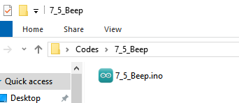

Open `7_5_Beep.ino` in Arduino IDE.

```c++
/*
 * Filename: 7_5_Beep
 * Function: Control the sound of the active buzzer
 * Compiling IDE: ARDUINO 2.3.4
 * Author: https://www.keyestudio.com/
*/
const int Buzzer_Pin = 13;  // the buzzer pin

void setup() {
  pinMode(Buzzer_Pin, OUTPUT);  // Set as output
}

void loop() {
  digitalWrite(Buzzer_Pin, HIGH);  //active buzzer sound
  delay(2000);                     //delay 2S
  digitalWrite(Buzzer_Pin, LOW);   //active buzzer off
  delay(2000);                     //delay 2S
}
```

### 7.5.6 Test Result

After wiring up and uploading the code to the board, the buzzer repeatedly emits sound for 2 seconds and stops for another 2 seconds. If you have a puzzle of how to upload code, please back to Chapter [4.6 Upload Code on Arduino IDE](https://docs.keyestudio.com/projects/KT0303/en/latest/docs/Arduino_Tutorial.html#upload-code-on-arduino-ide).

## 7.6 Passive Buzzer

### 7.6.1 Introduction

Here we introduce you a passive buzzer, an electronic component without an internal oscillator source, so it requires an external drive signal to sound. Therefore, it is possible to produce different tones of sound by changing the frequency of the input signal. This project includes its working principle, pin configuration, circuit design and how to output signals of different frequency by microcontroller(like Arduino). So you can program to play music, to alarm or compose by yourself.

Through the experiment, whether you are a beginner or an electronics enthusiast, you can easily apply passive buzzers to add voice prompts to your projects.

### 7.6.2 Component Knowledge

**(1) Passive Buzzer** 

The passive buzzer is without vibration source, so it must be driven by 2k-5k square waves, rather than a DC signal. The two kind of buzzers are very similar in appearance, but the passive one buzzer is with a green circuit board, while the active one is with black tape. Passive buzzers are not polar, yet active ones are. 


**Frequency comparison table of Tone in C:**

|    Note     | Frequency(Hz) |      Note      | Frequency(Hz) |     Note     | Frequency(Hz) |
| :---------: | :-----------: | :------------: | :-----------: | :----------: | :-----------: |
| Flat  1  Do |      262      | Natural  1  Do |      523      | Sharp  1  Do |     1047      |
| Flat  2  Re |      294      | Natural  2  Re |      587      | Sharp  2  Re |     1175      |
| Flat  3  Mi |      330      | Natural  3  Mi |      659      | Sharp  3  Mi |     1319      |
| Flat  4  Fa |      349      | Natural  4  Fa |      698      | Sharp  4  Fa |     1397      |
| Flat  5  So |      392      | Natural  5  So |      784      | Sharp  5  So |     1568      |
| Flat  6  La |      440      | Natural  6  La |      880      | Sharp  6  La |     1760      |
| Flat  7  Si |      494      | Natural  7  Si |      988      | Sharp  7  Si |     1967      |

### 7.6.3 Components

|  |  |  |
| :---------------------------: | :---------------------------: | :-----------------------------------------: |
|      ESP32 main board x1      |       NPN transistor x1       |              passive buzzer x1              |
|        |      |        |
|        1KΩ resistor x1        |       10KΩ resistor x1        |                breadboard x1                |
|      |        |                                             |
|          jump wires           |         USB cable x1          |                                             |

### 7.6.4 Wiring Diagram

**Schematic diagram:**


**Wiring diagram:**


### 7.6.5 Test Code

The test code is saved in `Code` file named `7_6_C_key`:


Open `7_6_C_key.ino` in Arduino IDE.

```c++
/*
 * Filename   : 7_6_C_key 
 * Function   : passive buzzer plays Do，Re，Mi，Fa，So，La，Si in tone C
 * Compiling IDE: ARDUINO 2.3.4
 * Author: https://www.keyestudio.com/
*/
const int Buzzer_Pine = 13; //set buzzer pin to IO13
void setup() {
  pinMode(Buzzer_Pine, OUTPUT);//set IO13 to output
}

void loop() {
  tone(Buzzer_Pine, 262);//Flat DO played for 500ms
  delay(500);
  tone(Buzzer_Pine, 294);//Flat Re played for 500ms
  delay(500);
  tone(Buzzer_Pine, 330);//Flat Mi played for 500ms
  delay(500);
  tone(Buzzer_Pine, 349);//Flat Fa played for 500ms
  delay(500);
  tone(Buzzer_Pine, 392);//Flat So played for 500ms
  delay(500);
  tone(Buzzer_Pine, 440);//Flat La played for 500ms
  delay(500);
  tone(Buzzer_Pine, 494);//Flat Si played for 500ms
  delay(500);
  noTone(Buzzer_Pine);//stop for 1s
  delay(1000);
}
```


### 7.6.6 Test Result

After wiring up and uploading the code to the board, the passive buzzer repeatedly plays tones in C of Do, Re, Mi, Fa, So, La, Si. If you have a puzzle of how to upload code, please back to Chapter [4.6 Upload Code on Arduino IDE](https://docs.keyestudio.com/projects/KT0303/en/latest/docs/Arduino_Tutorial.html#upload-code-on-arduino-ide).

### 7.6.7 Extensions

We have learned how to play music through passive buzzer. Now let’s program a *birthday song* to the buzzer! 

**The wiring is unchanged.**

**Numeric notation:**


**Flat, natural and sharp:**


**Test code:**

The test code is saved in `Code` file named `7_6_Music`:


Open `7_6_Music.ino` in Arduino IDE.

```c
/*
 * Filename   : 7_6_Music
 * Function   : passive buzzer plays a birthday song
 * Compiling IDE: ARDUINO 2.3.4
 * Author: https://www.keyestudio.com/
*/
int beeppin = 13;  //set buzzer to pin IO5
// do、re、mi、fa、so、la、si
int doremi[] = { 262, 294, 330, 370, 392, 440, 494,                                                        //Flat 0-6
                 523, 587, 659, 698, 784, 880, 988,                                                        //Natural 7-13
                 1047, 1175, 1319, 1397, 1568, 1760, 1967 };                                               //Sharp 14-20
int happybirthday[] = { 5, 5, 6, 5, 8, 7, 5, 5, 6, 5, 9, 8, 5, 5, 12, 10, 8, 7, 6, 11, 11, 10, 8, 9, 8 };  // Locate the position number in the doremi[] array based on the note
int meter[] = { 1, 1, 2, 2, 2, 4, 1, 1, 2, 2, 2, 4, 1, 1, 2, 2, 2, 2, 2, 1, 1, 2, 2, 2, 4 };               // beat

void setup() {
  pinMode(beeppin, OUTPUT);  //set IO5 to output
}

void loop() {
  for (int i = 0; i <= 24; i++) {                 //i<=24 because there are only 24 keys in the note
    tone(beeppin, doremi[happybirthday[i] - 1]);  //tone() function emits a waveform with frequency "frequency"
    delay(meter[i] * 200);                        //delay 1000ms
    noTone(beeppin);                              //stop
  }
}
```

### 7.6.8 Code Explanation

```c
  tone(Buzzer_Pine, 262);//Flat DO plays for 500ms
  delay(500);
```

- `tone()` → Arduino buzzer drive function. Official definition: [tone() | Arduino Documentation](https://docs.arduino.cc/language-reference/en/functions/advanced-io/tone/)
- `Buzzer_Pin` → The pin of the buzzer
- `262` → Frequency value (Hz), corresponding to the piano Flat Do
- `delay(500)` maintain 500ms

-----------

```c
noTone(beeppin);                              //stop
```

- `noTone()` → Arduino stop sound function. Official definition: [noTone() | Arduino Documentation](https://docs.arduino.cc/language-reference/en/functions/advanced-io/noTone/)
- `beeppin` → The pin of the buzzer
- Effect: Immediately terminates all PWM sound output for this pin

-----------

```c
// do、re、mi、fa、so、la、si
int doremi[] = { 262, 294, 330, 370, 392, 440, 494,                   //flat 0-6
                 523, 587, 659, 698, 784, 880, 988,                   //natural 7-13
                 1047, 1175, 1319, 1397, 1568, 1760, 1967 };          //sharp 14-20
```

Define array of type `int` , which can store a large number of data in the form of a group, and only need to give the bit number of the data when it is called, as follows:

doremi[0] geta the first data of the array (the first data bit number of the array is 0, the second is 1, and so on), so doremi[0] is the data 262.

Similarly, doremi[1] is 294, and doremi[6] is 494…

------------

```c
tone(beeppin, doremi[happybirthday[i] - 1]);  //Emit a waveform with frequency using the tone() function
delay(meter[i] * 200);                        //beat
```

`tone(beeppin, doremi[happybirthday[i] - 1]); `: differed from `tone(Buzzer_Pine, 262);`, its frequency values are stored in an array, and because the bit number of the array starts at 0, `doremi[happybirthday[i] - 1` comes with a “-1”.

`delay(meter[i] * 200); `: the number of beats in the array is multiplied by 200 as the true delay beat.

---------

## 7.7 Button

### 7.7.1 Introduction

Here we introduce you a button module, a common electronic input device used for manual control in a circuit. This project includes its working principle, pin configuration, circuit design and how to read button state by microcontroller(like Arduino). So you can program to detect button status (pressed or released), turn on or off, and response user input.

Through the experiment, whether you are a beginner or an electronics enthusiast, you can easily apply buttons to control your projects.

### 7.7.2 Component Knowledge

If a **button** is connect to a circuit, the circuit is opened when the button is not pressed. Press the button to close the circuit. Before pressing it, current in the circuit is blocked on one side. It is the metal sheet in the button that becomes a bridge for the current to flow over the circuit. 


Button structure: 

- Not pressed: 1 and 2 are connected, 3 and 4 are connected, yet 1/2 and 3/4 sides are disconnected.
- Pressed: all are connected.

Button circuit symbol: 

Button changes the high/low power levels with resistors. 

**Pull up circuit:** If the button is released, GPIO outputs high(3V3); If the button is pressed, GPIO outputs low(GND).

**Pull down circuit:** If the button is released, GPIO outputs low(GND); If the button is pressed, GPIO outputs high(3V3).


### 7.7.3 Components

|          |  |  |
| :-----------------------------------: | :---------------------------: | :-----------------------: |
|          ESP32 main board x1          |           button x1           |     10KΩ resistor x1      |
|  |      |    |
|             breadboard x1             |          jump wires           |       USB cable x1        |

### 7.7.4 Wiring Diagram

**Schematic diagram:**


**Wiring diagram:**


### 7.7.5 Test Code

The test code is saved in `Code` file named `7_7_Read_Button`:


Open `7_7_Read_Button.ino` in Arduino IDE.

```c
/*
 * Filename   : 7_7_Read_Button
 * Function   : read button value
 * Compiling IDE: ARDUINO 2.3.4
 * Author: https://www.keyestudio.com/
*/
const int Button_Pin = 14;  // set button pin to IO14
int val = 0;                // store button value

void setup() {
  Serial.begin(9600);          // set baud rate to 9600
  pinMode(Button_Pin, INPUT);  // set button pin to input
}

void loop() {
  val = digitalRead(Button_Pin);  // read button value and assign it to val
  Serial.print(val);              // print val on the monitor
  if (val == 0) {                 // press button, read low and print it out
    Serial.print("    ");
    Serial.println("Button Down!");  // print a message of button being pressed
    delay(100);
  } else {  // val is not equal to 0: button is released
    Serial.print("    ");
    Serial.println("Release the button!");  // print a message of button being released
    delay(100);
  }
}
```


### 7.7.6 Test Result

After wiring up and uploading the code to the board, click  in the upper right corner of Arduino IDE to open the serial monitor and set baud rate to `9600`. The monitor shows the button state. When the button is pressed, the val is `0` and it prints `Button Down!`; Release the button and val = `1` and the message becomes `Release the button!`. If you have a puzzle of how to upload code, please back to Chapter [4.6 Upload Code on Arduino IDE](https://docs.keyestudio.com/projects/KT0303/en/latest/docs/Arduino_Tutorial.html#upload-code-on-arduino-ide).

**Serial monitor output:**


### 7.7.7 Code Explanation

```c
int val = 0;       // store button value
```

Define a variable of type `int` named “val”, which stores integers.

Official definition: [int | Arduino Documentation](https://docs.arduino.cc/language-reference/en/variables/data-types/int/)

------------

```c
Serial.begin(9600);    // set baud rate to 9600
```

- Function: Start the serial communication of Arduino
- Parameters: `9600` is data transfer rate (bits per second), the baud rate is usually `9600` or `115200`
- Must be placed inside the `setup()`
- Need to use `Serial.print()` to output data

-------------------

```c
pinMode(Button_Pin, INPUT);  // set button pin to input
```

- `pinMode()` → Arduino specific function to set the pin mode
- `Button_Pin` → Pin to set
- `INPUT` → Set to input mode (read the analog value of the pin)

-------

```c
val = digitalRead(Button_Pin);  // read button value and assign it to val
```

- `digitalRead()` → Digital input read function that reads the HIGH or LOW level (LOW or HIGH) of the pin in parentheses. Official definition: [digitalRead() | Arduino Documentation](https://docs.arduino.cc/language-reference/en/functions/digital-io/digitalread/)
- `Button_Pin` → Connected button pin
- `val` → Stored variable (0/LOW or 1/HIGH)

-------

```c
Serial.print(val);          // print val
```

Print `val` value in the serial monitor without wrapping.

---------

```c
Serial.println("Press the botton"); // Print information of button released
```

Serial monitor prints “Press the button” with wrapping. Note that wrapping is not the same as printing functions without wrapping.

---------

```c
if (val == 0) {             // press the button to read low, and print messages
...
  }
  else {               // release the button
...
  }
```

- `if` → Conditional judgment statement
- `val == 0` → Determine if val is equal to 0. If val = 0, execute the code below; If val ≠ 0, execute the code in else.
- `else` → Execute when condition is not met

-------------

## 7.8 LM35D Temperature Sensor

### 7.8.1 Introduction

Here we introduce you the LM35D temperature sensor that outputs the ambient temperature values in the form of analog voltage signals. This project covers its working principle, pin functions, circuit design and how to read and process values by microcontroller(like Arduino). So you can program to detect ambient temperature and display it on monitor or LCD. In addition, methods of temperature calibration and error correction are included.

Through the experiment, whether you are a beginner or an electronics enthusiast, you can easily apply the LM35D sensor to monitor temperature.

### 7.8.2 Component Knowledge


**LM35 temperature sensor** is a widely used temperature sensor with a variety of package types. Its application on the ESP32 ‌ involves converting the temperature signals to voltage ones and reading the voltage values to obtain temperature information. 

It is a linear temperature sensor with an output voltage proportional to temperature, a sensitivity of 10mV/°C, and an operating voltage of 4V ~ 30V. At room temperature, it can achieve the accuracy of 1/4°C without additional calibration processing.


LM35 temperature sensor can produce different voltage according to different temperatures, when the temperature is 0 ℃, it output 0V; If increasing 1 ℃, the output voltage will increase 10mv. The output temperature is 0 ~ 100℃, the conversion formula is as follows:

$$
Temperature = analogValue * （Vin(5.0V) / 4095.0）* 100
$$


### 7.8.3 Components

|  |  |  |
| :---------------------------: | :-----------------------: | :-----------------------------------: |
|      ESP32 main board x1      |         LM35D x1          |             breadboard x1             |
|      |    |                                       |
|          jump wires           |       USB cable x1        |                                       |

### 7.8.4 Wiring Diagram

**Schematic diagram:**


**Wiring diagram:**


### 7.8.5 Test Code

The test code is saved in `Code` file named `7_8_Read_Temperature`:


Open `7_8_Read_Temperature.ino` in Arduino IDE.

```c
/*  
 * Filename   : 7_8_Read_Temperature
 * Function   : Read the value of LM35D and calculate the temperature value through the formula
 * Compiling IDE: ARDUINO 2.3.4
 * Author: https://www.keyestudio.com/
*/

const int LM35_Pin = 36;  //set lm35 pin to GPIO36
float temperature = 0;    //set variable temperature initial value to 0
long value = 0;           //set variable value initial value to 0

/*
  5.0 : the input voltage of LM35D 5V
  4095.0 ：4095 is the maximum ADC (analog-to-digital converter) of the ESP32 at 12-bit resolution
  Interger number adds a decimal part because we want to preserve the value of the decimal part
  If both values are integers, the system ignores the decimal part of the value and keeps only the integer part
*/
float constant = 5.0 / 4095.0;  //Set the analog value constant for the calculated temperature

void setup() {
  Serial.begin(9600);        //set baud rate to 9600
  pinMode(LM35_Pin, INPUT);  //set LM35_Pin to intput
}

void loop() {
  value = analogRead(LM35_Pin);  // read analog input
  temperature = (value * constant * 100);  // calculate analog temperature value
  //print temperature value
  Serial.print("Temper =  ");
  Serial.print(temperature);
  Serial.println("℃");
  delay(1000);
}
```

### 7.8.6 Test Result

After wiring up and uploading the code to the board, click  in the upper right corner of Arduino IDE to open the serial monitor and set baud rate to `9600`. The monitor reveals the ambient temperature values,If you want to see a noticeable temperature change, you can pinch the LM35 sensor with your fingers. If you have a puzzle of how to upload code, please back to Chapter [4.6 Upload Code on Arduino IDE](https://docs.keyestudio.com/projects/KT0303/en/latest/docs/Arduino_Tutorial.html#upload-code-on-arduino-ide).

**Serial monitor output:**


### 7.8.7 Code Explanation

```c
float temperature = 0;    //set variable temperature initial value to 0
long value = 0;           //set variable value initial value to 0
```

`float temperature = 0;` defines a variable of type `float` named “temperature” to store floating point data (a value with a decimal place), and initial value is “0”.

`long value = 0;` defines a variable of type `long` named “value” to store integer, yet its scale is much wider than `int`, storing ranging -2^31 ~ 2^31-1.

-------------

```c
/*
  5.0 : LM35D input voltage is 5V
  4095.0 ：4095 is ESP32 ADC (analog-to-digital converter) maximum value at 12-bit resolution
  Add the decimal part to the integer, because the value of the decimal part needs to be maintained.
  If both values are integers, the system ignores the decimal part of the value and keeps only the integer part.
*/
float constant = 5.0 / 4095.0;  // Define the analog value constant for the calculated temperature
```

Calculate the analog value constant, this code is essentially to calculate the value of 5.0 divided by 4095.0.

Why 5.0 and 4095.0? We need to know automatic type conversion. If the compiler detects that both numbers are integers, the value they divide will have only the integer part, and the decimal part will be ignored. Therefore, we add a `.0` behind the value, changing it into float type.

`/` is the division operator. Official definition: [/ (division) | Arduino Documentation](https://docs.arduino.cc/language-reference/en/structure/arithmetic-operators/division/)

----------------

```c
value = analogRead(LM35_Pin);  //read analog input
```

- `analogRead()` → The analog input read function reads the analog value of the pin in parentheses (0-4095). Official definition: [analogRead() | Arduino Documentation](https://docs.arduino.cc/language-reference/en/functions/analog-io/analogRead/)
- `LM35_Pin` → Connected pin of LM35
- `value` → Stored variable (0-4095)

-------------

```c
  temperature = (value * constant * 100);  //calculate analog temperature
```

After reading the analog value, calculate the temperature value through the formula. It is the fixed calculation formula for LM35 temperature.

`*` is the multiplication operator. [* (multiplication) | Arduino Documentation](https://docs.arduino.cc/language-reference/en/structure/arithmetic-operators/multiplication/)

------------------

## 7.9 Flame Sensor

### 7.9.1 Introduction

Here we introduce you a flame sensor, an electronic component used to detect a flame or infrared light source, commonly used in fire alarm systems and safety monitoring equipment. This project covers its working principle, pin functions, circuit design and how to read sensor values by microcontroller(like Arduino). So you can program to detect flame and even trigger some alarms. In addition, methods of sensitivity adjustment and interference removal are included.

Through the experiment, whether you are a beginner or an electronics enthusiast, you can easily apply the flame sensor to guarantee safety of your projects.

### 7.9.2 Component Knowledge


Flame emits a certain amount of IR light that is invisible, but the flame sensor can detect it and alert ESP32 board that a fire has been detected. It comes with a specially designed infrared receiver to detect the flame and convert the flame brightness into a fluctuating level signals. 

The short pin of the receiving triode is negative and the other long pin is positive. We should connect the short pin (negative) to 5V and the long pin (positive) to the analog pin, a resistor and GND. 


**ATTENTION**: Since vulnerable to radio frequency radiation and temperature changes, the flame sensor should be kept away from heat sources like radiators, heaters and air conditioners, as well as direct irradiation of sunlight, headlights and incandescent light.

### 7.9.3 Components

|          |  |  |
| :-----------------------------------: | :-----------------------------------: | :-----------------------: |
|          ESP32 main board x1          |            flame sensor x1            |     10KΩ resistor x1      |
|  |              |    |
|             breadboard x1             |              jump wires               |       USB cable x1        |

### 7.9.4 Wiring Diagram

**Schematic diagram:**


**Wiring diagram:**


### 7.9.5 Test Code

The test code is saved in `Code` file named `7_9_Flame_Sensor`:


Open `7_9_Flame_Sensor.ino` in Arduino IDE.

```c
/*  
 * Filename   : 7_9_Flame_Sensor
 * Function   : read flame sensor value
 * Compiling IDE: ARDUINO 2.3.4
 * Author: https://www.keyestudio.com/
*/
const int Flame_Pin = 36;   //set flame sensor pin to GPIO36

void setup() {
  Serial.begin(9600);   //set baud rate to 9600
  pinMode(Flame_Pin, INPUT);    //set flame sensor pin to input
}

void loop() {
  int analogVal = analogRead(Flame_Pin);    //read flame sensor analog signal
  Serial.print("Analog Val: ");    //print “Analog Val”
  Serial.println(analogVal);    //print analogVal value
  delay(200);
}
```

### 7.9.6 Test Result

After wiring up and uploading the code to the board, click  in the upper right corner of Arduino IDE to open the serial monitor and set baud rate to `9600`. The monitor shows the analog values of the flame sensor,When a flame appears in front of the sensor, the analog value will change.If you have a puzzle of how to upload code, please back to Chapter [4.6 Upload Code on Arduino IDE](https://docs.keyestudio.com/projects/KT0303/en/latest/docs/Arduino_Tutorial.html#upload-code-on-arduino-ide).

**Serial monitor output:**


## 7.10 Tilt Switch

### 7.10.1 Introduction


Here we introduce you a tilt switch, a mechanical sensor that can detect changes in the tilt or Angle of an object. This project covers its working principle, types(mercury or ball), circuit design and how to read sensor states by microcontroller(like Arduino). So you can program to detect tilt to trigger alarms, control attitudes and motions. 

Through the experiment, whether you are a beginner or an electronics enthusiast, you can easily apply the tilt switch to provide your projects with attitude perception.

### 7.10.2 Component Knowledge

Tilt switch is also called digital switch. There is a metal ball inside to detect a small angle of tilt. 

When the switch is tilted, the ball will roll down and touch the two contacts connected to the outside pins, forming a circuit. Otherwise, the ball will move away, thus breaking the circuit.

Inner structure of the tilt switch:


### 7.10.3 Components

|          |  |  |
| :-----------------------------------: | :-----------------------------------: | :-----------------------: |
|          ESP32 main board x1          |            tilt sensor x1             |     10KΩ resistor x1      |
|  |              |    |
|             breadboard x1             |              jump wires               |       USB cable x1        |

### 7.10.4 Wiring Diagram

**Schematic diagram:**


**Wiring diagram:**


### 7.10.5 Test Code

The test code is saved in `Code` file named `7_10_Tilt_Switch`:


Open `7_10_Tilt_Switch.ino` in Arduino IDE.

```c
/*
 * Filename   : 7_10_Tilt_Switch
 * Function   : read tilt sensor value
 * Compiling IDE: ARDUINO 2.3.4
 * Author: https://www.keyestudio.com/ 
*/
int Switch_Pin = 14; // set tilt switch pin to IO14
int val = 0;       // store tilt switch value

void setup(){
  Serial.begin(9600); // set baud rate to 9600
  pinMode(Switch_Pin, INPUT); // set tilt switch pin to input
} 

void loop(){
  val = digitalRead(Switch_Pin); // read tilt switch value and assign it to val
  Serial.print(val);  // print val
  if (val == 1) {  // tilt switch tilts: read high and print it out
    Serial.print("    ");  
    Serial.println("Tilt"); // print tilt
    delay(100); 
  }
  else {  // tilt switch does not tilt: read low
    Serial.print("    ");
    Serial.println("No tilt");
    delay(100);
  }
}
```

### 7.10.6 Test Result

After wiring up and uploading the code to the board, click  in the upper right corner of Arduino IDE to open the serial monitor and set baud rate to `9600`. The monitor prints the state of the tilt switch. If there is no tilt, the value is `0` and it shows `No tilt`; If a tilt is detected, the value is `1` and it shows `Tilt`. If you have a puzzle of how to upload code, please back to Chapter [4.6 Upload Code on Arduino IDE](https://docs.keyestudio.com/projects/KT0303/en/latest/docs/Arduino_Tutorial.html#upload-code-on-arduino-ide).

**Serial monitor output:**


## 7.11 Photoresistor

### 7.11.1 Introduction

Here we introduce you a photoresistor, an electronic component that detects ambient light intensity and is often used in automatic lighting control, light intensity monitoring and energy saving systems. This project covers its working principle, types(photoresistor or photodiode), circuit design and how to read light intensity analog by microcontroller(like Arduino). So you can program to obtain light intensity values, so as to automatically turn on/off light and adjust brightness. 

Through the experiment, whether you are a beginner or an electronics enthusiast, you can easily apply the photoresistor to provide your projects with light sensing function.

### 7.11.2 Component Knowledge


Based on photoconductivity effect, **photoresistor** is a kind of resistor made of  semiconductor materials such as cadmium sulfide or cadmium selenide, whose resistance changes with the ambient light intensity. The brighter the light is, the lower the resistance will be. With the increase of light intensity, the resistance value decreases rapidly to as small as 1KΩ. Its dark resistance is generally up to 1.5MΩ in dark.

To increase sensitivity, the photoresistor’s two electrodes are often shaped like a comb. It is non-polar. Here is its circuit symbol:


In the circuit, in order to read the change of photoresistor with light intensity, a resistor needs to be connected in series for voltage division. When the photoresistor resistance changes, the voltage at the analog input pin will change accordingly, and so does the read value. 

When its resistance changes with light intensity, the voltage between the photoresistor R2 and the resistor R1 will also change. Therefore, the light intensity can be obtained by measuring this voltage, as shown below:


### 7.11.3 Components

|          |  |  |
| :-----------------------------------: | :-------------------------: | :-----------------------: |
|          ESP32 main board x1          |      photoresistor x1       |     10KΩ resistor x1      |
|  |    |    |
|             breadboard x1             |         jump wires          |       USB cable x1        |

### 7.11.4 Wiring Diagram

**Schematic diagram:**


**Wiring diagram:**


### 7.11.5 Test Code

The test code is saved in `Code` file named `7_11_Photoresistor`:


Open `7_11_Photoresistor.ino` in Arduino IDE.

```c
/*  
 * Filename   : 7_11_Photoresistor
 * Function   : read photoresistor value to detect light intensity
 * Compiling IDE: ARDUINO 2.3.4
 * Author: https://www.keyestudio.com/
*/
const int Photoresistor_Pin = 36;   //set photoresistor pin to GPIO36

void setup() {
  Serial.begin(9600);   //set baud rate to 9600
  pinMode(Photoresistor_Pin, INPUT);    //set photoresistor pin to input
}

void loop() {
  int PhotoresistorVal = analogRead(Photoresistor_Pin);    //read photoresistor analog signal
  Serial.print("Photoresistor Val: ");    //print "Photoresistor Val:"
  Serial.println(PhotoresistorVal);    //show PhotoresistorVal value
  delay(200);
}
```


### 7.11.6 Test Result

After wiring up and uploading the code to the board, click  in the upper right corner of Arduino IDE to open the serial monitor and set baud rate to `9600`. The monitor prints the analog values of the photoresistor. The brighter the light is, the greater the value will be,When you block the light with your hand, the analog value will change as the ambient light darkens. If you have a puzzle of how to upload code, please back to Chapter [4.6 Upload Code on Arduino IDE](https://docs.keyestudio.com/projects/KT0303/en/latest/docs/Arduino_Tutorial.html#upload-code-on-arduino-ide).

**Serial monitor output:**


## 7.12 Potentiometer

### 7.12.1 Introduction

Here we introduce you a potentiometer, an adjustable resistor often used for voltage division, signal regulation and input control. This project covers its working principle, pin functions, circuit design and how to read analog signals by microcontroller(like Arduino). So you can program to obtain its position, so as to adjust brightness, volume, and motor speed. 

Through the experiment, whether you are a beginner or an electronics enthusiast, you can easily apply the potentiometer to manually control projects.

### 7.12.2 Component Knowledge


A **potentiometer** contains a resistance and a moving contact. When we rotate the potentiometer, the moving contact moves on the resistance, changing the ratio of the resistance between the moving contact and the two fixed contacts. Based on resistance voltage division, this change affects the current or voltage through the potentiometer, so as to steplessly adjust output signals. 

It is widely used in various electronic devices for adjusting volume, brightness and speed because of its convenience and high precision.

The default resolution of the ESP32 board is 12 bits, so we can get an analog value range of 0-4095.


In the figure below, slide PIN2 between PIN1 and PIN3 to change the resistance and voltage obtained by PIN2 according to the voltage division principle in circuit.


### 7.12.3 Components

|  |  |  |
| :---------------------------: | :---------------------: | :-----------------------------------: |
|      ESP32 main board x1      |    potentiometer x1     |             breadboard x1             |
|      |  |                                       |
|          jump wires           |      USB cable x1       |                                       |

### 7.12.4 Wiring Diagram

**Schematic diagram:**


**Wiring diagram:**


### 7.12.5 Test Code

The test code is saved in `Code` file named `7_12_Potentiometer`:


Open `7_12_Potentiometer.ino` in Arduino IDE.

```c
/*  
 * Filename   : 7_12_Potentiometer
 * Function   : read Potentiometer value
 * Compiling IDE: ARDUINO 2.3.4
 * Author: https://www.keyestudio.com/
*/
const int Pot_Pin = 36;   //set Potentiometer pin to GPIO36

void setup() {
  Serial.begin(9600);   //set baud rate to 9600
  pinMode(Pot_Pin, INPUT);    //set the pin to input
}

void loop() {
  int PotVal = analogRead(Pot_Pin);    //read Potentiometer analog signal
  Serial.print("Potentiometer Val: ");    //print Potentiometer Val:
  Serial.println(PotVal);    //show PotVal value
  delay(200);
}
```


### 7.12.6 Test Result

After wiring up and uploading the code to the board, click  in the upper right corner of Arduino IDE to open the serial monitor and set baud rate to `9600`. The monitor shows the analog value of the potentiometer,Turning the potentiometer will cause the analog value to change. If you have a puzzle of how to upload code, please back to Chapter [4.6 Upload Code on Arduino IDE](https://docs.keyestudio.com/projects/KT0303/en/latest/docs/Arduino_Tutorial.html#upload-code-on-arduino-ide).


**Serial monitor output:**


## 7.13 1-bit Digital Tube

### 7.13.1 Introduction

Here we introduce you a 1-bit digital tube, a common display device used to display numbers and partial letters. This project covers its working principle, pin configuration, circuit design and how to display characters by microcontroller(like Arduino). So you can program to show static or dynamic (scrolling) numbers. 

Through the experiment, whether you are a beginner or an electronics enthusiast, you can easily apply the digital tube to show numbers.

### 7.13.2 Component Knowledge

**Working principle:**


Digital tube is a semiconductor, whose basic unit is a light-emitting diode (LED). It can be divided into 7-segment and 8-segment. The 8-segment one boasts one more LED than the 7-segment one (decimal point). Each segment is a separate LED. According to the connection mode of LED units, it can be divided into common anode and common cathode.

In the common cathode 7-segment display, all the cathodes (negative electrodes) of LEDs are shared and should be connected to GND. To light up an LED, you can set its pin to “HIGH”.

On the contrary, all anodes (positive electrodes) of a common anode 7-segment display are shared and should be connected to “+5V”. To light up an LED, you can set its pin to “LOW”.


Each part of the digital tube is an LED. So a current limiting resistor is required when using. Otherwise, the LED will be damaged. In this experiment, we use `a common cathode one-bit digital tube`. As we mentioned above, we connect the common cathode to GND and set pin to “HIGH” to light it up.

**74HC595 chip:**


74HC595 chip is a powerful and flexible shift register chip, which comes with 8-bit serial input and parallel output and supports cascading connection and reset.

It is widely used in LED digital tube drive, LED dot matrix display and IO port expansion, which provides great convenience for electronic projects.

**74HC595 Pin-out:**


- Q0-Q7: 8-bit parallel data output pins for direct control of 8 leds or 8 7-segment display pins.
- SQR: Series output pin, connecting another 74HC595 DS, series multiple 74HC595
- SCLR: Reset pin, activated at low level.
- SCK: Timing input of the shift register. On the rising edge, the data in the shift register is continuously moved 1 bit, that is, the data from Q1 is moved to Q2, and so on. At the falling edge, the data in it remains unchanged.
- RCK: Timing input of the storage register. At the rising edge, the data in the shift register is moved to the storage register.
- OE: Output enable pin, activated at low level.
- SI: serial data input pin
- VCC: positive voltage of the power supply.
- GND: Ground.

**74HC595 working principle:**

When SCLR (pin10) is high and OE (pin13) is low, data is input from the rising edge of SCK and into the memory register via the rising edge of RCK.

- Shift register

	- Suppose we want to input binary data 1110 1110 into the 74HC595 shift register.
	- Data is input from the 0 bit of the shift register.
	- Each time the shift register clock is on a rising edge, the bits in the shift register are shifted by one step. For example, the 7th digit accepts the value before the 6th digit, the 6th digit obtains the value of the 5th, and so on.

	

- Storage register

	- When the storage register is in the rising edge state, the data in the shift register will be transferred to the storage register.
	- Connect the memory register directly to the eight output pins, and Q0 to Q7 can receive one byte of data.
	- The so-called storage register means that data can exist in this register and will not disappear with an output.
	- As long as the 74HC595 is powered on, the data will remain valid and unchanged.
	- When new data appears, the data in the storage register will be overwritten and updated.

	


To control the digital tube through 74HC595 in Arduino, a function called `shiftOut()` is used to transfer the bits we need to display to 74HC595 in turn. ([shiftOut() function - official meaning](https://docs.arduino.cc/language-reference/en/functions/advanced-io/shiftOut/))

If we want to display the number “2”, we turn off LED (low, `0`) on segment `f`, `c`, `dp(decimal)`, and turn on LED (high, `1`) on `a`, `b`, `d`, `e`, `g`:


Binary “01011011” converted into hexadecimal is “0x5b”. You can convert it through [the binary-hex computer converter](https://www.binaryhexconverter.com/binary-to-hex-converter).

Thus, function `shiftOut(siPin,sckPin,MSBFIRST,0x5b)` is required to show number “2” on the display.

The following table shows the hexadecimal pattern that needs to be written to the shift register in order to display numbers 0 ~ 9.


### 7.13.3 Components

|  |                |    |
| :---------------------------: | :-----------------------------------: | :-----------------------: |
|      ESP32 main board x1      |              74HC595 x1               |   1-bit digital tube x1   |
|      |  |  |
|       220Ω resistor x8        |             breadboard x1             |        jump wires         |
|        |                                       |                           |
|         USB cable x1          |                                       |                           |

### 7.13.4 Wiring Diagram

**Schematic diagram:**


The schematic diagram here is basically the same as the 74HC595. The only difference is that Q0-Q7 are connected to the a ~ g and dp pins of the display.


**Wiring diagram:**


**Note the direction of the 74HC595, as shown below:**


### 7.13.5 Test Code

The test code is saved in `Code` file named `7_13_One_Digit_Display`:


Open `7_13_One_Digit_Display.ino` in Arduino IDE.

```c
/*
 * Filename   : 7_13_One_Digit_Display
 * Function   : 1-bit digital tube shows number 0-9
 * Compiling IDE: ARDUINO 2.3.4
 * Author: https://www.keyestudio.com/
*/
const int rckPin = 23;  //RCK
const int sckPin = 18;  //SCK
const int siPin = 5;    //SI
//Store the numeric segment code in an array
int datArray[] = { 0x3f, 0x06, 0x5b, 0x4f, 0x66, 0x6d, 0x7d, 0x07, 0x7f, 0x6f };

void setup() {
  //set pins to output
  pinMode(rckPin, OUTPUT);
  pinMode(sckPin, OUTPUT);
  pinMode(siPin, OUTPUT);
}

void loop() {
  for (int num = 0; num < 10; num++) {
    displayNum(num);
    delay(1000);
  }
}
/*
  function：displayNum
  It control the digital tube to show 0-9
            Put the number you want to display in parentheses around the function
            if you want to show 1，"displayNum(1);"
*/
void displayNum(int num) {
  digitalWrite(rckPin, LOW);  //ground RCK and hold low for as long as you are transmitting
  shiftOut(siPin, sckPin, MSBFIRST, datArray[num]);
  digitalWrite(rckPin, HIGH);  //pull the RCK to save the data
}
```

### 7.13.6 Test Result

After wiring up and uploading the code to the board, the digital tube displays numbers 0 ~ 9. If you have a puzzle of how to upload code, please back to Chapter [4.6 Upload Code on Arduino IDE](https://docs.keyestudio.com/projects/KT0303/en/latest/docs/Arduino_Tutorial.html#upload-code-on-arduino-ide).

**Display result:**


## 7.14 4-bit Digital Tube

### 7.14.1 Introduction


Here we introduce you a 4-bit digital tube, a common display device that can display 4 numbers at the same time. This project covers its working principle, pin configuration, circuit design and how to show numbers by microcontroller(like Arduino). So you can program to show different numbers on each bit. 

Through the experiment, whether you are a beginner or an electronics enthusiast, you can easily apply the digital tube to show numbers.

### 7.14.2 Component Knowledge

For common cathode or anode **4-bit digital tube**, their working principle is similar to that of 1-bit Digital Tube. Yet there are four bits on this module, so 4 GPIO pins are required to light up one bit. The shift is too fast to be caught by human eyes, so it looks like the bits light up at the same time. 

In this experiment, we use a common cathode four-bit digital tube. Here are the pins, among which G1, G2, G3 and G4 are used to control bit.


Internal wiring schematic diagram:


### 7.14.3 Components

|          |  |  |
| :-----------------------------------: | :-------------------------: | :-----------------------: |
|          ESP32 main board x1          |    4-bit digital tube x1    |     220Ω resistor x8      |
|  |    |    |
|             breadboard x1             |         jump wires          |       USB cable x1        |

### 7.14.4 Wiring Diagram

**Schematic diagram:**


**Wiring diagram:**

Before wiring, bend both ends of the 220Ω resistor as shown in the figure:


### 7.14.5 Test Code

The test code is saved in `Code` file named `7_14_4_Digit_Digital_Tube_Display`:


Open `7_14_4_Digit_Digital_Tube_Display.ino` in Arduino IDE.

```c
/*
 * Filename   : 7_14_4_Digit_Digital_Tube_Display
 * Function   : 4-bit digital tube shows 0000-9999
 * Compiling IDE: ARDUINO 2.3.4
 * Function：digitalTube.DisplayNum(val); Used to display numbers, when used, replace val with the number you want to display
 * Author: https://www.keyestudio.com/ 
*/
#include "DigitalTube.h"

//set digital tube pins
const displayPins myPins = {
  .d_a = 19,  //set digital tube a-segment to pin 19
  .d_b = 17,
  .d_c = 14,
  .d_d = 13,
  .d_e = 5,
  .d_f = 23,
  .d_g = 27,
  .d_dp = 12,

  .G1 = 18,  //set digital tube group G1 to pin 18
  .G2 = 26,
  .G3 = 25,
  .G4 = 16,
};
//create SevenSegment object instance, and import the digital tube pin configuration into the internal code
DigitalTube digitalTube(myPins);

int val = 0;  //declare a val variable

void setup() {
}

void loop() {
  //Start counting from 0, gradually increase by 1 to 9999, and repeat.
  digitalTube.DisplayNum(val);
  if (millis() % 1000 < 5) {   //add 1 to val every second
    val = (val + 1);
    delay(6);
  }
}
```


### 7.14.6 Test Result

After wiring up and uploading the code to the board, the digital tube repeatedly shows four same number from 0000-9999. Each number increases by one every second. If you have a puzzle of how to upload code, please back to Chapter [4.6 Upload Code on Arduino IDE](https://docs.keyestudio.com/projects/KT0303/en/latest/docs/Arduino_Tutorial.html#upload-code-on-arduino-ide).


### 7.14.7 Code Explanation

```c
#include "DigitalTube.h"
```

`#include` calls “DigitalTube.h” library to enable its functions.

----------

```c
digitalTube.DisplayNum(val);
```

Display function, displays the value of val in parentheses to the digital tube.

---------

```c
  if (millis() % 1000 < 5) {   // add 1 to val every second
    val = (val + 1);
    delay(6);
  }
```

Because the display of the digital tube is always refreshed, we use millis() to calculate the time rather than delay(). 

The millis() function returns the number of milliseconds, and we take the remainder of 1000 to the number. If the remainder value is less than 5, it means that it is close to 1 second, so execute the code below if (add 1 to val) and exit after a delay of 6ms (delay avoids repeated entries).

`millis()`: Return the number of milliseconds that have elapsed since the Arduino board started running the current program. Official definition: [millis() | Arduino Documentation](https://docs.arduino.cc/language-reference/en/functions/time/millis/)

`%` is the remainder operator, it takes the remainder of an integer divided by another integer. Official definition: [% (remainder) | Arduino Documentation](https://docs.arduino.cc/language-reference/en/structure/arithmetic-operators/remainder/)

`+` is the addition operator. Official definition: [+ (addition) | Arduino Documentation](https://docs.arduino.cc/language-reference/en/structure/arithmetic-operators/addition/)

-----------

## 7.15 8*8 Dot Matrix

### 7.15.1 Introduction

Here we introduce you a 8x8 dot matrix, a display device consisting of 64 LEDs, capable of displaying simple graphics, characters, and animations. This project covers its working principle, pin configuration, circuit design and how to show icons by microcontroller(like Arduino). So you can program to show static icons, scrolling strings and simple animations or adjust its brightness. 

Through the experiment, whether you are a beginner or an electronics enthusiast, you can easily apply the dot matrix for vivid visual effect.

### 7.15.2 Component Knowledge

**8x8 dot matrix** is composed of 64 LEDs. There are row common anode and row common cathode, and here we use the former one. Each row connects one positive pole while each column is for the negative:


**8x8 dot matrix working principle:**

In fact, it can be regarded as a matrix LED. If we want to light the first point in the upper left corner, Y0 should output high and X0 should output low. If we want to light up the first column, Y0 should output high and X0-X7 should output low. So do other columns and rows. 

Yet there is a problem. Suppose we want to display the first in the first column and the second in the second column, we output high for Y0, Y1 and low for X0, X1. If so, the two points (Y0, X1) and (Y1, X0) that do not need to turn on will also light up:


We got a solution to this. we turn on (Y0, X0) and then turn it off; Immediately, we do the same thing to (Y1, X1). Here you need to know Human Visual Retention. Human eyes will generally stay about 50ms, so if we program to quickly repeat the above two steps, we can see (Y0, X0) and (Y1, X1) are turned on.

Therefore, theoretically, a complete pattern on the matrix we see is always rapidly on and off. If you use phone camera and slowly increase its shutter time, you can obviously see the flashing LEDs.

**Dot matrix pins:**


### 7.15.3 Components

|          |  |  |
| :-----------------------------------: | :---------------------------------: | :-----------------------: |
|          ESP32 main board x1          |          8x8 dot matrix x1          |     220Ω resistor x8      |
|  |            |    |
|             breadboard x1             |             jump wires              |     M-F DuPont wires      |
|                |                                     |                           |
|             USB cable x1              |                                     |                           |

### 7.15.4 Wiring Diagram

**Schematic diagram:**


**Wiring diagram:**

Before wiring, bend both ends of the 220Ω resistor as shown in the figure:


### 7.15.5 Test Code

The test code is saved in `Code` file named `7_15_8x8-Matrix_Display`:


Open `7_15_8x8-Matrix_Display.ino` in Arduino IDE.

```c
/*
 * Filename   : 7_15_8x8-Matrix_Display
 * Function   : 8x8 dot matrix shows 1-9, heart, smile and crying face
 * Compiling IDE: ARDUINO 2.3.4
 * Function： Matrix.DisplayNum(num) is used to display numbers. When used, change num to a number 0-9 to display the corresponding number
   Matrix.DisplayImage("str"); displays the pattern, when used, enter the string "heart" or "smile" or "cry" to display the corresponding pattern
 * Author: https://www.keyestudio.com/ 
*/
#include "matrix.h"
//set matrix pins
const MatrixPins myPins = {
  .ROW = { 18, 19, 23, 5, 13, 12, 14, 27 },
  .COLUMN = { 16, 17, 25, 26, 33, 32, 4, 2 }
};
//Create an instance of the matrix class and import the control pin configuration into the internal code
matrix Matrix(myPins);

void setup() {
}

void loop() {
  Matrix.DisplayNum(0); //show number "0"
  Matrix.DisplayNum(1); //show number "1"
  Matrix.DisplayNum(2); //show number "2"
  Matrix.DisplayNum(3); 
  Matrix.DisplayNum(4);
  Matrix.DisplayNum(5);
  Matrix.DisplayNum(6);
  Matrix.DisplayNum(7);
  Matrix.DisplayNum(8);
  Matrix.DisplayNum(9); //show number "9"

  Matrix.DisplayImage("heart");  //show heart icon
  Matrix.DisplayImage("smile"); //show smile icon
  Matrix.DisplayImage("cry"); //show cry icon
}
```


### 7.15.6 Test Result

After wiring up and uploading the code to the board, the 8x8 dot matrix shows numbers 0-9, a heart icon, smile and crying face in turn. If you have a puzzle of how to upload code, please back to Chapter [4.6 Upload Code on Arduino IDE](https://docs.keyestudio.com/projects/KT0303/en/latest/docs/Arduino_Tutorial.html#upload-code-on-arduino-ide).


## 7.16 Relay

### 7.16.1 Introduction

Here we introduce you a 5V relay, an electronic switch that can control the on-off of a high-voltage/current circuit by a low voltage. This project covers its working principle, pin functions, circuit design and how to control by microcontroller(like Arduino). So you can program to control the relay to automatically work, so as to operate electric appliance and drive motors. 

Through the experiment, whether you are a beginner or an electronics enthusiast, you can easily apply the relay to control circuits.

### 7.16.2 Component Knowledge


**Relay** is a safety switch that controls a high-power circuit via a low-power one. It consists of an electromagnet(controlled by low-power circuit) and a contact(control high-power circuit).  When the electromagnet is energized, it attracts the contact. 

Below is a diagram of a commonly used relay:


**Schematic diagram:**


A relay comes with one moving contact and two static contacts A and B.

When the switch K is disconnected, no current passes through the relay, and the moving contact is in contact with the B, so the upper part of the circuit is closed. B is called the normally closed contact(NC). It is usually closed, that is, the coil forms a loop without power.

When K is closed, the relay circuit generates magnetic force through the current, and the moving contact connects to A, so the lower half of the circuit is closed. A is called normally open contact(NO). It is usually disconnected, that is, the coil is disconnected without power.

Moving contacts are also known as common contacts (COM).

In simple terms, a relay is a switch. VCC is positive of the power supply, GND is negative, IN is signal input pin, and COM is a common end. NC is normally closed, while NO is normal opened.

Relay, the “automatic switch”, can be compatible with a variety of MCU boards. With relays, MCUs can drive load below 3A, such as LED strip, DC motor and mini water pump. Its interfaces are pluggable, which is easy to use.


### 7.16.3 Components

|  |            |                  |
| :---------------------------: | :-----------------------------------: | :-------------------------------------: |
|      ESP32 main board x1      |               relay x1                |               red LED x1                |
|      |  |                |
|       220Ω resistor x1        |             breadboard x1             |               jump wires                |
|        |                |  |
|       F-F DuPont wires        |             USB cable x1              |             screwdriver x1              |


### 7.16.4 Wiring Diagram

**Schematic diagram:**


**Wiring diagram:**

Use a screwdriver to loosen the relay terminals, insert the breadboard jumper wires, then tighten the terminals securely with the screwdriver.


### 7.16.5 Test Code

The test code is saved in `Code` file named `3_Traffic_Lights`:


Open `2_Breathing_LED.ino` in Arduino IDE.

```c
/*  
 * Filename   : 7_16_Relay_Control
 * Function   : relay controls 5V to power LED
 * Compiling IDE: ARDUINO 2.3.4
 * Author: https://www.keyestudio.com/
*/
const int Relay_Pin = 12;  // set relay pin to IO12

void setup() {
  pinMode(Relay_Pin, OUTPUT);    // set relay pin to output
  digitalWrite(Relay_Pin, LOW);  // set relay initial state to off
}
void loop() {
  digitalWrite(Relay_Pin, HIGH);  //turn off relay NC, red led on
  delay(1000);                    //delay 1s
  digitalWrite(Relay_Pin, LOW);   //tunr on relay NO, red led off
  delay(1000);                    //delay 1s
}
```


### 7.16.6 Test Result

After wiring up and uploading the code to the board, the relay works. It allows the 5V supply to turn on the red LED, and then it disconnects to the supply to turn off the LED. If you have a puzzle of how to upload code, please back to Chapter [4.6 Upload Code on Arduino IDE](https://docs.keyestudio.com/projects/KT0303/en/latest/docs/Arduino_Tutorial.html#upload-code-on-arduino-ide).


## 7.17 Servo

### 7.17.1 Introduction

Here we introduce you a servo, a type of motor that can precisely control angles and is widely used in robots, remote control models, and automation equipment. This project covers its working principle, pin functions, circuit design and how to set rotation angle by microcontroller(like Arduino). So you can program to precisely control positions and smoothly rotating. 

Through the experiment, whether you are a beginner or an electronics enthusiast, you can easily apply the servo to rotate or even collaboratively work.

### 7.17.2 Component Knowledge


**Working principle**: We drive the servo via duty cycle of PWM signals. A cycle of a standard PWM is fixed to 20ms (that is, frequency is 50Hz). Theoretically, pulse width ranges within 1ms ~ 2ms. Yet in face, it is 0.5ms ~ 2.5ms, which corresponds linearly to 0° ~ 180° of the servo. The angle may vary from servos of different brands after receiving the same signal.

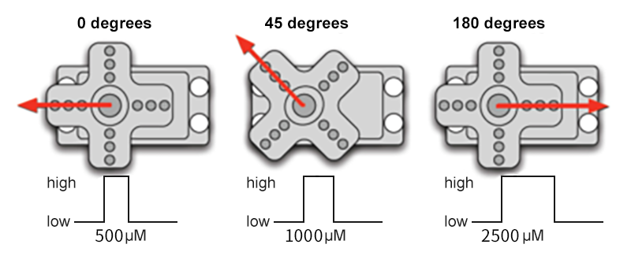

**Servo pins:**


**GND:** ground, in brown

**VCC:** for +5v power supply, in red

**S:** for signal pin, PWM signal control, in orange.


### 7.17.3 Components

|          |            |  |
| :-----------------------------------: | :-----------------------------------: | :---------------------: |
|          ESP32 main board x1          |               servo x1                |      USB cable x1       |
|  |  |                         |
|     AA battery x6 (self-provided)     |           battery holder x1           |                         |

### 7.17.4 Wiring Diagram

**Schematic diagram:**


**Wiring diagram:**


### 7.17.5 Test Code

Before uploading code, please import library first. In this project, it is saved in `lib` file named `ESP32Servo.zip`. If you meet trouble during importing libraries, please back to Chapter [4.7  Import Library](https://docs.keyestudio.com/projects/KT0303/en/latest/docs/Arduino_Tutorial.html#import-library).


The test code is saved in `Code` file named `7_17_Set_Servo_Angle`:


Open `7_17_Set_Servo_Angle.ino` in Arduino IDE.

```c
/*  
 * Filename   : 7_17_Set_Servo_Angle
 * Function   : servo rotation, from 0 degrees to 90 degrees to 180 degrees in turn
 * Compiling IDE: ARDUINO 2.3.4
 * Author: https://www.keyestudio.com/
*/
#include <ESP32Servo.h>

Servo myservo;             // create servo object to control a servo
const int Servo_Pin = 4;  // GPIO pin used to connect the servo control (digital out)

void setup() {
  myservo.attach(Servo_Pin);   //attaches the servo on pin to the servo object
}

void loop() {
  myservo.write(0);    // set servo angle to 0 degree
  delay(1000);         // delay 1s
  myservo.write(90);   // set servo angle to 90 degree
  delay(1000);         // delay 1s
  myservo.write(180);  // set servo angle to 180 degree
  delay(1000);         // delay 1s
}
```


### 7.17.6 Test Result

After wiring up and uploading the code to the board, connect to the battery holder (the USB power may not meet the need of servo working voltage). The servo rotates from 0° to 90° then to 180°. And then it back to 0° to repeat the rotation. If you have a puzzle of how to upload code, please back to Chapter [4.6 Upload Code on Arduino IDE](https://docs.keyestudio.com/projects/KT0303/en/latest/docs/Arduino_Tutorial.html#upload-code-on-arduino-ide).


## 7.18 Fan Motor

### 7.18.1 Introduction

Here we introduce you a mini fan motor, a common heat-dissipation device that drives the fan to rotate to generate airflow for cooling down. This project covers its working principle, pin functions, circuit design and how to control fan on/off and speed by microcontroller(like Arduino). So you can program to control fan rotating. 

Through the experiment, whether you are a beginner or an electronics enthusiast, you can easily apply the fan to temperature regulation, ventilation system and electronic equipment cooling.

### 7.18.2 Component Knowledge


DC motor works based on electromagnetic induction and Lorentz force. 

Its core includes a stator, a rotor and a commutator. The stator generates a fixed magnetic field, and the rotor (armature) consists of a winding coil, which generates a magnetic field after powering on. When the current enters the rotor coil through the rotor and commutator, the rotor magnetic field interacts with the stator magnetic field, generating a Lorentz force that drives the rotor to rotate. The commutator switches the direction of the current as the rotor rotates, ensuring that the rotor is continuously subjected to forces in the same direction, thus maintaining the rotation. 

Through the action of electromagnetic induction and Lorentz force, DC motor converts electrical energy into mechanical one. 

It is widely used in power tools, electric vehicles and household appliances due to its good speed regulation performance and large starting torque.

Note: DC motor cannot be driven directly by pins of the development board. If so, the board may be burned out. So we control the motor ta relay.


### 7.18.3 Components

|            |    |  |
| :-------------------------------------: | :---------------------------: | :-------------------------: |
|           ESP32 main board x1           |           relay x1            |         DC motor x1         |
|        |        |    |
|                 fan x1                  |       F-F DuPont wires        |         jump wires          |
|                  |    |  |
|              USB cable x1               | AA battery x6 (self-provided) |      battery holder x1      |
|  |                               |                             |
|             screwdriver x1              |                               |                             |

### 7.18.4 Wiring Diagram

**Schematic diagram:**


**Wiring diagram:**


### 7.18.5 Test Code

The test code is saved in `Code` file named `7_18_Relay_Control_Motor`:


Open `7_18_Relay_Control_Motor.ino` in Arduino IDE.

```c
/*  
 * Filename   : 7_18_Relay_Control_Motor
 * Function   : relay controls 5V to power motor
 * Compiling IDE: ARDUINO 2.3.4
 * Author: https://www.keyestudio.com/
*/
const int Relay_Pin = 12;  // set relay pin to IO12

void setup() {
  pinMode(Relay_Pin, OUTPUT);    // set relay pin to output
  digitalWrite(Relay_Pin, LOW);  // set relay initial state to off
}
void loop() {
  digitalWrite(Relay_Pin, HIGH);  //set relay NO to off, motor works
  delay(2000);                    //delay 2s
  digitalWrite(Relay_Pin, LOW);   //set relay NO to on, motor stops working
  delay(2000);                    //delay 2s
}
```


### 7.18.6 Test Result

After wiring up and uploading the code to the board, the relay works. It allows the 5V supply to turn on the motor, and then it disconnects to the supply to turn off the motor. If you have a puzzle of how to upload code, please back to Chapter [4.6 Upload Code on Arduino IDE](https://docs.keyestudio.com/projects/KT0303/en/latest/docs/Arduino_Tutorial.html#upload-code-on-arduino-ide).

## 7.19 Ultrasonic Sensor

### 7.19.1 Introduction

Here we introduce you a ultrasonic sensor, a kind of ultrasonic distance measurer that is widely used in obstacle avoidance and detection. This project covers its working principle, pin functions, circuit design and how to detect distance by microcontroller(like Arduino). So you can program to measure distance in real-time, detect obstacles, and filter and calibrate data.

Through the experiment, whether you are a beginner or an electronics enthusiast, you can easily apply the ultrasonic sensor to perceive accurate distances.

### 7.19.2 Component Knowledge


**Parameters:**

- Ultrasonic sensor operating voltage: DC 5V 
- Ultrasonic sensor operating current: 15mA
- Ultrasonic sensor operating frequency: 40Hz
- Ultrasonic sensor detection range: 3cm~3m
- Ultrasonic sensor measuring angle: <= 15 degrees
- Ultrasonic sensor input trigger signal: TTL pulse of 10 uS
- Ultrasonic sensor output echo signal: The output TTL level signal is proportional to the range
- Operating temperature0°C ~ +50°C
- Ultrasonic sensor dimensions: 45.5mm x 26.7mm x 17.6mm

**Working principle:**

The most common ultrasonic ranging method is the echo detection. When a pulse voltage is triggered (MCU sends a high level to the Trig pin), the chip in the ultrasonic transmitter will vibrate to generate ultrasonic waves. As long as the emitter emits these waves towards certain direction, the counter start to count. Waves travel and reflect back once encountering an obstacle (Echo pin sends a high level to MCU). Then the counter will stop counting when the receiver receives the ultrasonic waves coming back.

The ultrasonic wave is also sound wave, and its speed of sound V is related to temperature. Generally, it travels 340m/s in the air. According to time(t), we can calculate the distance(s) from the emitting spot to the obstacle: s=340t/2.


The HC-SR04 ultrasonic sensor can detect distance of 2cm-3m without direct contact, and its accuracy can reach as high as 3mm.

The module includes an ultrasonic transmitter, receiver and control circuit. 

(1) First pull down the TRIG, and then trigger it with at least 10us high level signal;

(2) After triggering, the module will automatically transmit eight 40KHZ square waves, and automatically detect whether there is a signal to return.

(3) If there is a signal returned back, through the ECHO to output a high level, the duration time of high level is actually the time from emission to reception of ultrasonic.

(4) Distance = (high level time x speed of sound (340M/S)) / 2


**ATTENTION:**

This module should not be powered on when connecting. If necessary, connect GND first.

The area of the object to be measured should be at least 0.5m² and as flat as possible. Otherwise, it will affect the result.

### 7.19.3 Components

|  |  |  |  |
| :---------------------------: | :-----------------------: | :---------------------: | ----------------------- |
|      ESP32 main board x1      |   ultrasonic sensor x1    |    F-F DuPont wires     | USB cable x1            |

### 7.19.4 Wiring Diagram

**Schematic diagram:**


**Wiring diagram:**


### 7.19.5 Test Code

The test code is saved in `Code` file named `7_19_Read_Distance`:


Open `7_19_Read_Distance.ino` in Arduino IDE.

```c
/*  
 * Filename   : 7_19_Read_Distance
 * Function   : the ultrasonic sensor detects distance
 * Compiling IDE: ARDUINO 2.3.4
 * Author: https://www.keyestudio.com/ 
*/
// Define pins for the ultrasonic sensor
const int trigPin = 13;
const int echoPin = 12;

// Function prototype for reading sensor data
float readSensorData();

void setup() {
  // Begin serial communication at 115200 baud rate
  Serial.begin(9600);
  // Set echoPin as input and trigPin as output
  pinMode(trigPin, OUTPUT);
  pinMode(echoPin, INPUT);
  // Print sensor information to the serial monitor
  Serial.println("Ultrasonic sensor:");  
}

void loop() {
  // Read distance from the ultrasonic sensor
  float distance = readSensorData();
  // Print the measured distance to the serial monitor
  Serial.print("distance: ");
  Serial.print(distance);   
  Serial.println(" cm");
  // Delay between readings
  delay(100);
}

// Function to read data from the ultrasonic sensor
float readSensorData() {
  // Trigger a low signal before sending a high signal
  digitalWrite(trigPin, LOW); 
  delayMicroseconds(2);
  // Send a 10-microsecond high signal to the trigPin
  digitalWrite(trigPin, HIGH); 
  delayMicroseconds(10);
  // Return to low signal
  digitalWrite(trigPin, LOW);
  
  // Measure the duration of the high signal on the echoPin
  unsigned long microsecond = pulseIn(echoPin, HIGH);

  // Calculate the distance using the speed of sound (29.00µs per centimeter)
  float distance = microsecond / 29.00 / 2;

  // Return the calculated distance
  return distance;
}
```


### 7.19.6 Test Result

After wiring up and uploading the code to the board, click  in the upper right corner of Arduino IDE to open the serial monitor and set baud rate to `9600`. The monitor prints the distance values detected by the ultrasonic sensor,Adjusting the distance between the ultrasonic sensor and the obstacle will allow you to observe changes in the measured distance. If you have a puzzle of how to upload code, please back to Chapter [4.6 Upload Code on Arduino IDE](https://docs.keyestudio.com/projects/KT0303/en/latest/docs/Arduino_Tutorial.html#upload-code-on-arduino-ide).

**Serial monitor output:**


### 7.19.7 Code Explanation

```c
float readSensorData() {
    ...
}
```

Ultrasonic ranging function. This is a custom function to read the ultrasonic distance and simplify the code.

---------------

```c
delayMicroseconds(2);
```

Microsecond delay function. Official definition: [delayMicroseconds() | Arduino Documentation](https://docs.arduino.cc/language-reference/en/functions/time/delayMicroseconds/)

1S = 1000mS; 1mS = 1000uS

--------------

```c
  // Measure the duration of the high signal on the echoPin
  unsigned long microsecond = pulseIn(echoPin, HIGH);
```

Read pin pulse function. Official definition: [pulseIn() | Arduino Documentation](https://docs.arduino.cc/language-reference/en/functions/advanced-io/pulseIn/)

----------

```c
  // Return the calculated distance
  return distance;
```

Return function. End the function and return the value to the calling function. Official definition: [return | Arduino Documentation](https://docs.arduino.cc/language-reference/en/structure/control-structure/return/)

----------------

## 7.20 Joystick Module

### 7.20.1 Introduction

Here we introduce you a joystick module, a kind of sensor that can detect and output data on axis X, Y and Z so is widely used in attitude detection, motion control and virtual reality. This project covers its working principle, pin functions, circuit design and how to read and process axial data by microcontroller(like Arduino). So you can program to detect attitude and motion in real-time, and calibrate and filter data.

Through the experiment, whether you are a beginner or an electronics enthusiast, you can easily apply the joystick sensor to sensing motions.

### 7.20.2 Component Knowledge


Inside the module, there are two adjustable potentiometers (left and right, up and down) and a button. When the button is not pressed, R1 is pulled down to low; When the button is pressed, VCC is connected so it is at high. The button level is the opposite of the one we have learned before. 

Pull the joystick in any direction, the internal potentiometer will accordingly move to adjust voltage output and read analog values:


It mainly uses PS2 joystick components. In fact, the joystick module comes with 3 signal terminals, which simulate a three-dimensional space. Pins are GND, VCC, and signal terminals (B, X, Y). The signal terminals X and Y simulate the X-axis and Y-axis of the space. When controlling, the X and Y signal terminals of the module are connected to the analog port of the microcontroller. The signal terminal B simulates the Z axis of the space, it is generally connected to the digital port and used as a button.

VCC is connected to the power output V/VCC (3.3/5V), GND is connected to G/GND, the voltage in the original state is about 1.65V/2.5V. 

In the X-axis direction, when moving in the direction of the arrow, the voltage value increases till reach the maximum voltage. Moving in the opposite direction, the voltage value gradually decreases to the minimum. 

In the Y-axis direction, the voltage value decreases gradually as it moves in the direction of the arrow on the module till to the minimum. As the arrow is moved in the opposite direction, the voltage value increases to the maximum. 

In the Z-axis direction, the signal terminal B is connected to the digital port and outputs 0 in the original state and outputs 1 when pressed. 

In this way, we can read the two analog values and a high/low level of the digital port to determine the operating status of the joystick.

**Direction of axis X and Y:**


### 7.20.3 Components

|  |  |  |  |
| :---------------------------: | :---------------------: | :---------------------: | ----------------------- |
|      ESP32 main board x1      |   joystick module x1    |    F-F DuPont wires     | USB cable x1            |

### 7.20.4 Wiring Diagram

**Schematic diagram:**


**Wiring diagram:**


### 7.20.5 Test Code

The test code is saved in `Code` file named `7_20_Read_Joystick`:


Open `7_20_Read_Joystick.ino` in Arduino IDE.

```c
/*  
 * Filename   : 7_20_Read_Joystick
 * Function   : read joystick values
 * Compiling IDE: ARDUINO 2.3.4
 * Author: https://www.keyestudio.com/ 
*/
int VRX_Pin = 36;  //set X axis pin to IO36
int VRY_Pin = 39;  //set Y axis pin to IO39
int SW_Pin = 26;    //set B axis pin to IO26

int xPosition = 0;  //set variable xPosition initial value to 0
int yPosition = 0;  //set variable yPosition initial value to 0
int SW_state = 0;  //set variable SW_state initial value to 0

void setup() {
Serial.begin(9600); 
pinMode(VRX_Pin, INPUT);  //X axis pin to input
pinMode(VRY_Pin, INPUT);  //Y axis pin to input
pinMode(SW_Pin, INPUT_PULLUP);   //Z axis pin to input pull-up
}

// In loop(), use analogRead() to read the X-axis and Y-axis values, and use digitalRead() to read the Z-axis values, and then display them.
void loop() {
  xPosition = analogRead(VRX_Pin); 
  yPosition = analogRead(VRY_Pin);
  SW_state = digitalRead(SW_Pin);
  Serial.print("X: ");
  Serial.print(xPosition);
  Serial.print(" | Y: ");
  Serial.print(yPosition);
  Serial.print(" | Button: ");
  Serial.println(SW_state);
  delay(100);
}
```


### 7.20.6 Test Result

After wiring up and uploading the code to the board, click  in the upper right corner of Arduino IDE to open the serial monitor and set baud rate to `9600`. The monitor prints the values of three axes,Moving the joystick will show real-time changes in the X/Y values, while pressing it will trigger a change in the button's value. If you have a puzzle of how to upload code, please back to Chapter [4.6 Upload Code on Arduino IDE](https://docs.keyestudio.com/projects/KT0303/en/latest/docs/Arduino_Tutorial.html#upload-code-on-arduino-ide).


**Serial monitor output:**


## 7.21 Soil Humidity Sensor

### 7.21.1 Introduction

Here we introduce you a soil humidity sensor, an electronic device used to measure the moisture content of soil, which is widely used in agricultural irrigation, gardening and environment monitoring. This project covers its working principle, pin functions, circuit design and how to read and process humidity data by microcontroller(like Arduino). So you can program to monitor humidity in real-time, automatically control irrigation as well as perform data calibration and error correction.

Through the experiment, whether you are a beginner or an electronics enthusiast, you can easily apply the sensor to manage soil humidity intelligently.

### 7.21.2 Component Knowledge


The sensor measures humidity by detecting changes in the electrical conductivity of the soil. When the soil is short of water, the electrical conductivity decreases and the sensor analog value decreases. On the contrary, if the soil is wet, the analog value increases. It is simple and practical, suitable for agricultural irrigation and horticulture.


### 7.21.3 Components

|  |  |  |  |
| :---------------------------: | :-----------------------: | :---------------------: | ----------------------- |
|      ESP32 main board x1      |  soil humidity sensor x1  |    F-F DuPont wires     | USB cable x1            |

### 7.21.4 Wiring Diagram

**Schematic diagram:**


**Wiring diagram:**


### 7.21.5 Test Code

The test code is saved in `Code` file named `7_21_Soil`:


Open `7_21_Soil.ino` in Arduino IDE.

```c
/*  
 * Filename   : 7_21_Soil
 * Function   : read soil humidity values
 * Compiling IDE: ARDUINO 2.3.4
 * Author: https://www.keyestudio.com/ 
*/
const int Soil_Pin = 33;  //set soil humidity sensor to pin IO33

void setup() {
Serial.begin(9600); 
pinMode(Soil_Pin, INPUT);  //set pin to input

}

void loop() {
  //read sensor analog value
  int soil_Val = analogRead(Soil_Pin);  
  //print the humidity values
  Serial.print("Soil Humidity: ");  
  Serial.println(soil_Val);
  delay(100);
}
```


### 7.21.6 Test Result

After wiring up and uploading the code to the board, click  in the upper right corner of Arduino IDE to open the serial monitor and set baud rate to `9600`. The monitor prints the analog values of the soil humidity sensor,If you don't have a potted plant, you can lightly moisten a paper towel with water to simulate soil moisture. If you have a puzzle of how to upload code, please back to Chapter [4.6 Upload Code on Arduino IDE](https://docs.keyestudio.com/projects/KT0303/en/latest/docs/Arduino_Tutorial.html#upload-code-on-arduino-ide).


**Serial monitor output:**


## 7.22 Water Level Sensor

### 7.22.1 Introduction

Here we introduce you a water level sensor, a kind of liquid depth detector that is widely used in water tower monitoring, tank management and environment monitoring. This project covers its working principle, pin functions, circuit design and how to read and process water level data by microcontroller(like Arduino). So you can program to monitor water level in real-time, alarm when over-lined as well as perform data calibration and error correction.

Through the experiment, whether you are a beginner or an electronics enthusiast, you can easily apply the sensor to manage water level accurately.

### 7.22.2 Component Knowledge


Same as the previous one, this water level sensor works according to changes in the electrical conductivity. The less detection area the water covers, the lower electrical conductivity and the sensor analog value will be. It is simple and practical, suitable for agricultural irrigation and horticulture.

Please note that the sensor is non-waterproof, except the detection area.


### 7.22.3 Components

|  |  |  |  |
| :---------------------------: | :-----------------------------------: | :---------------------: | ----------------------- |
|      ESP32 main board x1      |         water level sensor x1         |    F-F DuPont wires     | USB cable x1            |


### 7.22.4 Wiring Diagram

**Schematic diagram:**


**Wiring diagram:**


### 7.22.5 Test Code

The test code is saved in `Code` file named `7_22_Water_Level_Sensor`:


Open `7_22_Water_Level_Sensor.ino` in Arduino IDE.

```c
/*  
 * Filename   : 7_22_Water_Level_Sensor
 * Function   : read water level sensor value
 * Compiling IDE: ARDUINO 2.3.4
 * Author: https://www.keyestudio.com/ 
*/
const int Water_Level_Pin = 34;  //set sensor pin to IO34

void setup() {
Serial.begin(9600); 
pinMode(Water_Level_Pin, INPUT);  //set the pin to input

}

void loop() {
  //read the water level sensor value
  int waterLevel_Val = analogRead(Water_Level_Pin);  
  //print the value
  Serial.print("Water Level Value: ");  
  Serial.println(waterLevel_Val);
  delay(100);
}
```


### 7.22.6 Test Result

After wiring up and uploading the code to the board, click  in the upper right corner of Arduino IDE to open the serial monitor and set baud rate to `9600`. The monitor prints the analog values of the water level sensor,Place the water level sensor into the container, then slowly add water—being careful not to exceed the safety line. If you have a puzzle of how to upload code, please back to Chapter [4.6 Upload Code on Arduino IDE](https://docs.keyestudio.com/projects/KT0303/en/latest/docs/Arduino_Tutorial.html#upload-code-on-arduino-ide).

**Serial monitor output:**


## 7.23 Water Pump

### 7.23.1 Introduction

Here we introduce you a mini water pump, a liquids transporting device that is widely used in agricultural irrigation, aquarium management and industrial fluid control. This project covers its working principle, pin functions, circuit design and how to control by microcontroller(like Arduino). So you can program to accomplish automatic control, timed operations and linkage control with other sensors such as water level sensor.

Through the experiment, whether you are a beginner or an electronics enthusiast, you can easily apply the water pump to efficiently deliver liquid in your projects.

### 7.23.2 Component Knowledge


The water pump deliver liquid from a low pressure area to a high one by motor drive impeller or piston movement. It converts electrical energy into mechanical energy and then into liquid kinetic energy, which is widely used in fields of household, agriculture and industry.

Note: The water pump, like the motor, cannot be driven directly by the IO ports, otherwise the board may be burned out.

**Disassembly diagram of the water pump:**


### 7.23.3 Components

|            |    |  |
| :-------------------------------------: | :---------------------------: | :---------------------------------: |
|           ESP32 main board x1           |           relay x1            |            water pump x1            |
|      |        |            |
|              water pipe x1              |       F-F DuPont wires        |             jump wires              |
|                  |    |          |
|              USB cable x1               | AA battery x6 (self-provided) |          battery holder x1          |
|  |                               |                                     |
|             screwdriver x1              |                               |                                     |


### 7.23.4 Wiring Diagram

**Schematic diagram:**


**Wiring diagram:**


### 7.23.5 Test Code

The test code is saved in `Code` file named `7_23_Water_Pump`:


Open `7_23_Water_Pump.ino` in Arduino IDE.

```c
/*  
 * Filename   : 7_23_Water_Pump
 * Function   : relay controls 5V to power water pump
 * Compiling IDE: ARDUINO 2.3.4
 * Author: https://www.keyestudio.com/
*/
const int Relay_Pin = 12;  // set relay pin to IO12

void setup() {
  pinMode(Relay_Pin, OUTPUT);    // set relay pin to output
  digitalWrite(Relay_Pin, LOW);  // set relay initial state to off
}
void loop() {
  digitalWrite(Relay_Pin, HIGH);  //set relay NO off, the water pump works
  delay(2000);                    //delay 2s
  digitalWrite(Relay_Pin, LOW);   //set relay NO on, the water pump stops working
  delay(2000);                    //delay 2s
}
```


### 7.23.6 Test Result

After wiring up and uploading the code to the board,  the relay works. It allows the 5V supply to turn on the water pump for 2 seconds, and then it disconnects to the supply to turn off the water pump. If you have a puzzle of how to upload code, please back to Chapter [4.6 Upload Code on Arduino IDE](https://docs.keyestudio.com/projects/KT0303/en/latest/docs/Arduino_Tutorial.html#upload-code-on-arduino-ide).

## 7.24 IR Receiver

### 7.24.1 Introduction

Here we introduce you an IR receiver, a device that receives IR remote control signals and is widely used in home appliance, remote control toys and automation systems. This project covers its working principle, pin functions, circuit design and how to decode and process infrared signals by microcontroller(like Arduino). So you can program to identify control signals, custom remote controls, and filter signals and process errors.

Through the experiment, whether you are a beginner or an electronics enthusiast, you can easily apply the IR receiver to remotely control your projects.

### 7.24.2 Component Knowledge


**IR receiver:** 

It is a VS1838B infrared receiving sensor element, which can receive infrared light, so it can be used to detect the infrared signal emitted by remote control.

IR receiver integrates reception, amplification and demodulation. The received infrared signal has been adjusted in its internal IC (converting the infrared signal back to binary), so the output is a digital signal. It can receive the standard 38KHz modulated remote control signal.

- S: signal output
- GND(-) : GND
- VCC(+) : power supply, 3.3V~5V


**IR remote control:**

It is currently the most common means of communication and remote control. An infrared(IR) remote control is a low-cost and easy-to-use wireless communication technology. IR light is very similar to visible light, except that its wavelength is slightly longer. This means that infrared rays cannot be detected by the human eye, which is perfect for wireless communication. 

For example, when you press a button on the TV remote control, an infrared LED will switch on and off repeatedly at a frequency of 38,000 times per second, transmitting information (such as volume or channel control) to the infrared sensor on the TV. 

As it features small size, low power consumption, strong function and low cost, it is widely used in small electrical equipment, like recorders, audio equipment, air conditioners and electrical toys.

Its transmitting circuit adopts infrared light-emitting diode to emit modulated infrared waves. The infrared receiving circuit consists of an infrared receiving diode and a triode / a silicon photocell, which converts the emitted infrared light into corresponding electrical signals and then sends them to the post amplifier.

The remote control in this kit is coded by NEC.


- Dimensions: 86x40x7mm
- Remote control range: about 8-10m
- Battery: 3V button lithium manganese battery
- Infrared carrier frequency: 38KHz
- Effective life: more than 20,000 times


**Installing the CR2025 Battery in the Remote Control**

<span style="color:red;font-size:20px;">Note: This remote control does not include batteries. You need to purchase a CR2025 coin cell battery separately. The battery type is shown in the image below:</span>


"To remove: Push the Position ① latch rightward while pulling down the battery holder. To reinstall: Insert batteries (observe polarity) and push the holder back until secured."


**Important: Match the battery's positive (+) and negative (-) ends to the corresponding symbols in the battery holder (see illustration).**


**Infrared signal modulation process diagram:**


### 7.24.3 Components

|                |      |  |
| :-----------------------------------------: | :-----------------------: | :-----------------------: |
|             ESP32 main board x1             |      IR receiver x1       |      10K resistor x1      |
|        |  |    |
|                breadboard x1                |        jump wires         |       USB cable x1        |
|  |                           |                           |
|            IR remote control x1             |                           |                           |

### 7.24.4 Wiring Diagram

**Schematic diagram:**


**Wiring diagram:**


### 7.24.5 Test Code

Before uploading code, please import library first. In this project, it is saved in `lib` file named `IRremote.zip`. If you meet trouble during importing libraries, please back to Chapter [4.7  Import Library](https://docs.keyestudio.com/projects/KT0303/en/latest/docs/Arduino_Tutorial.html#import-library).


The test code is saved in `Code` file named `7_24_Read_IR_Receiver`:


Open `7_24_Read_IR_Receiver.ino` in Arduino IDE.

```c
/*  
 * Filename   : 7_24_Read_IR_Receiver
 * Function   : IR receiver reads the IR remote control key value
 * Compiling IDE: ARDUINO 2.3.4
 * Author: https://www.keyestudio.com/
*/
#include <IRremote.hpp>  // import IRremote library

#define DECODE_NEC  // Only the NEC protocol is enabled

const int IR_Pin = 5;  //set the IR receiver pin to IO5

void setup() {
  Serial.begin(9600);  // set baud rate to 9600
  while (!Serial)
    ;  // wait for initialization

  Serial.println(F("Ready to receive NEC IR signals..."));

  IrReceiver.begin(IR_Pin, ENABLE_LED_FEEDBACK);  // Initiate reception using pin IO5
}

void loop() {
  if (IrReceiver.decode()) {  // Detect whether an infrared signal is received
    if (IrReceiver.decodedIRData.protocol != UNKNOWN) {
      // Print the received key values and convert to decimal
      long IR_Value = IrReceiver.decodedIRData.command;
      Serial.print("IR Value:");
      Serial.println(IR_Value);  // Print key values in decimal
    }
    IrReceiver.resume();  // Stand by to receive the next infrared signal
  }
  delay(100);
}
```


### 7.24.6 Test Result

After wiring up and uploading the code to the board, click  in the upper right corner of Arduino IDE to open the serial monitor and set baud rate to `9600`. Press the keys on IR remote control, and the IR receiver catches its signals. Then the monitor prints the received key values of the remote control. If you have a puzzle of how to upload code, please back to Chapter [4.6 Upload Code on Arduino IDE](https://docs.keyestudio.com/projects/KT0303/en/latest/docs/Arduino_Tutorial.html#upload-code-on-arduino-ide).

**Serial monitor output:**

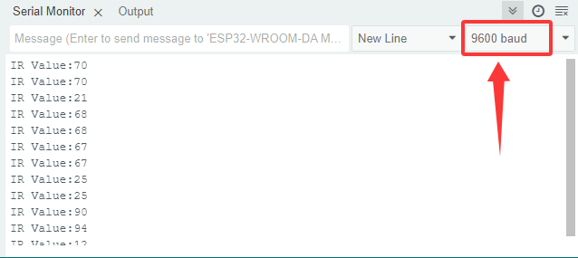

**The values corresponding to each key on the IR remote control**

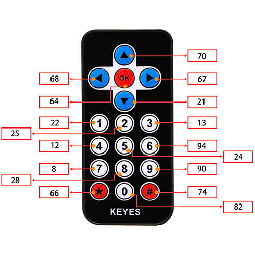

## 7.25 4x4 Matrix Key Pad

### 7.25.1 Introduction

Here we introduce you a 4x4 matrix key pad, a common input device that contains 16 keys (1, 2, 3, 4, 5, 6, 7, 8, 9, 0, *, #, A, B, C, D). This project covers its working principle, pin functions, circuit design and how to read key values by microcontroller(like Arduino). So you can program to identify key states and eliminate jitters.

Through the experiment, whether you are a beginner or an electronics enthusiast, you can easily apply the key pad to control user input of your projects.

### 7.25.2 Component Knowledge


**4*4 matrix key pad:** is a matrix device that integrates 4x4 = 16 keys:


In a 4x4 key pad, each row/column of keys is connected with a pin, which reduces the processor ports. The internal circuit is shown below.


When using, we detect the state of keys by scanning each column and row. Take the column scanning as an example, send low level to column 1(Pin1), detect the level status of row 5, 6, 7, 8 to determine whether A, B, C, D are pressed. The low levels are then sent to columns 2, 3, 4 in turn to detect if any other keys have been pressed. Then, you can get the states of all the keys.

### 7.25.3 Components

|  |  |  |  |
| :---------------------------: | :---------------------------: | :-----------------------: | ----------------------- |
|      ESP32 main board x1      |     4x4 matrix key pad x1     |        jump wires         | USB cable x1            |

### 7.25.4 Wiring Diagram

**Schematic diagram:**


**Wiring diagram:**


### 7.25.5 Test Code

Before uploading code, please import library first. In this project, it is saved in `lib` file named `Keypad.zip`. If you meet trouble during importing libraries, please back to Chapter [4.7  Import Library](https://docs.keyestudio.com/projects/KT0303/en/latest/docs/Arduino_Tutorial.html#import-library).


The test code is saved in `Code` file named `7_25_Keypad`:


Open `7_25_Keypad.ino` in Arduino IDE.

```c
/*  
 * Filename   : 7_25_Keypad
 * Function   : read thin film 4*4 key pad values
 * Compiling IDE: ARDUINO 2.3.4
 * Author: https://www.keyestudio.com/
*/
#include <Keypad.h> // include Keypad library

//Defines symbols of keys
const byte ROWS = 4;
const byte COLS = 4;
char keys[ROWS][COLS] = {
  {'1', '2', '3', 'A'},
  {'4', '5', '6', 'B'},
  {'7', '8', '9', 'C'},
  {'*', '0', '#', 'D'}
};

byte rowPins[ROWS] = {26, 25, 17, 16}; // set pins of rows
byte colPins[COLS] = {27, 14, 12, 13};   // set pins of columns

//Initialize an instance of the myKeypad class
Keypad myKeypad = Keypad(makeKeymap(keys), rowPins, colPins, ROWS, COLS);

void setup() {
  Serial.begin(9600); // set baud rate to 9600
  Serial.println("ESP32 is ready!");  // print “ESP32 is ready!”
}

void loop() {
  // Get character input
  char keyPressed = myKeypad.getKey();
  // If there is any character input, it is sent to the serial port
  if (keyPressed) {
    Serial.println(keyPressed);
  }
}
```


### 7.25.6 Test Result

After wiring up and uploading the code to the board, click  in the upper right corner of Arduino IDE to open the serial monitor and set baud rate to `9600`. The monitor prints the key values of the module. If you have a puzzle of how to upload code, please back to Chapter [4.6 Upload Code on Arduino IDE](https://docs.keyestudio.com/projects/KT0303/en/latest/docs/Arduino_Tutorial.html#upload-code-on-arduino-ide).

**Serial monitor output:**


## 7.26 1.3-inch OLED

### 7.26.1 Introduction

Here we introduce you a 1.3-inch OLED that adopts the SSH1106 driver chip and can displays blue font. This project covers its working principle, pin functions, circuit design and how to show contents by microcontroller(like Arduino). So you can program to show texts and icons, scrolling strings and simple animations. Besides, you can set font, brightness and screen refresh optimization.

Through the experiment, whether you are a beginner or an electronics enthusiast, you can easily apply the OLED for vivid and clear visual effect.

### 7.26.2 Component Knowledge


**OLED** OLED is an organic light-emitting diode, also known as organic dot laser display. It has self-luminous properties, because it uses a very thin coating of organic materials and glass substrate that glow when an electric current passes through.

It consists of OLED panel and OLED drive chip. 

On the panel, there are may tiny pixels that can emit different colors. Each pixel consists of several layers of organic material sandwiched between two electrodes (anode and cathode). When an electric current flows through the electrode, the organic material emits light at different wavelengths depending on its composition. 

It uses SSH1106 chip to control the OLED panel pixels through IIC(Internal Integrated circuit) serial communication protocol. Its dimensions are 1.3 inches, resolution is 128*64 pixels, and display color is blue.

As for the chip, it converts signals from the Arduino into commands for the panel. The Arduino can send data to it via a library that controls the I2C protocol, for instance, Adafruit SSD1306 library. Thus, you can initialize OLED, set brightness levels, print text, graphics or images.

### 7.26.3 Components

|  |  |  |  |
| :---------------------------: | :---------------------------: | :---------------------: | ----------------------- |
|      ESP32 main board x1      |       1.3 inch OLED x1        |    F-F DuPont wires     | USB cable x1            |

### 7.26.4 Wiring Diagram

**Schematic diagram:**


**Wiring diagram:**


### 7.26.5 Test Code

Before uploading code, please import library first. In this project, it is saved in `lib` file named `GyverOLED.zip`. If you meet trouble during importing libraries, please back to Chapter [4.7  Import Library](https://docs.keyestudio.com/projects/KT0303/en/latest/docs/Arduino_Tutorial.html#import-library).


The test code is saved in `Code` file named `7_26_OLED_Display`:


Open `7_26_OLED_Display.ino` in Arduino IDE.

```c
/*  
 * Filename   : 7_26_OLED_Display
 * Function   : OLED shows “Hello!” in three sizes
 * Compiling IDE: ARDUINO 2.3.4
 * Author: https://www.keyestudio.com/
*/
#include <GyverOLED.h>  // Introduce GyverOLED library for controlling OLED display

GyverOLED<SSH1106_128x64> oled;  // Create an OLED object specifying the display model SSH1106 with a resolution of 128x64

void setup() {
  oled.init();   // initialize OLED
  oled.clear();  // Clear the screen, making sure it is initially blank
}

void loop() {

  oled.setScale(1);        // set size to 1
  oled.setCursorXY(0, 0);  // set character position
  oled.println("Hello!");  // show character
  oled.update();           // refresh

  oled.setScale(2);         // set size to 2
  oled.setCursorXY(0, 10);  // set character position
  oled.println("Hello!");   // show character
  oled.update();            // refresh

  oled.setScale(3);         // set size to 3 (large)
  oled.setCursorXY(0, 35);  // set character position
  oled.println("Hello!");   // show character
  oled.update();            // refresh
}
```

### 7.26.6 Test Result

After wiring up and uploading the code to the board, the OLED shows text `Hello!` in three sizes. If you have a puzzle of how to upload code, please back to Chapter [4.6 Upload Code on Arduino IDE](https://docs.keyestudio.com/projects/KT0303/en/latest/docs/Arduino_Tutorial.html#upload-code-on-arduino-ide).


## 7.27 RFID Module

### 7.27.1 Introduction

Here we introduce you a RFID-RC522 module based on radio frequency identification, which is widely used in access control systems, logistics management and intelligent payment. This project covers its working principle, pin configuration, circuit design and how to read and write flags by microcontroller(like Arduino). So you can program to recognize flags, store data and control access. In addition, methods of security authentication and error handling are included.

Through the experiment, whether you are a beginner or an electronics enthusiast, you can easily apply the RFID module for wireless identification.

### 7.27.2 Component Knowledge


**Transmission principle:**

The data read and written are done by radio waves between the non-contact IC card and the card reader. Their communication frequency is 13.56MHZ. 

The non-contact IC card, in fact, is a passive card. When the reader reads and writes the card, the signals it sent is composed of two parts: power signals(after received, the card generates an instant energy with its own L/C to supply the chip), and instruction and data signals (conduct data reading, modification, storage, etc., and the card returns the signal to the reader to finish one time of read and write). 

The reader, however, is generally composed of an MCU, a dedicated intelligent module and an antenna. It is equipped with a communication interface with the PC, a print port and I/O ports.

**Radio frequency card:**

Contactless IC card, also known as radio frequency card, is composed of IC chip and induction antenna. They are packaged in a standard PVC card without any exposure. This brand-new technology, a major breakthrough for electronic devices, successfully combines radio frequency identification and IC card, ending the problem of passive (no power in the card) and contactless. 

Pay attention that there is a certain distance (usually 5-10cm) of efficient reading, and the data is read and written through radio waves.

**Working Principle：**

The RF reader sends a electromagnetic waves to the IC card, and the frequency of an LC series resonant circuit in the card is the same as that emitted by the reader. In this way, the LC resonant circuit resonates under the excitation of the electromagnetic wave, so that a charge is generated in the capacitor. At the other end of this charge, there is a single-pass electronic pump, which sends the charge in the capacitor to another for storage. When the accumulated charge reaches 2V, this capacitor can be used as a power supply for other circuits, transmitting or receiving data.

**Functions of RC522 pins:**

- SDA - serial data (I/O port for IIC interface); NSS (slave flag pin) in SPI interface;
- SCK - SCK signal connected to MCU;
- MOSI - MCU output, RC522 receive (i.e. master output, slave input);
- MISO - RC522 output, MCU receive (i.e. slave output, master input);
- IRQ - interrupt request output;
- GND - ground;
- RST - reset;
- 3.3V -- VSS, operating voltage; if using 5V MCU, the voltage division is required.

### 7.27.3 Components

|  |        |  |  |
| :---------------------------: | :-----------------------------: | :---------------------: | ----------------------- |
|      ESP32 main board x1      |         RFID module x1          |    F-F DuPont wires     | USB cable x1            |
|  |  |                         |                         |
|          IC card x1           |            ID key x1            |                         |                         |

### 7.27.4 Wiring Diagram

**Schematic diagram:**

| MFRC522 pins | ESP32 pins |
| :----------: | :--------: |
|   SDA (SS)   |   GPIO5    |
|     SCK      |   GPIO18   |
|     MOSI     |   GPIO23   |
|     MISO     |   GPIO19   |
|     IRQ      |    none    |
|     GND      |    GND     |
|     RST      |   GPIO13   |
|     VCC      |    3.3V    |

**Wiring diagram:**


### 7.27.5 Test Code

Before uploading code, please import library first. In this project, it is saved in `lib` file named `rfid-master.zip`. If you meet trouble during importing libraries, please back to Chapter [4.7  Import Library](https://docs.keyestudio.com/projects/KT0303/en/latest/docs/Arduino_Tutorial.html#import-library).


The test code is saved in `Code` file named `7_27_Read_RFID`:


Open `7_27_Read_RFID.ino` in Arduino IDE.

```c
/*  
 * Filename   : 7_27_Read_RFID
 * Function   : read RFID value
 * Compiling IDE: ARDUINO 2.3.4
 * Author: https://www.keyestudio.com/
*/
#include <MFRC522.h>  // import MFRC522 library to control the MFRC522 RFID module

// set RFID pin
#define SS_PIN  5   // The chip selection pin (SS) of SPI, used to select the RFID module
#define RST_PIN 13  // Reset pin, used to reset the RFID module

// Create the MFRC522 object, passing in the SS pin and the reset pin
MFRC522 mfrc522(SS_PIN, RST_PIN);

void setup() {
  Serial.begin(9600);  // initialize serial baud rate to 9600, for debugging
  SPI.begin();           // initialize SPI communication, configure the SPI interface with MFRC522
  mfrc522.PCD_Init();    // initialize MFRC522 RFID, set SPI communication parameters
  Serial.println("RFID Reader Initialized. Place your card near the reader...");  // Prompt user to place RFID card
}

void loop() {
  // Check if a new RFID card is near and ready to read
  if (mfrc522.PICC_IsNewCardPresent() && mfrc522.PICC_ReadCardSerial()) {
    // If the card is detected and the card serial number (UID) is successfully read
    Serial.print("Card UID: ");  // print “Card UID:”
    for (byte i = 0; i < mfrc522.uid.size; i++) {
      // Loop through each byte of the card UID
      Serial.print(mfrc522.uid.uidByte[i] < 0x10 ? " 0" : " ");  // If the byte is less than 0x10, add a leading zero to ensure that the output format is consistent
      Serial.print(mfrc522.uid.uidByte[i], HEX);  // Print each byte in hexadecimal
    }
    Serial.println();  // Wrap the line to end UID output

    // Stop communication with the current card and release the SPI bus
    mfrc522.PICC_HaltA();
  }
}
```


### 7.27.6 Test Result

After wiring up and uploading the code to the board, click  in the upper right corner of Arduino IDE to open the serial monitor and set baud rate to `9600`. Place the IC card above the RFID module, and the monitor prints the IC card values. Note that the value varies from each IC card. If you have a puzzle of how to upload code, please back to Chapter [4.6 Upload Code on Arduino IDE](https://docs.keyestudio.com/projects/KT0303/en/latest/docs/Arduino_Tutorial.html#upload-code-on-arduino-ide).

**Serial monitor output:**


# 8. Comprehensive Projects

Now that we know how to use each sensor, let’s put them together to make comprehensive experiments.

## 8.1 IR Remote Control Small Lamp

### 8.1.1 Introduction

Here we introduce you how to control LED by IR remote control and a button. We can control the LED on/off manually at a close range or remotely. 

With this project, you can program to decode infrared signals and detect button states when controlling the LED. In addition, methods of signal processing, state altering and error handling are included. Through the experiment, whether you are a beginner or an electronics enthusiast, you can easily apply the dual-control LED, making your project more flexible.

### 8.1.2 Components

|                |      |    |
| :-----------------------------------------: | :-----------------------: | :-----------------------: |
|             ESP32 main board x1             |      IR receiver x1       |        red led x1         |
|                      |  |  |
|                  button x1                  |     220Ω resistor x1      |      10K resistor x2      |
|        |  |    |
|                breadboard x1                |        jump wires         |       USB cable x1        |
|  |                           |                           |
|            IR remote control x1             |                           |                           |

### 8.1.3 Wiring Diagram


### 8.1.4 Code Flow


### 8.1.5 Test Code

The test code is saved in `Code` file named `8_1_Table_Lamp`:

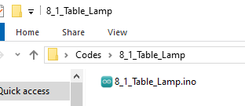

Open `8_1_Table_Lamp.ino` in Arduino IDE.

```c
/*  
 * Filename: 8_1_Table_Lamp
 * Function: Use IR remote control and button to realize dual control LED
 * Compile IDE: ARDUINO 2.3.4
 * Author: https://www.keyestudio.com/
*/
#include <IRremote.hpp>  // Import IRremote library

#define DECODE_NEC  // Only enable the NEC protocol

const int IR_Pin = 5;       //set ir receiver pin to IO5
const int Button_Pin = 14;  //set button pin to IO14
const int LED_Pin = 23;     //set LED pin to IO23

long IR_Value = 0;          //save remote control key values
bool Button_State = false;  //save button state, true: button is pressed, false: button is released
bool LED_State = false;     //save led states, false: LED off, true: LED on

void setup() {
  Serial.begin(9600);  // set baud rate

  IrReceiver.begin(IR_Pin, ENABLE_LED_FEEDBACK);  // Initiate reception using pin IO5
  pinMode(Button_Pin, INPUT);                     //Set the button pin to input
  pinMode(LED_Pin, OUTPUT);                       //Set led pin to output
}

void loop() {
  if (IrReceiver.decode()) {  // Detects whether an infrared signal is received
    if (IrReceiver.decodedIRData.protocol != UNKNOWN) {
      // Print the received key value (command value) and convert it to decimal
      IR_Value = IrReceiver.decodedIRData.command;
      //Check whether the key value is equal to 64. If so, reverse LED_State
      if (IR_Value == 64) {
        LED_State = !LED_State;
        delay(200);
      }
    }
    IrReceiver.resume();  // Stand by to receive the next infrared signal
  }
  Button_State = digitalRead(Button_Pin);  //Read key status
  if (Button_State == false) {             //Determine whether the button is pressed
    LED_State = !LED_State;                //reverse LED_State
    while (!digitalRead(Button_Pin))       //Use the While loop to prevent the led light from flashing while the key is being pressed
      ;
  }
  digitalWrite(LED_Pin, LED_State);  //control LED on/off
  delay(50); //delay 50ms
}
```


### 8.1.6 Test Result

After wiring up and uploading the code to the board, you can control the LED by both the button and the IR remote control. If you have a puzzle of how to upload code, please back to Chapter [4.6 Upload Code on Arduino IDE](https://docs.keyestudio.com/projects/KT0303/en/latest/docs/Arduino_Tutorial.html#upload-code-on-arduino-ide).


## 8.2 Car Backing Radar

### 8.2.1 Introduction

Here we introduce you how to build a simple car backing radar by an ultrasonic sensor and a buzzer. With this project, you can program to read distance values so as to control the sound frequency of the buzzer. In addition, methods of data filtering, threshold setting, and system optimization are included. Through the experiment, whether you are a beginner or an electronics enthusiast, you can easily build a simple car backing radar to detect distances, making your project more practical.

### 8.2.2  Components

|              |    |  |
| :---------------------------------------: | :-----------------------: | :-----------------------------------: |
|            ESP32 main board x1            |       USB cable x1        |             breadboard x1             |
|                  |    |          |
|              10K resistor x1              |      1K resistor x1       |           NPN transistor x1           |
|  |  |                |
|             active buzzer x1              |   ultrasonic sensor x1    |           F-F DuPont wires            |
|                  |                           |                                       |
|                jump wires                 |                           |                                       |

### 8.2.3 Wiring Diagram


### 8.2.2 Code Flow


### 8.2.4 Test Code

The test code is saved in `Code` file named `8_2_Parking_Sensor`:

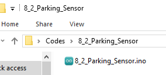

Open `8_2_Parking_Sensor.ino` in Arduino IDE.

```c
/*
 * Filename: 8_2_Parking_Sensor
 * Function: Use ultrasonic sensor and buzzer to alert the distance of obstacles
 * Compile IDE: ARDUINO 2.3.4
 * Author: https://www.keyestudio.com/ 
*/
const int Buzzer_Pin = 13;  // the buzzer pin
const int Trig_Pin = 16;
const int Echo_Pin = 17;

// Function prototype for reading sensor data
float readSensorData();

void setup() {
  pinMode(Buzzer_Pin, OUTPUT);  // Set as output
  // Set Echo_Pin as input and Trig_Pin as output
  pinMode(Trig_Pin, OUTPUT);
  pinMode(Echo_Pin, INPUT);
}

void loop() {

  float distance = readSensorData();             //Read distance value
  if (distance <= 30 && distance > 20) {         //determine whether the value is within 20~30. If yes, run code below
    digitalWrite(Buzzer_Pin, HIGH);              //active buzzer alarms
    delay(500);                                  //delay 500ms
    digitalWrite(Buzzer_Pin, LOW);               //active buzzer off
    delay(500);                                  //delay 500ms
  } else if (distance <= 20 && distance > 10) {  //determine whether the value is within 10~20. If yes, run code below
    digitalWrite(Buzzer_Pin, HIGH);              //active buzzer alarms
    delay(100);                                  //delay 100ms
    digitalWrite(Buzzer_Pin, LOW);               //active buzzer off
    delay(100);                                  //delay 100ms
  } else if (distance <= 10) {                   //determine whether the value is euqal to or less than 10. If yes, run code below
    digitalWrite(Buzzer_Pin, HIGH);              //active buzzer alarms
  } else {                                       //else
    digitalWrite(Buzzer_Pin, LOW);               //active buzzer off
  }
  delay(100);  // delay for a period of time and measure
}

// Function to read data from the ultrasonic sensor
float readSensorData() {
  // Trigger a low signal before sending a high signal
  digitalWrite(Trig_Pin, LOW);
  delayMicroseconds(2);
  // Send a 10-microsecond high signal to the Trig_Pin
  digitalWrite(Trig_Pin, HIGH);
  delayMicroseconds(10);
  // Return to low signal
  digitalWrite(Trig_Pin, LOW);
  // Measure the duration of the high signal on the Echo_Pin
  unsigned long microsecond = pulseIn(Echo_Pin, HIGH);
  // Calculate the distance using the speed of sound (29.00µs per centimeter)
  float distance = microsecond / 29.00 / 2;
  // Return the calculated distance
  return distance;
}
```


### 8.2.5 Test Result

After wiring up and uploading the code to the board, when the ultrasonic sensor detects an obstacle with 30-20cm in front, the buzzer slowly alarms. If the distance is within 20-10cm, the buzzer quickly alarms. If it is within 10cm, the buzzer keeps sounding. If you have a puzzle of how to upload code, please back to Chapter [4.6 Upload Code on Arduino IDE](https://docs.keyestudio.com/projects/KT0303/en/latest/docs/Arduino_Tutorial.html#upload-code-on-arduino-ide).

## 8.3 Fire Alarm

### 8.3.1 Introduction

Here we introduce you how to build a simple fire alarm by an LM35 temperature sensor, a flame sensor and a buzzer. With this project, you can program to read temperature values and detect flame to make the buzzer alarm. In addition, methods of data filtering, threshold setting, and system optimization are included. Through the experiment, whether you are a beginner or an electronics enthusiast, you can easily build a simple fire alarm, making your project more secure.

### 8.3.2 Components

|              |  |  |
| :---------------------------------------: | :---------------------: | :-----------------------------------: |
|            ESP32 main board x1            |      USB cable x1       |             breadboard x1             |
|                  |  |          |
|              10K resistor x2              |     1K resistor x1      |           NPN transistor x1           |
|  |    |  |
|             active buzzer x1              |         LM35 x1         |            flame sensor x1            |
|                  |                         |                                       |
|                jump wires                 |                         |                 8.3.                  |

### 8.3.3 Wiring Diagram


### 8.3.4 Code Flow


### 8.3.5 Test Code

The test code is saved in `Code` file named `8_3_Fire_Alarm`:


Open `8_3_Fire_Alarm.ino` in Arduino IDE.

```c
/*
 * Filename: 8_3_Fire_Alarm
 * Function: Use flame sensor, LM35 temperature sensor, buzzer to make fire alarm
 * Compile IDE: ARDUINO 2.3.4
 * Author: https://www.keyestudio.com/ 
*/

const int Buzzer_Pin = 13;  // the buzzer pin
const int Flame_Pin = 35;   //set flame sensor pin to GPIO35

const int LM35_Pin = 36;        //set lm35 pin to GPIO36
float temperature = 0;          //set variable temperature initial value to 0
long value = 0;                 //set variable value initial value to 0
float constant = 5.0 / 4095.0;  //Set the analog value constant for the calculated temperature

void setup() {
  pinMode(Buzzer_Pin, OUTPUT);  // Set as output
  pinMode(LM35_Pin, INPUT);     //set LM35_Pin to input
  pinMode(Flame_Pin, INPUT);    //set flame sensor pin to input
  Serial.begin(9600);
}

void loop() {

  int analogVal = analogRead(Flame_Pin);  //Read the analog signal of the flame sensor

  value = analogRead(LM35_Pin);            //Read analog input
  temperature = (value * constant * 100);  //Calculate temperature values
  
  if (analogVal > 500 || temperature > 50) {
    digitalWrite(Buzzer_Pin, HIGH);  //buzzer alarms
  } else {
    digitalWrite(Buzzer_Pin, LOW);  //buzzer off
  }
  delay(100);
}
```


### 8.3.6 Test Result

After wiring up and uploading the code to the board, when the flame sensor value reaches more than 500, or the temperature is over 50 degrees, the buzzer alarms. Otherwise, it keeps quiet. If you have a puzzle of how to upload code, please back to Chapter [4.6 Upload Code on Arduino IDE](https://docs.keyestudio.com/projects/KT0303/en/latest/docs/Arduino_Tutorial.html#upload-code-on-arduino-ide).

## 8.4 Digital Fan

### 8.4.1 Introduction

Here we introduce you how to build a mini fan by a motor, a fan, two buttons and a relay. With this project, you can program to detect two button states and control the motor via the relay, so as to turn on/off the fan. In addition, methods of state reading, relay control, and system optimization are included. Through the experiment, whether you are a beginner or an electronics enthusiast, you can easily build a mini fan, making your project more cooler.

### 8.4.2 Components

|            |    |                 |
| :-------------------------------------: | :---------------------------: | :-----------------------------------: |
|           ESP32 main board x1           |       8x8 dot matrix x1       |              DC motor x1              |
|        |        |  |
|                 fan x1                  |           button x2           |     button cap x2 (red and green)     |
|                    |        |              |
|             10K resistor x2             |       F-F DuPont wires        |              jump wires               |
|                  |    |            |
|              USB cable x1               | AA battery x6 (self-provided) |           battery holder x1           |
|  |                               |                                       |
|             screwdriver x1              |                               |                                       |

### 8.4.3 Wiring Diagram


### 8.4.4 Code Flow


### 8.4.5 Test Code

The test code is saved in `Code` file named `8_4_Electric_Fan`:


Open `8_4_Electric_Fan.ino` in Arduino IDE.

```c
/*  
 * Filename: 8_4_Electric_Fan
 * Function: Make a simple electric fan using relay, buttons, motor, and fan
 * Compile IDE: ARDUINO 2.3.4
 * Author: https://www.keyestudio.com/
*/
const int Relay_Pin = 12;  // set relay pin to IO12

const int Red_Button_Pin = 18;    // set red button pin to IO12
const int Green_Button_Pin = 19;  // set green button pin to IO12

bool Red_Button_State = true;    //store red button state value
bool Green_Button_State = true;  //store green button state value

void setup() {
  pinMode(Red_Button_Pin, INPUT);    // set red button pin to input 
  pinMode(Green_Button_Pin, INPUT);  // set green button pin to input 
  pinMode(Relay_Pin, OUTPUT);        // set relay pin to output

  digitalWrite(Relay_Pin, LOW);  // set relay initial state to off
}
void loop() {

  Red_Button_State = digitalRead(Red_Button_Pin);      //read red button state
  Green_Button_State = digitalRead(Green_Button_Pin);  //read green button state

  if (Red_Button_State == false) {           //determine whether the red button is pressed
    digitalWrite(Relay_Pin, LOW);            //turn relay NO on, fan stops
  } else if (Green_Button_State == false) {  //determine whether the green button is pressed
    digitalWrite(Relay_Pin, HIGH);           //turn relay NO off, fan rotates
  }
  delay(100);  //delay 100ms
}
```


### 8.4.6 Test Result

After wiring up and uploading the code to the board, press the green button and the fan rotates; press the red button and the fan stops working. If you have a puzzle of how to upload code, please back to Chapter [4.6 Upload Code on Arduino IDE](https://docs.keyestudio.com/projects/KT0303/en/latest/docs/Arduino_Tutorial.html#upload-code-on-arduino-ide).

## 8.5 Password Door

### 8.5.1 Introduction

Here we introduce you how to build a simple password door by an OLED display, a servo and a 4x4 key pad. With this project, you can program to read key values(1, 2, 3, 4, 5, 6, 7, 8, 9, 0, *, #, A, B, C, D) and compare them with the passwords you set. If the passwords is correct, the servo rotates to open the “door”. If not, the servo holds still. In addition, methods of key value reading, password storing, and system optimization are included. Through the experiment, whether you are a beginner or an electronics enthusiast, you can easily build a simple password lock, making your project more secure.

### 8.5.2 Components

|  |  |       |
| :---------------------------: | :---------------------------: | :-------------------------: |
|      ESP32 main board x1      |     4x4 matrix key pad x1     |          servo x1           |
|        |    |  |
|         1.3寸 OELD x1         | AA battery x6 (self-provided) |      battery holder x1      |
|      |        |      |
|          jump wires           |       F-F DuPont wires        |        USB cable x1         |

### 8.5.3 Wiring Diagram


### 8.5.4 Code Flow


### 8.5.5 Test Code

**Pay attention that the code needs three libraries to be imported before uploading the code. Otherwise, it will report an error!**

The test code is saved in `Code` file named `8_5_Password_Door`:


Open `8_5_Password_Door.ino` in Arduino IDE.

```c
/*  
 * Filename: 8_5_Password_Door
 * Function: Use OLED, 4x4 key pad, servo to make a simple password door
 * Compile IDE: ARDUINO 2.3.4
 * Author: https://www.keyestudio.com/
*/
#include <Keypad.h>     // include Keypad library
#include <GyverOLED.h>  // include GyverOLED library for controlling OLED display
#include <ESP32Servo.h>

Servo myservo;            // create servo object to control a servo
const int Servo_Pin = 4;  // GPIO pin used to connect the servo control (digital out)

GyverOLED<SSH1106_128x64> oled;  // Create an OLED object specifying the display model SSH1106 with a resolution of 128x64

//Define keys
const byte ROWS = 4;
const byte COLS = 4;
char keys[ROWS][COLS] = {
  { '1', '2', '3', 'A' },
  { '4', '5', '6', 'B' },
  { '7', '8', '9', 'C' },
  { '*', '0', '#', 'D' }
};

byte rowPins[ROWS] = { 26, 25, 17, 16 };  // connect the row pins to the key pad
byte colPins[COLS] = { 27, 14, 12, 13 };  // connect the column pins to the key pad

// Initialize an instance of the myKeypad class
Keypad myKeypad = Keypad(makeKeymap(keys), rowPins, colPins, ROWS, COLS);

String password = "1234";   //save passwords
String inputPassword = "";  //save entered passwords

void setup() {
  oled.init();                      // iniitalize OLED
  oled.clear();                     // Clear the screen, making sure it is initially blank
  oled.setCursorXY(0, 0);           // Set display position
  oled.println("Enter Password:");  // Prompt character
  oled.update();                    //Refresh display

  myservo.attach(Servo_Pin);  //attaches the servo on pin to the servo object
  myservo.write(0);           // Set the servo to 0 degrees
  delay(1000);                // delay 1s
}

void loop() {
  // Get character input
  char keyPressed = myKeypad.getKey();
  // If any characters are entered, send them to the serial port
  if (keyPressed) {
    Serial.println(keyPressed);

    //validate password
    if (keyPressed == '#') {
      if (inputPassword == password) {        //Check whether the entered password is correct
        oled.clear();                         //Clear OLED display
        oled.setCursorXY(0, 0);               // Set display position
        oled.println("Correct! Opening...");  //Password correct door opening prompt
        oled.update();                        //Refresh display
        myservo.write(180);                   //set servo to 180degree, open the door
        delay(2000);                          //delay 2s
        myservo.write(0);                     // set servo to 0degree, close the door
        inputPassword = "";                   // Clear input password
      } else {                                //If the password entered is incorrect, execute the following code
        oled.clear();
        oled.setCursorXY(0, 0);
        oled.println("Wrong! Try again.");  //Incorrect password prompt
        oled.update();
        inputPassword = "";
      }
      delay(1000);  //After judging the correctness of the password, OLED recovers the password prompt
      oled.clear();
      oled.setCursorXY(0, 0);
      oled.println("Enter Password:");
      oled.update();
    } else if (keyPressed == '*') {  //If you enter the wrong password, press the * key to clear and re-enter
      inputPassword = "";
      oled.clear();
      oled.setCursorXY(0, 0);
      oled.println("Enter Password:");
      oled.update();
    } else {  //If the input key is not '#' and '*', it means to enter the password again

      if (inputPassword.length() < 4) {  //Check whether the number of entered passwords is smaller than four
        inputPassword += keyPressed;     //Put all entered passwords in the variable inputPassword
        oled.clear();
        oled.setCursorXY(0, 0);
        oled.println("Enter Password:");
        oled.setCursorXY(0, 20);
        oled.println(inputPassword);  //Display the entered password
        oled.update();
      }
    }
  }
}
```


### 8.5.6 Test Result

After wiring up and uploading the code to the board, If you enter any combination of numbers other than "1, 2, 3, 4" and then press "#" to confirm the password, the servo will not rotate. Only by entering "1, 2, 3, 4" and then pressing "#" to confirm will the servo rotate from 0 degrees to 180 degrees, pause for two seconds, and then return to 0 degrees.If you have a puzzle of how to upload code, please back to Chapter [4.6 Upload Code on Arduino IDE](https://docs.keyestudio.com/projects/KT0303/en/latest/docs/Arduino_Tutorial.html#upload-code-on-arduino-ide).


## 8.6 Electronic Measuring Ruler

### 8.6.1 Introduction

Here we introduce you how to build an electronic measuring ruler by an ultrasonic sensor and an OLED display. With this project, you can program to read distances and reveal them on the OLED. Through the experiment, whether you are a beginner or an electronics enthusiast, you can easily make a simple electronic ruler, providing your projects with more accurate distance measurement and intuitive display.

### 8.6.2 Components

|  |  |  |
| :---------------------------: | :-----------------------: | :---------------------------: |
|      ESP32 main board x1      |   ultrasonic sensor x1    |       1.3-inch OLED x1        |
|        |    |                               |
|       F-F DuPont wires        |       USB cable x1        |                               |

### 8.6.3 Wiring Diagram


### 8.6.5 Test Code

The test code is saved in `Code` file named `8_6_Electronic_Ruler`:


Open `8_6_Electronic_Ruler.ino` in Arduino IDE.

```c
/*  
 * Filename: 8_6_Electronic_Ruler
 * Function: Use the ultrasonic sensor to measure distances
 * Compile IDE: ARDUINO 2.3.4
 * Author: https://www.keyestudio.com/ 
*/
#include <GyverOLED.h>  // Import GyverOLED library for controlling OLED display

GyverOLED<SSH1106_128x64> oled;  // Create an OLED object specifying the display model SSH1106 with a resolution of 128x64

// Define pins for the ultrasonic sensor
const int trigPin = 13;
const int echoPin = 12;

// Function prototype for reading sensor data
float readSensorData();

void setup() {
  oled.init();   // Initialize the OLED display
  oled.clear();  // Clear the screen, making sure it is initially blank
  // Set echoPin as input and trigPin as output
  pinMode(trigPin, OUTPUT);
  pinMode(echoPin, INPUT);
}

void loop() {
  // Read distance from the ultrasonic sensor
  float distance = readSensorData();

  oled.clear();               //Clear display
  oled.setScale(2);           // Set the font size to 2
  oled.setCursorXY(0, 0);     // Set display position
  oled.println("Distance:");  // wrap to display
  oled.print(distance);       // Display distance value
  oled.println("CM");         // wrap to display
  oled.update();              // Refresh display
  delay(100);
}

// Function to read data from the ultrasonic sensor
float readSensorData() {
  // Trigger a low signal before sending a high signal
  digitalWrite(trigPin, LOW);
  delayMicroseconds(2);
  // Send a 10-microsecond high signal to the trigPin
  digitalWrite(trigPin, HIGH);
  delayMicroseconds(10);
  // Return to low signal
  digitalWrite(trigPin, LOW);

  // Measure the duration of the high signal on the echoPin
  unsigned long microsecond = pulseIn(echoPin, HIGH);
  // Calculate the distance using the speed of sound (29.00µs per centimeter)
  float distance = microsecond / 29.00 / 2;
  // Return the calculated distance
  return distance;
}
```


### 8.6.6 Test Result

After wiring up and uploading the code to the board, the OLED shows the distance values detected by the ultrasonic sensor. If you have a puzzle of how to upload code, please back to Chapter [4.6 Upload Code on Arduino IDE](https://docs.keyestudio.com/projects/KT0303/en/latest/docs/Arduino_Tutorial.html#upload-code-on-arduino-ide).


## 8.7 LAN WIFI Control

### 8.7.1 Introduction

Here we introduce you how to control LED by ESP32 board and LAN WIFI. This project covers ESP32 WIFI configuration, circuit design and how to remote control through programming. With this project, you can learn how to set ESP32 as a WIFI Access Point (AP) and connect to an existing network, so as to control LED by commands from web pages. Through the experiment, whether you are a beginner or an electronics enthusiast, you can master WIFI control ESP32, making your project more flexible and powerful in remote control.

### 8.7.2 Working Principle

One of the most useful features of the ESP32 is its ability not only to connect to existing WiFi networks —— acting as a Web server, but also to create its own network —— allowing other devices to connect directly to it and access web pages. This is because the ESP32 can run in three modes: Station (STA) mode, Soft Access Point (AP) mode, and Station+AP mode.

- Station mode (active connection to the router as a WiFi device, also known as WiFi Client)
- AP mode (as an Access Point for other WiFi devices to connect to), also known as WiFi hotspot
- Station+AP mode (ESP32 connects to the router and is also a hotspot for other WiFi devices to connect)

All WiFi programming projects must configure the WiFi operating mode before using it. In this projec, we will learn the Station mode of the ESP32.

In Station mode, the ESP32 connects to an existing WiFi network (a network created by a wireless router).

When the ESP32 selects Station mode, it acts as a WiFi client and can connect to the router network to communicate with other devices on the router through a WiFi connection. As shown below, the mobile device (smartphone/tablet) and PC are connected to the same router, so the ESP32 is able to communicate with them.


In this mode, the ESP32 gets its IP address from the wireless router it is connected to. By using this IP address, it can set up a Web server and serve web pages to all connected devices on the WiFi network.

Note: This can only work in one LAN, that is, if the wifi of your control terminal is not consistent with that of your development board, the control page of the Web server cannot be accessed.

### 8.7.3 Components

|  |      |          |
| :---------------------------: | :-------------------------: | :-----------------------------------: |
|      ESP32 main board x1      |         red led x1          |             yellow LED x1             |
|      |    |  |
|       220Ω resistor x2        |         jump wires          |             breadboard x1             |
|        |  |            |
|         USB cable x1          |      mobile device x1       |     AA battery x6 (self-provided)     |
|    |                             |                                       |
|       battery holder x1       |                             |                                       |

### 8.7.4 Wiring Diagram


### 8.7.5 Test Code

The test code is saved in `Code` file named `8_7_WiFi_Control`:


Open `8_7_WiFi_Control.ino` in Arduino IDE.

You need to modify the name and password of the wifi that the ESP32 development board needs to connect to, so that you can upload the code successful. Otherwise your ESP32 will not be able to connect to the network. (Note that the wifi must be 2.4Ghz, or the ESP32 may fail to connect.)

```c
/* Put your SSID & Password */
const char* ssid = "your SSID";    // Wi-Fi SSID, network name
const char* password = "Password"; // Wi-Fi password
```

**The Test Code involves HTML and CSS. If you need more details, please Google!**

```c
/*  
 * Filename: 8_7_WiFi_Control
 * Function: Use LAN wifi wireless control LED lights on and off
 * Compile IDE: ARDUINO 2.3.4
 * Author: https://www.keyestudio.com/ 
*/
#include <WiFi.h>       // import WiFi library to control WiFi connectivity on the ESP32
#include <WebServer.h>  // import WebServer library to create an HTTP Server

/* Put your SSID & Password */
const char* ssid = "your SSID";    //  Wi-Fi SSID, network name
const char* password = "Password"; //  Wi-Fi password

WebServer server(80);  // Create a Web server object that listens on port 80

uint8_t Green_LED_Pin = 17;    // green LED to GPIO17
bool Green_LED_State = false;  // green LED initial state to off

uint8_t Red_LED_Pin = 13;    // red LED to GPIO13
bool Red_LED_State = false;  // red LED initial state to off

void setup() {
  Serial.begin(9600);              // set baud rate to 9600
  delay(100);                      // delay 100ms
  pinMode(Green_LED_Pin, OUTPUT);  // set GPIO17 to output
  pinMode(Red_LED_Pin, OUTPUT);    // set GPIO13 to output

  Serial.println("Connecting to ");
  Serial.println(ssid);  // Print the name of the Wi-Fi you are connecting to

  // connect to Wi-Fi
  WiFi.begin(ssid, password);

  // Check whether the Wi-Fi connection is successful
  while (WiFi.status() != WL_CONNECTED) {
    delay(1000);
    Serial.print(".");  // print a dot per 1 second to indicate that a connection is being made
  }
  Serial.println("");
  delay(500);
  Serial.println("WiFi connected..!");  // successful Wi-Fi connection
  Serial.print("Got IP: ");
  Serial.println(WiFi.localIP());  // Print the assigned IP address

  // set handlers for different URL paths
  server.on("/", handle_OnConnect);                   // Root path, initialize the page
  server.on("/Red_LED_ON", handle_Red_LED_ON);        // red LED on
  server.on("/Red_LED_OFF", handle_Red_LED_OFF);      // red LED off
  server.on("/Green_LED_ON", handle_Green_LED_ON);    // green LED on
  server.on("/Green_LED_OFF", handle_Green_LED_OFF);  // green LED off
  server.onNotFound(handle_NotFound);                 // Handle paths that are not found

  server.begin();                         // Start the Web server
  Serial.println("HTTP server started");  // Print the server startup information
}

void loop() {
  server.handleClient();  // Process client requests
  if (Green_LED_State) {
    digitalWrite(Green_LED_Pin, HIGH);  // if green LED state is on, output high to turn on LED
  } else {
    digitalWrite(Green_LED_Pin, LOW);  // or output low to turn off LED
  }

  if (Red_LED_State) {
    digitalWrite(Red_LED_Pin, HIGH);  // if red LED state is on, output high to turn on LED
  } else {
    digitalWrite(Red_LED_Pin, LOW);  // or output low to turn off LED
  }
}

// The root path request is processed and the initial page is displayed
void handle_OnConnect() {
  Green_LED_State = false;                                                  // green LED initially off
  Red_LED_State = false;                                                    // red LED initially off
  Serial.println("GPIO17 Status: OFF | GPIO13 Status: OFF");                // Print LED status
  server.send(200, "text/html", SendHTML(Red_LED_State, Green_LED_State));  // Return to the original HTML page
}

// process red LED on request
void handle_Red_LED_ON() {
  Red_LED_State = true;                                                     // set green LED state to on
  Serial.println("GPIO13 Status: ON");                                      // print LED state 
  server.send(200, "text/html", SendHTML(Red_LED_State, Green_LED_State));  // return the updated HTML page
}

// process red LED off request
void handle_Red_LED_OFF() {
  Red_LED_State = LOW;                                                      // set green LED state to off
  Serial.println("GPIO13 Status: OFF");                                     // print LED state 
  server.send(200, "text/html", SendHTML(Red_LED_State, Green_LED_State));  // return the updated HTML page
}

// process green LED on request
void handle_Green_LED_ON() {
  Green_LED_State = true;                                                   // set red LED state to on
  Serial.println("GPIO17 Status: ON");                                      // print LED state 
  server.send(200, "text/html", SendHTML(Red_LED_State, Green_LED_State));  // return the updated HTML page
}

// process green LED off request
void handle_Green_LED_OFF() {
  Green_LED_State = false;                                                  // set red LED state to off
  Serial.println("GPIO17 Status: OFF");                                     // print LED state 
  server.send(200, "text/html", SendHTML(Red_LED_State, Green_LED_State));  // return the updated HTML page
}

// process none path
void handle_NotFound() {
  server.send(404, "text/plain", "Not found");  // 404 error returned
}

// Generate an HTML page to display the LED state and control buttons
String SendHTML(uint8_t RedState, uint8_t GreenState) {
  String ptr = "<!DOCTYPE html> <html>\n";
  ptr += "<head><meta name=\"viewport\" content=\"width=device-width, initial-scale=1.0, user-scalable=no\">\n";
  ptr += "<title>LED Control</title>\n";
  ptr += "<style>html { font-family: Helvetica; display: inline-block; margin: 0px auto; text-align: center;}\n";
  ptr += "body{margin-top: 50px;} h1 {color: #444444;margin: 50px auto 30px;} h3 {color: #444444;margin-bottom: 50px;}\n";
  ptr += ".button {display: block;width: 80px;background-color: #3498db;border: none;color: white;padding: 13px 30px;text-decoration: none;font-size: 25px;margin: 0px auto 35px;cursor: pointer;border-radius: 4px;}\n";
  ptr += ".button-on {background-color: #3498db;}\n";
  ptr += ".button-on:active {background-color: #2980b9;}\n";
  ptr += ".button-off {background-color: #34495e;}\n";
  ptr += ".button-off:active {background-color: #2c3e50;}\n";
  ptr += "p {font-size: 14px;color: #888;margin-bottom: 10px;}\n";
  ptr += "</style>\n";
  ptr += "</head>\n";
  ptr += "<body>\n";
  ptr += "<h1>ESP32 Web Server</h1>\n";
  ptr += "<h3>Using Station(STA) Mode</h3>\n";

  // according to red LED state, generate HTML button
  if (RedState) {
    ptr += "<p>Red LED State: ON</p><a class=\"button button-off\" href=\"/Red_LED_OFF\">OFF</a>\n";
  } else {
    ptr += "<p>Red LED State: OFF</p><a class=\"button button-on\" href=\"/Red_LED_ON\">ON</a>\n";
  }

  // according to green LED state, generate HTML button
  if (GreenState) {
    ptr += "<p>Green LED State: ON</p><a class=\"button button-off\" href=\"/Green_LED_OFF\">OFF</a>\n";
  } else {
    ptr += "<p>Green LED State: OFF</p><a class=\"button button-on\" href=\"/Green_LED_ON\">ON</a>\n";
  }

  ptr += "</body>\n";
  ptr += "</html>\n";
  return ptr;  // Return the generated HTML page
}
```


### 8.7.6 Test Result

After wiring up and uploading the code to the board, connect your mobile device and the ESP32 to the same Wifi and open the serial monitor to set the baud rate to `9600`, and the IP address will show up. If not, please press the reset button and try to reconnect. Visit the IP address and you can access the control page. If you have a puzzle of how to upload code, please back to Chapter [4.6 Upload Code on Arduino IDE](https://docs.keyestudio.com/projects/KT0303/en/latest/docs/Arduino_Tutorial.html#upload-code-on-arduino-ide).

**Note: Your mobile device must be connected to the same wifi as the ESP32 board, otherwise we may fail to enter the control page. The ESP32 board consumes much power when using WiFi, so an external DC power supply is required to meet its needs. If not, the ESP32 board will keep resetting, causing the code to not run.**


## 8.8 LAN WIFI Reading

### 8.8.1 Introduction

Here we introduce you how to read photoresistor and LM35 sensor values by ESP32 board and LAN WIFI and display them on web pages in real time. With this project, you can learn how to set ESP32 as a WIFI Access Point (AP) and connect to an existing network, so as to show sensor values on the web page. In addition, the project covers the basic methods of network communication protocols, data visualization, and system optimization. Through the experiment, whether you are a beginner or an electronics enthusiast, you can master ESP32 WiFi data acquisition and web display, providing your project with real-time environment monitoring.

### 8.8.2 Working Principle

- ESP32 connects to LAN through  `WiFi.begin()` .
- Obtain the local IP address for client access.

- ESP32 creates an HTTP server through  `WiFiServer` .
- When a client (such as a browser) accesses the IP address of the ESP32, it generates an HTML page, and sensor values are embedded in the page.

- Web pages display sensor data in HTML and CSS.
- Periodically refreshes the page via JavaScript or requests real-time updating via AJAX.

### 8.8.3 Components

|  |        |                 |
| :---------------------------: | :-------------------------: | :-----------------------------------: |
|      ESP32 main board x1      |         red led x1          |             yellow LED x1             |
|          |    |  |
|        10K resistor x1        |         jump wires          |             breadboard x1             |
|        |  |            |
|         USB cable x1          |      mobile device x1       |     AA battery x6 (self-provided)     |
|    |                             |                                       |
|       battery holder x1       |                             |                                       |

### 8.8.4 Wiring Diagram


### 8.8.5 Test Code

The test code is saved in `Code` file named `8_8_WiFi_Read_Sensor`:


Open `8_8_WiFi_Read_Sensor.ino` in Arduino IDE.

You need to modify the name and password of the wifi that the ESP32 development board needs to connect to, so that you can upload the code successful. Otherwise your ESP32 will not be able to connect to the network. (Note that the wifi must be 2.4Ghz, or the ESP32 may fail to connect.)

```c
/* Put your SSID & Password */
const char* ssid = "your SSID";    // Wi-Fi SSID, network name
const char* password = "Password"; // Wi-Fi password
```

**The Test Code involves HTML and CSS. If you need more details, please Google!**

```c
/*  
 * Filename: 8_8_WiFi_Read_Sensor
 * Function: Use LAN wifi wireless to read the photoresistor and temperature value, and display them on the web page
 * Compile IDE: ARDUINO 2.3.4
 * Author: https://www.keyestudio.com/ 
*/

#include <WiFi.h>       // import WiFi library to control the WiFi connection function of the ESP32
#include <WebServer.h>  // import WebServer library to create HTTP server

/* Put your SSID & Password */
const char* ssid = "your SSID";    // Wi-Fi SSID, network name
const char* password = "Password"; // Wi-Fi password

WebServer server(80);  // Create a Web server object that listens on port 80

// sensor pins
const int LM35_Pin = 36;        //set lm35 pin to GPIO36
float temperature = 0;          //set variable temperature initial value to 0
long value = 0;                 //set variable value initial value to 0
float constant = 5.0 / 4095.0;  //Set the analog value constant for the calculated temperature

const int Light_Pin = 35;  // photoresistor pin 

void setup() {
  Serial.begin(9600);  // set baud rate to 9600
  delay(100);          // delay 100ms

  Serial.println("Connecting to ");
  Serial.println(ssid);  // Print the name of the Wi-Fi you are connecting to

  // connect to Wi-Fi
  WiFi.begin(ssid, password);

  // Check whether the Wi-Fi connection is successful
  while (WiFi.status() != WL_CONNECTED) {
    delay(1000);
    Serial.print(".");  // print a dot per 1 second to indicate that a connection is being made
  }
  Serial.println("");
  delay(500);
  Serial.println("WiFi connected..!");  // successful Wi-Fi connection
  Serial.print("Got IP: ");
  Serial.println(WiFi.localIP());  // Print the assigned IP address

  // set handlers for different URL paths
  server.on("/", handle_OnConnect);    // Root path, initialize the page
  server.onNotFound(handle_NotFound);  // Handle paths that are not found

  server.begin();                         // Start the Web server
  Serial.println("HTTP server started");  // Print the server startup information
}

void loop() {
  server.handleClient();  // Process client requests
}

// The root path request is processed and the initial page is displayed
void handle_OnConnect() {
  int lightValue = analogRead(Light_Pin);  // read photoresistor value
  value = analogRead(LM35_Pin);            //read analog input
  temperature = (value * constant * 100);  //Calculate temperature values

  String htmlPage = "<!DOCTYPE html><html>\n";
  htmlPage += "<head><meta name=\"viewport\" content=\"width=device-width, initial-scale=1.0, user-scalable=no\">\n";
  htmlPage += "<title>ESP32 Sensor Data</title>\n";
  htmlPage += "<meta http-equiv=\"refresh\" content=\"1\"> <!-- Automatically refresh the page every 5 seconds -->\n";
  htmlPage += "<style>html { font-family: Helvetica; display: inline-block; margin: 0px auto; text-align: center;}\n";
  htmlPage += "body{margin-top: 50px; background-color: #f4f4f9;} h1 {color: #444444;margin: 50px auto 30px;} h3 {color: #444444;margin-bottom: 50px;}\n";
  htmlPage += "p {font-size: 20px;color: #444;margin-bottom: 10px;}\n";
  htmlPage += ".sensor-box { background-color: #fff; padding: 20px; border-radius: 8px; box-shadow: 0 4px 6px rgba(0, 0, 0, 0.1); width: 300px; margin: 20px auto;}\n";
  htmlPage += ".sensor-title { font-size: 24px; font-weight: bold; color: #333; margin-bottom: 10px; }\n";
  htmlPage += ".sensor-value { font-size: 28px; color: #e74c3c; }\n";
  htmlPage += "</style>\n";
  htmlPage += "</head>\n";
  htmlPage += "<body>\n";
  htmlPage += "<h1>ESP32 Sensor Data</h1>\n";

  // photoresistor value
  htmlPage += "<div class=\"sensor-box\">\n";
  htmlPage += "<div class=\"sensor-title\">Light Sensor Value:</div>\n";
  htmlPage += "<div class=\"sensor-value\">" + String(lightValue) + "</div>\n";
  htmlPage += "</div>\n";

  // LM35 temperature sensor value
  htmlPage += "<div class=\"sensor-box\">\n";
  htmlPage += "<div class=\"sensor-title\">Temperature:</div>\n";
  htmlPage += "<div class=\"sensor-value\">" + String(temperature) + " °C</div>\n";
  htmlPage += "</div>\n";

  htmlPage += "</body>\n";
  htmlPage += "</html>\n";

  server.send(200, "text/html", htmlPage);  // Return to HTML page
}

// Handle paths that are not found
void handle_NotFound() {
  server.send(404, "text/plain", "Not found");  // 404 error returned
}
```


### 8.8.6 Test Result

After wiring up and uploading the code to the board, connect your mobile device and the ESP32 to the same Wifi and open the serial monitor to set the baud rate to `9600`, and the IP address will show up. If not, please press the reset button and try to reconnect. Visit the IP address and you can access the page showing real time sensor values. If you have a puzzle of how to upload code, please back to Chapter [4.6 Upload Code on Arduino IDE](https://docs.keyestudio.com/projects/KT0303/en/latest/docs/Arduino_Tutorial.html#upload-code-on-arduino-ide).

**Note: Your mobile device must be connected to the same wifi as the ESP32 board, otherwise we may fail to enter the control page. The ESP32 board consumes much power when using WiFi, so an external DC power supply is required to meet its needs. If not, the ESP32 board will keep resetting, causing the code to not run.**


# 9. IOT Projects

Differed from project 8.7 and 8.8, these IOT projects are based on network, which means the WiFi for the ESP32 needs to be able to connect to the Internet. Therefore, as long as connecting to network, our control terminal (a mobile device) can control sensors and modules without a distance limit. For instance, you can water your potted plant, feed your pet or add water to your fish tank on your app even during a business trip…

## 9.1 Warming-up for IoT

### 9.1.1 Introduction

Here we introduce you how to apply IoT by ESP32 board with MQTT protocol. The project covers the basic concept of MQTT protocol, ESP32 WiFi configuration, MQTT client setup and how to transmit message between devices. So you will learn how to connect the ESP32 to an MQTT broker server (such as Mosquitto or Cloud MQTT) and Publish and Subscribe data. In addition, methods of topic management, message formatting, and system security are included. 

Through the experiment, whether you are an IoT beginner or an advanced developer, you can easily master how to develop IoT based on MQTT with ESP32, making device communication in your project more efficient.

### 9.1.2 What is MQTT?

**MQTT is a data communication protocol for publishing and subscribing information based on a client-server architecture**.

MQTT features: lightweight, open source, simple and easy to implement.

These features make MQTT ideal for applications where the Internet of Things has a high demand for **low additional overhead** and **low network load occupancy** for information transmission.

**Publish-subscribe model:**


The publish-subscribe model differs from the traditional server-client model. 

In the server-client model, clients directly exchange information with endpoints. While in the publish-subscribe model, the message-publishing client (Publisher) and message-receiving client (Subscriber) are loosely coupled. Publishers and subscribers do not communicate directly and remain unaware of each other’s existence. Their communication relies on a third-party (MQTT Broker) server. It filters all received messages from publishers and distribute them to subscribers interested in specific topics.

In the model shown above, the **temperature sensor** acts as a **publisher**, sending temperature data. The MQTT Broker receives these messages and forwards them to subscribers (**computer** or/and **smartphone**) that have subscribed to the temperature topic. If you have a **smartwatch** which hasn’t subscribed to this topic, it won’t receive messages from the sensor. Notably, the roles of publisher and subscriber are interchangeable - the **computer** and **smartphone** could also act as publishers distributing information.

The **publish-subscribe model** eliminates the need for publishers and subscribers to know each other’s IP addresses/ports (they only require a MQTT Broker’s connection details). The broker handles all coordination, enabling asynchronous communication where publishers don’t require subscribers to be simultaneously available. This significantly enhances system scalability to exchange data across exponentially larger device networks.

The MQTT client development is relatively simple, as the message filtering and categorization logic is embedded within it.

### 9.1.3 Public MQTT Broker

Here are some commonly used public MQTT brokers. Since the brokers used here are public, if we fail to connect to it, we can use another one.

`test.mosquitto.org` and `broker.hivemq.com` are two optional commonly used public MQTT brokers. 

Test code:

```c
// MQTT broker
const char* mqtt_broker = "test.mosquitto.org";  // a public Mosquitto MQTT broker
const int mqtt_port = 1883;   
```

Or:

```c
// MQTT broker
const char* mqtt_broker = "broker.hivemq.com"; // a public Mosquitto MQTT broker
const int mqtt_port = 1883;   
```


## 9.2 APP Download and Layout

### 9.2.1 Download APP

For Android, search `IOT MQTT Panel` in Google Play to install the app. Or you can download the app package we provided.


For IOS, open App Store and search `IOT MQTT Panel` to install the app. 

Here we demonstrate how to download the App on a Android device.


### 9.2.2 Add Switches


## 9.3 Remote Control LED

### 9.3.1 Introduction

Here we introduce you how to remotely control 3 LEDs(red, green, yellow) by ESP32 board with MQTT protocol. With this project, you will learn how to connect the ESP32 to an MQTT broker server and Publish and Subscribe data to control LED on/off. 

Through the experiment, whether you are an IoT beginner or an advanced developer, you can easily master “remote control” based on MQTT with ESP32, making your project more intelligent and flexible.

### 9.3.2 Principle Diagram


### 9.3.3 Components

|  |    |          |
| :---------------------------: | :-----------------------: | :-----------------------------------: |
|      ESP32 main board x1      |        red led x1         |             yellow LED x1             |
|    |  |  |
|         green LED x1          |     220Ω resistor x3      |             breadboard x1             |
|      |    |            |
|          jump wires           |       USB cable x1        |     AA battery x6 (self-provided)     |
|    |                           |                                       |
|       battery holder x1       |                           |                                       |

### 9.3.4 Wiring Diagram

**The ESP32 board consumes much power when using WiFi, so an external DC power supply is required to meet its needs.**


### 9.3.5 Test Code

Before uploading code, please import library first. In this project, it is saved in `lib` file named `PubSubClient.zip`. If you meet trouble during importing libraries, please back to Chapter [4.7  Import Library](https://docs.keyestudio.com/projects/KT0303/en/latest/docs/Arduino_Tutorial.html#import-library).


The test code is saved in `Code` file named `9_3_Control_LED`:


Open `9_3_Control_LED.ino` in Arduino IDE.

You need to modify the name and password of the wifi that the ESP32 development board needs to connect to, so that you can upload the code successful. Otherwise your ESP32 will not be able to connect to the network. (Note that the wifi must be 2.4Ghz, or the ESP32 may fail to connect.)

```c
// Wi-Fi credentials
const char* ssid = "your SSID";    // Wi-Fi SSID, network name
const char* password = "Password"; // Wi-Fi passwords
```

To ensure a unique clientId, you need to rename by adding your own identifier. For example, change `ESP32Client-66557` into `keyes-ESP32Client`. We add a “keyes” brand name.

```c
// Define a unique clientId for the MQTT client
String clientId = "ESP32Client-66557";  // Ensure that the clientId is unique; otherwise, connection conflicts may occur
```

**Test code:**

```c
/*  
 * Filename: 9_3_Control_LED
 * Function: Use network to control the three LEDs on and off
 * Compile IDE: ARDUINO 2.3.4
 * Author: https://www.keyestudio.com/ 
*/
#include <Arduino.h>
#include <WiFi.h>
#include <WiFiClient.h>    // Use WiFiClient instead of WiFiClientSecure because this example uses an unencrypted connection
#include <PubSubClient.h>  // Include MQTT client libraries for connecting and managing MQTT messages

// Wi-Fi credentials
const char* ssid = "your SSID";    // Wi-Fi SSID, network name
const char* password = "Password"; // Wi-Fi passwords

// MQTT broker
const char* mqtt_broker = "test.mosquitto.org";  // a public Mosquitto MQTT broker
const int mqtt_port = 1883;                      // MQTT uses port 1883 for an unencrypted connection

// Define a unique clientId for the MQTT client
String clientId = "keyestudio_esp32198189";  // Ensure that the clientId is unique; otherwise, connection conflicts may occur

// Handle MQTT topics for sending and receiving control signals
const char* topic_led_red = "esp32/led_control_red";        // red LED control
const char* topic_led_green = "esp32/led_control_green";    // green LED control
const char* topic_led_yellow = "esp32/led_control_yellow";  // yellow LED control

const int red_led_pin = 13;     // GPIO 13 (connect to red led）
const int yellow_led_pin = 14;  // GPIO 14 (connect to yellow LED）
const int green_led_pin = 16;   // GPIO 16 (connect to green LED）


// Create WiFi client and MQTT client instances
WiFiClient wifiClient;                // Use normal WiFiClient to connect
PubSubClient mqttClient(wifiClient);  // Instantiate the MQTT client using the WiFi client

// Define a time variable to publish sensor data periodically
long previous_time = 0;  // store the last time data was sent

// MQTT message callback function that processes received messages
void mqttCallback(char* topic, byte* payload, unsigned int length) {
  Serial.print("Message arrived [");
  Serial.print(topic);  // Topic of the output message
  Serial.print("]: ");
  String message;

  // Convert the received byte data to a string
  for (int i = 0; i < length; i++) {
    message += (char)payload[i];
  }
  Serial.print("message:");
  Serial.println(message);

  // control LED according to the received message
  if (message == "on-r") {
    Serial.println("Turning on LED R");
    digitalWrite(red_led_pin, HIGH);  // turn on red led
  } else if (message == "off-r") {
    Serial.println("Turning off LED R");
    digitalWrite(red_led_pin, LOW);  // turn off red led
  } else if (message == "on-g") {
    Serial.println("Turning on LED G");
    digitalWrite(green_led_pin, HIGH);  // turn on green LED
  } else if (message == "off-g") {
    Serial.println("Turning off LED G");
    digitalWrite(green_led_pin, LOW);  // turn off green LED
  } else if (message == "on-y") {
    Serial.println("Turning on LED Y");
    digitalWrite(yellow_led_pin, HIGH);  // turn on yellow LED
  } else if (message == "off-y") {
    Serial.println("Turning off LED Y"); 
    digitalWrite(yellow_led_pin, LOW);  // turn off yellow LED
  }
}

// Set up the MQTT client
void setupMQTT() {
  mqttClient.setServer(mqtt_broker, mqtt_port);  // Set the address and port of the MQTT broker
  mqttClient.setCallback(mqttCallback);          // Set the message callback function
}

// try to re-connect to MQTT broker
void reconnect() {
  Serial.println("Connecting to MQTT Broker...");
  while (!mqttClient.connected()) {  // If it is not connected, the connection attempt is repeated
    Serial.println("Reconnecting to MQTT Broker...");
    clientId += String(random(0xffff), HEX);  // If it is not connected, the connection attempt is repeated
    Serial.print("Failed to connect to MQTT Broker, state: ");
    Serial.println(mqttClient.state());

    if (mqttClient.connect(clientId.c_str())) {  // Connect to the broker through clientId
      Serial.println("Connected to MQTT Broker.");

      // subsribe LED control topic
      mqttClient.subscribe(topic_led_red);     // subsribe red LED control
      mqttClient.subscribe(topic_led_green);   // subsribe green LED control
      mqttClient.subscribe(topic_led_yellow);  // subsribe yellow LED control
    } else {
      Serial.print("Failed, rc=");
      Serial.print(mqttClient.state());  // Print the reason for the connection failure
      Serial.println(" try again in 5 seconds");
      delay(5000);  // Retry the connection every 5 seconds
    }
  }
}

void setup() {
  Serial.begin(115200);  // set baud rate to 115200

  // set LED pin to output
  pinMode(red_led_pin, OUTPUT);
  pinMode(green_led_pin, OUTPUT);
  pinMode(yellow_led_pin, OUTPUT);

  // connect to Wi-Fi
  WiFi.begin(ssid, password);
  while (WiFi.status() != WL_CONNECTED) {  // Wait for the Wi-Fi connection
    delay(500);                            // Check the Wi-Fi status every 500ms
    Serial.print(".");
  }
  Serial.println("");
  Serial.println("Connected to Wi-Fi");

  setupMQTT();  // Set up the MQTT client
}

void loop() {
  if (!mqttClient.connected()) {  // If MQTT broker is not connected
    reconnect();                  // Attempt to reconnect
  }
  mqttClient.loop();  // Keep MQTT client connections active
}
```

### 9.3.6 APP Key Layout

**Before layout, you need to know the Settings that code and app need to match:**

1\. The MQQTT broker matches IP address. The broker must be correct or it will not connect. Note that MQTT broker is public.

```c
// MQTT broker
const char* mqtt_broker = "test.mosquitto.org";  // a public Mosquitto MQTT broker
const int mqtt_port = 1883;  // MQTT uses port 1883 for an unencrypted connection
```


2\. Key theme matches.

**Note: Since we are using a public MQTT, remember re-name it by our own identifier so as not to conflict with other’s.**

For example, re-name `esp32/led_control_red` to `keyes_esp32/led_control_red`, we add a brand name “keyes” to avoid conflicts.

```c
// Handle MQTT topics for sending and receiving control signals
const char* topic_led_red = "esp32/led_control_red";  // red LED control
const char* topic_led_green = "esp32/led_control_green";  // green LED control
const char* topic_led_yellow = "esp32/led_control_yellow";  // yellow LED control
```

Take the red key as an example, key’s `Topic` must be consistent with code’s `Topic`. Otherwise, the control signal will not be received.


3\. Control key value configuration. You can also change the value of the command, because it is not unique, as long as the app is consistent with the code.

Like, change `on-r` into `keyes-on-r`. But try to keep the instructions brief.

```c
  // control LED according to the received messages
  if (message == "on-r") {
    Serial.println("Turning on LED R");
    digitalWrite(red_led_pin, HIGH);  // turn on red LED
  } else if (message == "off-r") {
    Serial.println("Turning off LED R");
    digitalWrite(red_led_pin, LOW);  // turn off red LED
  } else if (message == "on-g") {
    Serial.println("Turning on LED G");
    digitalWrite(green_led_pin, HIGH);  // turn on green LED
  } else if (message == "off-g") {
    Serial.println("Turning off LED G");
    digitalWrite(green_led_pin, LOW);  // turn off green LED
  } else if (message == "on-y") {
    Serial.println("Turning on LED Y");
    digitalWrite(yellow_led_pin, HIGH);  // turn on yellow LED
  } else if (message == "off-y") {
    Serial.println("Turning off LED Y");
    digitalWrite(yellow_led_pin, LOW);  // turn off yellow LED
  }
```

Match the control command value of keys. We take the red key as an example. From the code we can tell when `on-r` is received, the red LED turns on; and when `off-r` is received, red LED is off. So we need to input `on-r`(`off-r`) to `Payload on`(`Payload off`). Pay attention that the control command must be consistent with the code, otherwise LED can not be controlled.


**Set app keys:**

Open `IOT MQTT Panel` APP and tap  to add a new control page. Choose  according to the following guide.


Set key style. Tap  to change the key icon and  to set the key color.


Add yellow LED and green LED control keys.


Only when you see , the broker is successfully connected. Thus the control commands normally work after connecting.

### 9.3.7 Test Result

After wiring up and uploading the code to the board, click  to set the baud rate to `115200`, and wait for a while, the serial monitor prints `Connected to MQTT Broker.`, which means ESP32 successfully connects to the MQTT broker.。If you have a puzzle of how to upload code, please back to Chapter [4.6 Upload Code on Arduino IDE](https://docs.keyestudio.com/projects/KT0303/en/latest/docs/Arduino_Tutorial.html#upload-code-on-arduino-ide).

**Serial monitor output:**


When you see  is shown on the app, keys are available. 

If both your esp32 and app successfully connect to the broker but cannot control modules, check that instructions and topics of your code and the app match each other.


## 9.4 Remote Watering System

### 9.4.1 Introduction

Here we introduce you how to remotely water plant by ESP32 board with MQTT protocol. A soil humidity sensor, a relay and a water pump are required. With this project, you will learn how to connect the ESP32 to an MQTT broker server and Publish and Subscribe humidity data to control water pump on/off. In addition, basic methods of topic management, message formatting, and system security are included. Through the experiment, whether you are an IoT beginner or an advanced developer, you can easily master “remote watering” based on MQTT with ESP32, making plant maintenance more intelligent.

### 9.4.2 Principle Diagram


### 9.4.3 Components

|  |              |  |
| :---------------------------: | :-------------------------------------: | :---------------------------------: |
|      ESP32 main board x1      |                relay x1                 |            water pump x1            |
|      |      |              |
|    soil humidity sensor x1    |              water pipe x1              |          F-F DuPont wires           |
|      |                  |          |
|          jump wires           |              USB cable x1               |    AA battery x6 (self-provided)    |
|    |  |                                     |
|       battery holder x1       |                                         |                                     |

### 9.4.4 Wiring Diagram


### 9.4.5 Test Code

The test code is saved in `Code` file named `9_4_Watering`:


Open `9_4_Watering.ino` in Arduino IDE.

You need to modify the name and password of the wifi that the ESP32 development board needs to connect to, so that you can upload the code successful. Otherwise your ESP32 will not be able to connect to the network. (Note that the wifi must be 2.4Ghz, or the ESP32 may fail to connect.)

```c
// Wi-Fi credentials
const char* ssid = "your SSID";    // Wi-Fi SSID, network name
const char* password = "Password"; // Wi-Fi passwords
```

To ensure a unique clientId, you need to rename by adding your own identifier. For example, change `ESP32Client-66557` into `keyes-ESP32Client`. We add a “keyes” brand name.

```c
//Ensure that the clientId is unique; otherwise, connection conflicts may occur
String clientId = "ESP32Client-keyes";
```

**Test code:**

```c
/*  
 * Filename: 9_4_Watering
 * Function: use the network to read the analog humidity values of the plants and remotely control the water pump
 * Compile IDE: ARDUINO 2.3.4
 * Author: https://www.keyestudio.com/ 
*/
#include <Arduino.h>
#include <WiFi.h>
// Use WiFiClient instead of WiFiClientSecure because this example uses an unencrypted connection
#include <PubSubClient.h>  // Include MQTT client libraries for connecting and managing MQTT messages

// Wi-Fi credentials
const char* ssid = "your SSID";    // Wi-Fi SSID, network name
const char* password = "Password"; // Wi-Fi passwords

// MQTT broker
const char* mqtt_broker = "test.mosquitto.org";  // a public Mosquitto MQTT broker
const int mqtt_port = 1883;                      // MQTT uses port 1883 for an unencrypted connection

//Ensure that the clientId is unique; otherwise, connection conflicts may occur
String clientId = "ESP32Client-keyes";

// Handle MQTT topics for sending and receiving control signals
const char* topic_soil_value = "esp32/soil_value";  //sensor data topic
const char* topic_relay = "esp32/control_relay";    //relay control 

const int soil_sensor_pin = 36;  // soil humidity sensor pin
const int relay_pin = 12;        //relay pin

// Create WiFi client and MQTT client instances
WiFiClient wifiClient;                // Use normal WiFiClient to connect
PubSubClient mqttClient(wifiClient);  // Instantiate the MQTT client using the WiFi client

// Define a time variable to publish sensor data periodically
long previous_time = 0;  // store the last time data was sent

// MQTT message callback function that processes received messages
void mqttCallback(char* topic, byte* payload, unsigned int length) {
  Serial.print("Message arrived [");
  Serial.print(topic);  // Topic of the output message
  Serial.print("]: ");
  String message;
  // Convert the received byte data to a string
  for (int i = 0; i < length; i++) {
    message += (char)payload[i];
  }
  Serial.print("message:");
  Serial.println(message);

  // control LED according to the received message
  if (message == "relay-on") {  //relay on, water pump on
    Serial.println("Turning on water pump");
    digitalWrite(relay_pin, HIGH);
  } else if (message == "relay-off") {  //relay off, water pump off
    Serial.println("Turning off water pump");
    digitalWrite(relay_pin, LOW);
  }
}

// Set up the MQTT client
void setupMQTT() {
  mqttClient.setServer(mqtt_broker, mqtt_port);  // Set the address and port of the MQTT broker
  mqttClient.setCallback(mqttCallback);          // Set the message callback function
}

// try to re-connect to MQTT broker
void reconnect() {
  Serial.println("Connecting to MQTT Broker...");
  while (!mqttClient.connected()) {  // If it is not connected, the connection attempt is repeated
    Serial.println("Reconnecting to MQTT Broker...");
    clientId += String(random(0xffff), HEX);  // If it is not connected, the connection attempt is repeated

    if (mqttClient.connect(clientId.c_str())) {  // Connect to the broker through clientId
      Serial.println("Connected to MQTT Broker.");

      // subscribe the topic
      mqttClient.subscribe(topic_relay);  //subscribe relay control 
    } else {
      Serial.print("Failed, rc=");
      Serial.print(mqttClient.state());  // Print the reason for the connection failure
      Serial.println(" try again in 5 seconds");
      delay(5000);  // Retry the connection every 5 seconds
    }
  }
}

void setup() {
  Serial.begin(115200);  // Retry the connection every 5 seconds
  // set relay pin to output
  pinMode(relay_pin, OUTPUT);
  // set soil humidity sensor pin to input
  pinMode(soil_sensor_pin, INPUT);
  // connect to Wi-Fi
  WiFi.begin(ssid, password);
  while (WiFi.status() != WL_CONNECTED) {
    delay(500);
    Serial.print(".");
  }
  Serial.println("");
  Serial.println("Connected to Wi-Fi");

  setupMQTT();  // Set up the MQTT client
}

void loop() {
  if (!mqttClient.connected()) {// If MQTT broker is not connected
    reconnect(); // Attempt to reconnect
  }
  mqttClient.loop(); // Keep MQTT client connections active

  long now = millis();
  if (now - previous_time > 1000) {  // Publish every 1 second
    previous_time = now;

    // Read the sensor value
    int sensor_value = analogRead(soil_sensor_pin);

    // Convert the value to a string
    String sensor_value_str = String(sensor_value);
    Serial.println(sensor_value_str);

    mqttClient.publish(topic_soil_value, sensor_value_str.c_str());
  }
}
```


### 9.4.6 APP Key Layout

**Before layout, you need to know the Settings that code and app need to match:**

1\. The MQQTT broker matches IP address. The broker must be correct or it will not connect. Note that MQTT broker is public.

```c
// MQTT broker
const char* mqtt_broker = "test.mosquitto.org";  // a public Mosquitto MQTT broker
const int mqtt_port = 1883;  // MQTT uses port 1883 for an unencrypted connection
```


2\. Key theme matches.

**Note: Since we are using a public MQTT, remember re-name it by our own identifier so as not to conflict with other’s.**

For example, re-name `esp32/control_relay` to `keyes_esp32/control_relay`, we add a brand name “keyes” to avoid conflicts.

```c
// Handle MQTT topics for sending and receiving control signals
const char* topic_soil_value = "esp32/soil_value";  //sensor value topic
const char* topic_relay = "esp32/control_relay";    //relay control
```


3\. Control key value configuration. You can also change the value of the command, because it is not unique, as long as the app is consistent with the code.

Like, change `relay-on` into `keyes-relay-on`. But try to keep the instructions brief.

```c
  // control relay according to the received messages
  if (message == "relay-on") {  //relay on, water pump on
    Serial.println("Turning on water pump");
    digitalWrite(relay_pin, HIGH);
  } else if (message == "relay-off") {  //relay off, water pump off
    Serial.println("Turning off water pump");
    digitalWrite(relay_pin, LOW);
  }
```

From the code we can tell when `relay-on` is received, the red LED turns on; and when `relay-off` is received, red LED is off. So we need to input `relay-on`(`relay-off`) to `Payload on`(`Payload off`). Pay attention that the control command must be consistent with the code, otherwise LED can not be controlled.

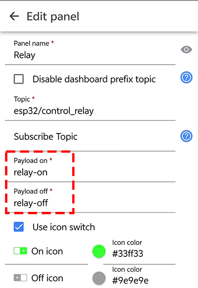

4\. Data topic matches.

To display the data in the APP, we need to read esp32 to send the data to the MQTT broker and get the data, so the topic in the APP must be consistent with the code.

```c
// Handle MQTT topics for sending and receiving control signals
const char* topic_soil_value = "esp32/soil_value";  //sensor data topic 
...
//send data
 mqttClient.publish(topic_soil_value, sensor_value_str.c_str());
```


**Set app keys:**

Open `IOT MQTT Panel` APP and tap  to add a new control page. Choose  according to the following guide.

Add a relay control key:


Add an interface to read soil humidity analog:


Only when you see , the broker is successfully connected. Thus the control commands normally work after connecting.

### 9.4.7 Test Result

After wiring up and uploading the code to the board, click  to set the baud rate to `115200`, and wait for a while, the serial monitor prints `Connected to MQTT Broker.`, which means ESP32 successfully connects to the MQTT broker. If you have a puzzle of how to upload code, please back to Chapter [4.6 Upload Code on Arduino IDE](https://docs.keyestudio.com/projects/KT0303/en/latest/docs/Arduino_Tutorial.html#upload-code-on-arduino-ide).

**Serial monitor output:**


When you see  is shown on the app, keys are available. 

If both your esp32 and app successfully connect to the broker but cannot control modules, check that instructions and topics of your code and the app match each other.


## 9.5 Remote Control Fish Tank

### 9.5.1 Introduction

Here we introduce you how to remotely control fish tank by ESP32 board with MQTT protocol. A water level sensor, an LM35 temperature sensor, a relay and a water pump are required. With this project, you will learn how to connect the ESP32 to an MQTT broker server and Publish and Subscribe water level and temperature data to control water pump on/off. In addition, basic methods of topic management, message formatting, and system security are included. Through the experiment, whether you are an IoT beginner or an advanced developer, you can easily master “remote control fish tank” based on MQTT with ESP32, making aquarium management more intelligent.

### 9.5.2 Principle Diagram


### 9.5.3 Components

|            |          |  |
| :-------------------------------------: | :---------------------------------: | :---------------------------------: |
|           ESP32 main board x1           |              relay x1               |            water pump x1            |
|          |  |              |
|          water level sensor x1          |            water pipe x1            |          F-F DuPont wires           |
|                |            |              |
|                LM35D x1                 |             jump wires              |            USB cable x1             |
|    |          |          |
|              breadboard x1              |    AA battery x6 (self-provided)    |          battery holder x1          |
|  |                                     |                                     |
|             screwdriver x1              |                                     |                                     |

### 9.5.4 Wiring Diagram


### 9.5.5 Test Code

The test code is saved in `Code` file named `9_5_fish_tank`:


Open `9_5_fish_tank.ino` in Arduino IDE.

You need to modify the name and password of the wifi that the ESP32 development board needs to connect to, so that you can upload the code successful. Otherwise your ESP32 will not be able to connect to the network. (Note that the wifi must be 2.4Ghz, or the ESP32 may fail to connect.)

```c
// Wi-Fi credentials
const char* ssid = "your SSID";    // Wi-Fi SSID, network name
const char* password = "Password"; // Wi-Fi passwords
```

To ensure a unique clientId, you need to rename by adding your own identifier. For example, change `ESP32Client-66557` into `keyes-ESP32Client`. We add a “keyes” brand name.

```c
//Ensure that the clientId is unique; otherwise, connection conflicts may occur
String clientId = "ESP32Client-keyes";
```

**Test code:**

```c
/*  
 * Filename: 9_5_fish_tank
 * Function: use the network to read the temperature and the depth of the water, and if there is little water, we can add water remotely
 * Compile IDE: ARDUINO 2.3.4
 * Author: https://www.keyestudio.com/ 
*/
#include <Arduino.h>
#include <WiFi.h>
// Use WiFiClient instead of WiFiClientSecure because this example uses an unencrypted connection
#include <PubSubClient.h>  // Include MQTT client libraries for connecting and managing MQTT messages

// Wi-Fi credentials
const char* ssid = "your SSID";    // Wi-Fi SSID, network name
const char* password = "Password"; // Wi-Fi passwords

// MQTT broker
const char* mqtt_broker = "test.mosquitto.org";  // a public Mosquitto MQTT broker
const int mqtt_port = 1883;                      // MQTT uses port 1883 for an unencrypted connection

//Ensure that the clientId is unique; otherwise, connection conflicts may occur
String clientId = "ESP32Client-keyes";

// Handle MQTT topics for sending and receiving control signals
const char* topic_waterlevel_value = "esp32/water_level_value";   //sensor data topic
const char* topic_temperature_value = "esp32/temperature_value";  //sensor data topic
const char* topic_relay = "esp32/control_relay";                  //relay control 

const int water_level_sensor_pin = 36;         // water level sensor pin
const int temperature_sensor_pin = 35;  // temperature sensor pin
const int relay_pin = 12;               //relay pin

float temperature = 0;          //set variable temperature initial value to 0
long temperature_value = 0;                 //set variable value initial value to 0
float constant = 5.0 / 4095.0;  //Define the analog constant for the calculated temperature

// Create WiFi client and MQTT client instances
WiFiClient wifiClient;                // Use normal WiFiClient to connect
PubSubClient mqttClient(wifiClient);  // Instantiate the MQTT client using the WiFi client

// Define a time variable to publish sensor data periodically
long previous_time = 0;  // store the last time data was sent

// MQTT message callback function that processes received messages
void mqttCallback(char* topic, byte* payload, unsigned int length) {
  Serial.print("Message arrived [");
  Serial.print(topic);  // Topic of the output message
  Serial.print("]: ");
  String message;
  // Convert the received byte data to a string
  for (int i = 0; i < length; i++) {
    message += (char)payload[i];
  }
  Serial.print("message:");
  Serial.println(message);

  // control LED according to the received message
  if (message == "relay-on") {  //relay on, water pump on
    Serial.println("Turning on water pump");
    digitalWrite(relay_pin, HIGH);
  } else if (message == "relay-off") {  //relay off, water pump off
    Serial.println("Turning off water pump");
    digitalWrite(relay_pin, LOW);
  }
}

// Set up the MQTT client
void setupMQTT() {
  mqttClient.setServer(mqtt_broker, mqtt_port);  // Set the address and port of the MQTT broker
  mqttClient.setCallback(mqttCallback);          // Set the message callback function
}

// try to re-connect to MQTT broker
void reconnect() {
  Serial.println("Connecting to MQTT Broker...");
  while (!mqttClient.connected()) {  // If it is not connected, the connection attempt is repeated
    Serial.println("Reconnecting to MQTT Broker...");
    clientId += String(random(0xffff), HEX);  // If it is not connected, the connection attempt is repeated

    if (mqttClient.connect(clientId.c_str())) {  // Connect to the broker through clientId
      Serial.println("Connected to MQTT Broker.");

      // subscribe the topic
      mqttClient.subscribe(topic_relay);  //subscribe relay control 
    } else {
      Serial.print("Failed, rc=");
      Serial.print(mqttClient.state());  // Print the reason for the connection failure
      Serial.println(" try again in 5 seconds");
      delay(5000);  // Retry the connection every 5 seconds
    }
  }
}

void setup() {
  Serial.begin(115200);  // Retry the connection every 5 seconds
  // set relay pin to output
  pinMode(relay_pin, OUTPUT);
  //set soil humidity sensor pin to input
  pinMode(water_level_sensor_pin, INPUT);
  //set temperature sensor pin to input
  pinMode(temperature_sensor_pin, INPUT);
  // connect to Wi-Fi
  WiFi.begin(ssid, password);
  while (WiFi.status() != WL_CONNECTED) {
    delay(500);
    Serial.print(".");
  }
  Serial.println("");
  Serial.println("Connected to Wi-Fi");

  setupMQTT();  // Set up the MQTT client
}

void loop() {
  if (!mqttClient.connected()) {  // If MQTT broker is not connected
    reconnect();                  // Attempt to reconnect
  }
  mqttClient.loop();  // Keep MQTT client connections active

  long now = millis();
  if (now - previous_time > 1000) {  // Publish every 1 second
    previous_time = now;

    // Read the sensor value
    int water_sensor_value = analogRead(water_level_sensor_pin);
    temperature_value = analogRead(temperature_sensor_pin);
    temperature = (temperature_value * constant * 100);  //Calculate analog temperature value

    // Convert the value to a string
    String water_sensor_value_str = String(water_sensor_value);
    String temperature_sensor_value_str = String(temperature);

    //send data
    mqttClient.publish(topic_waterlevel_value, water_sensor_value_str.c_str());
    mqttClient.publish(topic_temperature_value, temperature_sensor_value_str.c_str());
  }
}
```


### 9.5.6 Test Result

The App key layout is the same as the previous projects.

After wiring up and uploading the code to the board, click  to set the baud rate to `115200`, and wait for a while, the serial monitor prints `Connected to MQTT Broker.`, which means ESP32 successfully connects to the MQTT broker. If you have a puzzle of how to upload code, please back to Chapter [4.6 Upload Code on Arduino IDE](https://docs.keyestudio.com/projects/KT0303/en/latest/docs/Arduino_Tutorial.html#upload-code-on-arduino-ide).


## 9.6 Remote Greenhouse Environment Monitoring

### 9.6.1 Introduction

Here we introduce you how to monitor greenhouse by ESP32 board with MQTT protocol. The smart greenhouse requires a soil humidity sensor, a water level sensor, an LM35 temperature sensor, a relay, a water pump, a photoresistor(light intensity) and a servo(vent control). With this project, you will learn how to connect the ESP32 to an MQTT broker server and Publish and Subscribe data(values of soil humidity, water level, temperature and light intensity) to control water pump and servo. In addition, basic methods of topic management, message formatting, and system security are included. Through the experiment, whether you are an IoT beginner or an advanced developer, you can easily master “remote greenhouse monitoring” based on MQTT with ESP32, making agricultural management more intelligent.

### 9.6.2 Principle Diagram


### 9.6.3 Components

|  |              |  |
| :---------------------------: | :-------------------------------------: | :---------------------------------: |
|      ESP32 main board x1      |                relay x1                 |            water pump x1            |
|      |      |              |
|    soil humidity sensor x1    |              water pipe x1              |          F-F DuPont wires           |
|    |                   |               |
|     water level sensor x1     |                servo x1                 |               光敏 x1               |
|      |                    |            |
|           LM35D x1            |             10K resistor x1             |             jump wires              |
|        |    |          |
|         USB cable x1          |              breadboard x1              |    AA battery x6 (self-provided)    |
|    |  |                                     |
|       battery holder x1       |             screwdriver x1              |                                     |

### 9.6.4 Wiring Diagram


Many sensors are involved, so we tabulate the wiring diagram:

|          sensors          | S(signal) | VCC  | GND  |
| :-----------------------: | :-------: | :--: | :--: |
|           relay           |   IO12    | VCC  | GNG  |
|           servo           |   IO13    | VCC  | GND  |
|       photoresistor       |   IO33    | VCC  | GND  |
|    water level sensor     |   IO34    | VCC  | GND  |
|   soil humidity sensor    |   IO35    | VCC  | GND  |
| (LM35) temperature sensor |   IO36    | VCC  | GND  |


### 9.6.5 Test Code

The test code is saved in `Code` file named `9_6_environmental_monitoring`:


Open `9_6_environmental_monitoring.ino` in Arduino IDE.

You need to modify the name and password of the wifi that the ESP32 development board needs to connect to, so that you can upload the code successful. Otherwise your ESP32 will not be able to connect to the network. (Note that the wifi must be 2.4Ghz, or the ESP32 may fail to connect.)

```c
// Wi-Fi credentials
const char* ssid = "your SSID";    // Wi-Fi SSID, network name
const char* password = "Password"; // Wi-Fi passwords
```

To ensure a unique clientId, you need to rename by adding your own identifier. For example, change `ESP32Client-66557` into `keyes-ESP32Client`. We add a “keyes” brand name.

```c
//Ensure that the clientId is unique; otherwise, connection conflicts may occur
String clientId = "ESP32Client-keyes";
```

**Test code:**

```c
/*  
 * Filename: 9_6_environmental_monitoring
 * Function: use the network to read the illuminance, temperature, water level, soil moisture in the greenhouse, (relay + pump) watering, (servo) opening the Windows for ventilation
 * Compile IDE: ARDUINO 2.3.4
 * Author: https://www.keyestudio.com/ 
*/
#include <Arduino.h>
#include <WiFi.h>
#include <ESP32Servo.h>
// Use WiFiClient instead of WiFiClientSecure because this example uses an unencrypted connection
#include <PubSubClient.h>  // Include MQTT client libraries for connecting and managing MQTT messages

// Wi-Fi credentials
const char* ssid = "your SSID";    // Wi-Fi SSID, network name
const char* password = "Password"; // Wi-Fi passwords

// MQTT broker
const char* mqtt_broker = "test.mosquitto.org";  // a public Mosquitto MQTT broker
const int mqtt_port = 1883;                      // MQTT uses port 1883 for an unencrypted connection

//Ensure that the clientId is unique; otherwise, connection conflicts may occur
String clientId = "ESP32Client-keyes";

// Handle MQTT topics for sending and receiving control signals
const char* topic_light_value = "esp32/light_value";              //photoresistor data topic
const char* topic_water_level_value = "esp32/water_level_value";  //water level sensor data topic
const char* topic_soil_value = "esp32/soil_value";                //soil humidity sensor data topic
const char* topic_temperature_value = "esp32/temperature_value";  //temperature sensor data topic
const char* topic_relay = "esp32/control_relay";                  //relay control topic
const char* topic_servo = "esp32/control_servo";                  //servo control topic

const int light_sensor_pin = 33;        //photoresistor pin
const int water_level_sensor_pin = 34;  // water level sensor pin
const int soil_sensor_pin = 35;         // soil humidity sensor pin
const int temperature_sensor_pin = 36;  // temperature sensor pin
const int relay_pin = 12;               //relay pin
const int servo_pin = 13;               //servo pin

Servo myservo;  // create servo object to control a servo

float temperature = 0;          //set variable temperature initial value to 0
long temperature_value = 0;     //set variable value initial value to 0
float constant = 5.0 / 4095.0;  //Define the analog constant for the calculated temperature

// Create WiFi client and MQTT client instances
WiFiClient wifiClient;                // Use normal WiFiClient to connect
PubSubClient mqttClient(wifiClient);  // Instantiate the MQTT client using the WiFi client

// Define a time variable to publish sensor data periodically
long previous_time = 0;  // store the last time data was sent

// MQTT message callback function that processes received messages
void mqttCallback(char* topic, byte* payload, unsigned int length) {
  Serial.print("Message arrived [");
  Serial.print(topic);  // Topic of the output message
  Serial.print("]: ");
  String message;
  // Convert the received byte data to a string
  for (int i = 0; i < length; i++) {
    message += (char)payload[i];
  }
  Serial.print("message:");
  Serial.println(message);

  // control LED according to the received message
  if (message == "relay-on") {  //relay on, water pump on
    Serial.println("Turning on water pump");
    digitalWrite(relay_pin, HIGH);
  } else if (message == "relay-off") {  //relay off, water pump off
    Serial.println("Turning off water pump");
    digitalWrite(relay_pin, LOW);
  } else if (message == "servo-on") {  //relay off, servo on
    myservo.write(180);                // set servo to 180°
    delay(500);
  } else if (message == "servo-off") {  //relay off, servo off
    myservo.write(0);                   // set servo to 0°
    delay(500);
  }
}

// Set up the MQTT client
void setupMQTT() {
  mqttClient.setServer(mqtt_broker, mqtt_port);  // Set the address and port of the MQTT broker
  mqttClient.setCallback(mqttCallback);          // Set the message callback function
}

// try to re-connect to MQTT broker
void reconnect() {
  Serial.println("Connecting to MQTT Broker...");
  while (!mqttClient.connected()) {  // If it is not connected, the connection attempt is repeated
    Serial.println("Reconnecting to MQTT Broker...");
    clientId += String(random(0xffff), HEX);  // If it is not connected, the connection attempt is repeated

    if (mqttClient.connect(clientId.c_str())) {  // Connect to the broker through clientId
      Serial.println("Connected to MQTT Broker.");

      // subscribe the topic
      mqttClient.subscribe(topic_relay);  //subscribe relay control 
      mqttClient.subscribe(topic_servo);  //subscribe servo control 
    } else {
      Serial.print("Failed, rc=");
      Serial.print(mqttClient.state());  // Print the reason for the connection failure
      Serial.println(" try again in 5 seconds");
      delay(5000);  // Retry the connection every 5 seconds
    }
  }
}

void setup() {
  Serial.begin(115200);  // Retry the connection every 5 seconds
  // set relay pin to output
  pinMode(relay_pin, OUTPUT);
  //set sensor pins to input
  pinMode(light_sensor_pin, INPUT);
  pinMode(water_level_sensor_pin, INPUT);
  pinMode(soil_sensor_pin, INPUT);
  pinMode(temperature_sensor_pin, INPUT);

  // connect to Wi-Fi
  WiFi.begin(ssid, password);
  while (WiFi.status() != WL_CONNECTED) {
    delay(500);
    Serial.print(".");
  }
  Serial.println("");
  Serial.println("Connected to Wi-Fi");

  setupMQTT();                // Set up the MQTT client
  myservo.attach(servo_pin);  //attaches the servo on pin to the servo object
}

void loop() {
  if (!mqttClient.connected()) {  // If MQTT broker is not connected
    reconnect();                  // Attempt to reconnect
  }
  mqttClient.loop();  // Keep MQTT client connections active

  long now = millis();
  if (now - previous_time > 1000) {  // Publish every 1 second
    previous_time = now;

    // Read the sensor value
    int light_level_sensor_value = analogRead(light_sensor_pin);
    int water_level_sensor_value = analogRead(water_level_sensor_pin);
    int soil_sensor_value = analogRead(soil_sensor_pin);

    temperature_value = analogRead(temperature_sensor_pin);
    temperature = (temperature_value * constant * 100);  //Calculate analog temperature value

    // Convert the value to a string
    String light_sensor_value_str = String(light_level_sensor_value);
    String water_level_sensor_value_str = String(water_level_sensor_value);
    String soil_sensor_value_str = String(soil_sensor_value);
    String temperature_sensor_value_str = String(temperature);

    //send data
    mqttClient.publish(topic_light_value, light_sensor_value_str.c_str());
    mqttClient.publish(topic_water_level_value, water_level_sensor_value_str.c_str());
    mqttClient.publish(topic_soil_value, soil_sensor_value_str.c_str());
    mqttClient.publish(topic_temperature_value, temperature_sensor_value_str.c_str());
  }
}
```


### 9.6.6 Test Result

After wiring up and uploading the code to the board, click  to set the baud rate to `115200`, and wait for a while, the serial monitor prints `Connected to MQTT Broker.`, which means ESP32 successfully connects to the MQTT broker. If you have a puzzle of how to upload code, please back to Chapter [4.6 Upload Code on Arduino IDE](https://docs.keyestudio.com/projects/KT0303/en/latest/docs/Arduino_Tutorial.html#upload-code-on-arduino-ide).

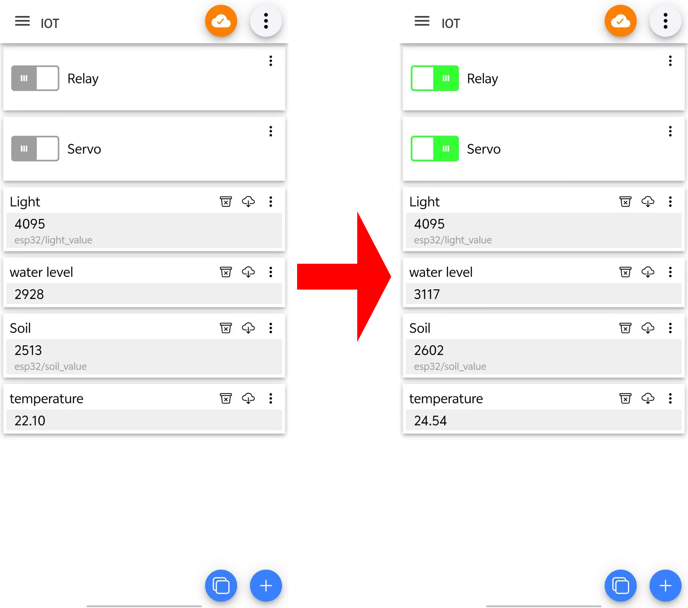

## 9.7 Forest Fire Monitoring

### 9.7.1 Introduction

Here we introduce you how to monitor forest fire by ESP32 board with MQTT protocol. A flame sensor and a temperature sensor are required. With this project, you will learn how to connect the ESP32 to an MQTT broker server and Publish and Subscribe humidity data(values of flame and temperature) to monitor fire. An alarm will be triggered when an anomaly is detected. 

In addition, basic methods of topic management, message formatting, and system security are included. Through the experiment, whether you are an IoT beginner or an advanced developer, you can easily monitor forest fire based on MQTT with ESP32, making your projects more secure.

### 9.7.2 Principle Diagram


### 9.7.3 Components

|  |        |  |
| :---------------------------: | :---------------------------: | :-----------------------------------: |
|      ESP32 main board x1      |         USB cable x1          |             breadboard x1             |
|      |          |  |
|        10K resistor x1        |            LM35 x1            |            flame sensor x1            |
|      |    |            |
|          jump wires           | AA battery x6 (self-provided) |           battery holder x1           |

### 9.7.4 Wiring Diagram


### 9.7.5 Test Code

The test code is saved in `Code` file named `9_7_Forest_fire_prevention`:


Open `9_7_Forest_fire_prevention.ino` in Arduino IDE.

You need to modify the name and password of the wifi that the ESP32 development board needs to connect to, so that you can upload the code successful. Otherwise your ESP32 will not be able to connect to the network. (Note that the wifi must be 2.4Ghz, or the ESP32 may fail to connect.)

```c
// Wi-Fi credentials
const char* ssid = "your SSID";    // Wi-Fi SSID, network name
const char* password = "Password"; // Wi-Fi passwords
```

To ensure a unique clientId, you need to rename by adding your own identifier. For example, change `ESP32Client-66557` into `keyes-ESP32Client`. We add a “keyes” brand name.

```c
//Ensure that the clientId is unique; otherwise, connection conflicts may occur
String clientId = "ESP32Client-keyes";
```

**Test code:**

```c
/*  
 * Filename: 9_7_Forest_fire_prevention
 * Function: use the network to read the data of the flame sensor and temperature sensor in the forest, and we can know the first time there is a fire according to the data provided by the sensor.
 * Compile IDE: ARDUINO 2.3.4
 * Author: https://www.keyestudio.com/ 
*/
#include <Arduino.h>
#include <WiFi.h>
// Use WiFiClient instead of WiFiClientSecure because this example uses an unencrypted connection
#include <PubSubClient.h>  // Include MQTT client libraries for connecting and managing MQTT messages

// Wi-Fi credentials
const char* ssid = "your SSID";    // Wi-Fi SSID, network name
const char* password = "Password"; // Wi-Fi passwords

// MQTT broker
const char* mqtt_broker = "test.mosquitto.org";  // a public Mosquitto MQTT broker
const int mqtt_port = 1883;                      // MQTT uses port 1883 for an unencrypted connection

//Ensure that the clientId is unique; otherwise, connection conflicts may occur
String clientId = "ESP32Client-keyes";

// Handle MQTT topics for sending and receiving control signals
const char* topic_flame_value = "esp32/flame_value";                //flame sensor data topic
const char* topic_temperature_value = "esp32/temperature_value";  //temperature sensor data topic

const int flame_sensor_pin = 35;         // flame sensor pin
const int temperature_sensor_pin = 36;  // temperature sensor pin


float temperature = 0;          //set variable temperature initial value to 0
long temperature_value = 0;     //set variable value initial value to 0
float constant = 5.0 / 4095.0;  //Define the analog constant for the calculated temperature

// Create WiFi client and MQTT client instances
WiFiClient wifiClient;                // Use normal WiFiClient to connect
PubSubClient mqttClient(wifiClient);  // Instantiate the MQTT client using the WiFi client

// Define a time variable to publish sensor data periodically
long previous_time = 0;  // store the last time data was sent

// MQTT message callback function that processes received messages
void mqttCallback(char* topic, byte* payload, unsigned int length) {
  Serial.print("Message arrived [");
  Serial.print(topic);  // Topic of the output message
  Serial.print("]: ");
  String message;
  // Convert the received byte data to a string
  for (int i = 0; i < length; i++) {
    message += (char)payload[i];
  }
  Serial.print("message:");
  Serial.println(message);
}

// Set up the MQTT client
void setupMQTT() {
  mqttClient.setServer(mqtt_broker, mqtt_port);  // Set the address and port of the MQTT broker
  mqttClient.setCallback(mqttCallback);          // Set the message callback function
}

// try to re-connect to MQTT broker
void reconnect() {
  Serial.println("Connecting to MQTT Broker...");
  while (!mqttClient.connected()) {  // If it is not connected, the connection attempt is repeated
    Serial.println("Reconnecting to MQTT Broker...");
    clientId += String(random(0xffff), HEX);  // If it is not connected, the connection attempt is repeated

    if (mqttClient.connect(clientId.c_str())) {  // Connect to the broker through clientId
      Serial.println("Connected to MQTT Broker.");
      // subscribe the topic

    } else {
      Serial.print("Failed, rc=");
      Serial.print(mqttClient.state());  // Print the reason for the connection failure
      Serial.println(" try again in 5 seconds");
      delay(5000);  // Retry the connection every 5 seconds
    }
  }
}

void setup() {
  Serial.begin(115200);  // Retry the connection every 5 seconds
  //set sensor pins to input
  pinMode(flame_sensor_pin, INPUT);
  pinMode(temperature_sensor_pin, INPUT);

  // connect to Wi-Fi
  WiFi.begin(ssid, password);
  while (WiFi.status() != WL_CONNECTED) {
    delay(500);
    Serial.print(".");
  }
  Serial.println("");
  Serial.println("Connected to Wi-Fi");

  setupMQTT();                // Set up the MQTT client
}

void loop() {
  if (!mqttClient.connected()) {  // If MQTT broker is not connected
    reconnect();                  // Attempt to reconnect
  }
  mqttClient.loop();  // Keep MQTT client connections active

  long now = millis();
  if (now - previous_time > 1000) {  // Publish every 1 second
    previous_time = now;

    // Read the sensor value
    int flame_sensor_value = analogRead(flame_sensor_pin);

    temperature_value = analogRead(temperature_sensor_pin);
    temperature = (temperature_value * constant * 100);  //Calculate analog temperature value

    // Convert the value to a string
    String flame_sensor_value_str = String(flame_sensor_value);
    String temperature_sensor_value_str = String(temperature);

    //send data
    mqttClient.publish(topic_flame_value, flame_sensor_value_str.c_str());
    mqttClient.publish(topic_temperature_value, temperature_sensor_value_str.c_str());
  }
}
```


### 9.7.6 Test Result

After wiring up and uploading the code to the board, click  to set the baud rate to `115200`, and wait for a while, the serial monitor prints `Connected to MQTT Broker.`, which means ESP32 successfully connects to the MQTT broker. If you have a puzzle of how to upload code, please back to Chapter [4.6 Upload Code on Arduino IDE](https://docs.keyestudio.com/projects/KT0303/en/latest/docs/Arduino_Tutorial.html#upload-code-on-arduino-ide).


# 10. FAQ

## 10.1 Fails to Upload Code

1. Check the software first. Click  on the Arduino IDE to compile a code. If it reports an error, there may be some problem with Arduino IDE or codes rather than any hardware.

   A. Read the error prompt clearly for targeted troubleshooting.

   B. If the library is included, check whether the Arduino IDE ESP32 version is “3.1.3”. In this tutorial, we adopt ESP32 `3.1.3` as other versions may be incompatible.

2. Click  and the compiling complete. That means software and codes work normally, so you can pay attention to pins:

   A. Check that you have selected the correct development board and port number.

   B. Check whether there is a problem with the USB cable connected to the board and the computer. Try replacing the interface or the cable.

   C. ESP32 consumes much power when using WiFi, so an external power supply is required, otherwise the board will reset and fails to upload code.

   

## 10.2 Prints No IP on Serial After Code is Uploaded

1. If you open the serial monitor after the ESP32 is connected to WiFi, the monitor will not print `...` signs. Press the on-board `RES` button to solve such problems.
2. Since ESP32 Plus is not able to connect to 5GHz WiFi, check whether the connected WiFi is 2.4GHz.

## 10.3 Cannot Connect to WiFi

1. Check that the WiFi name and WiFi password in the code are correct.
2. Check whether the WiFi frequency connected to the ESP32 is 2.4GHz.
3. Check whether the battery holder is turned on. ESP32 WiFi consumes a lot of power ao requires an external power supply.
4. Check whether the external antenna is properly connected.

## 10.4 Does Not Appear USB Port Number

1. Check whether a USB driver is installed. Refer to `4.3 Install USB Driver`.
2. Replace the USB interface of the computer (to prevent bad contact) and the USB cable.

## 10.5 Does Not Function Properly for Motor, Servo, Water Pump, ESP32 WiFi

1. Check whether the cable is connected incorrectly, resulting in short circuit.
2. Check whether there is an external power supply, because these functions requires large power consumption. Only USB power supply is difficult to meet their needs.

## 10.6 Fails to Connect to MQTT

1. Because the MQTT broker we use is public, access may be restricted when there is a high visitor volume. We can replace the MQTT broker in the code. You can use the two we provided, or find another one yourself.

   Codes:

   ```c
   // MQTT broker
   const char* mqtt_broker = "test.mosquitto.org";  // a public Mosquitto MQTT broker
   const int mqtt_port = 1883;   
   ```

   Or

   ```c
   // MQTT broker
   const char* mqtt_broker = "broker.hivemq.com"; // a public Mosquitto MQTT broker
   const int mqtt_port = 1883;   
   ```

2. The WiFi connected to the ESP32 is unstable. Choose another WiFi network.

